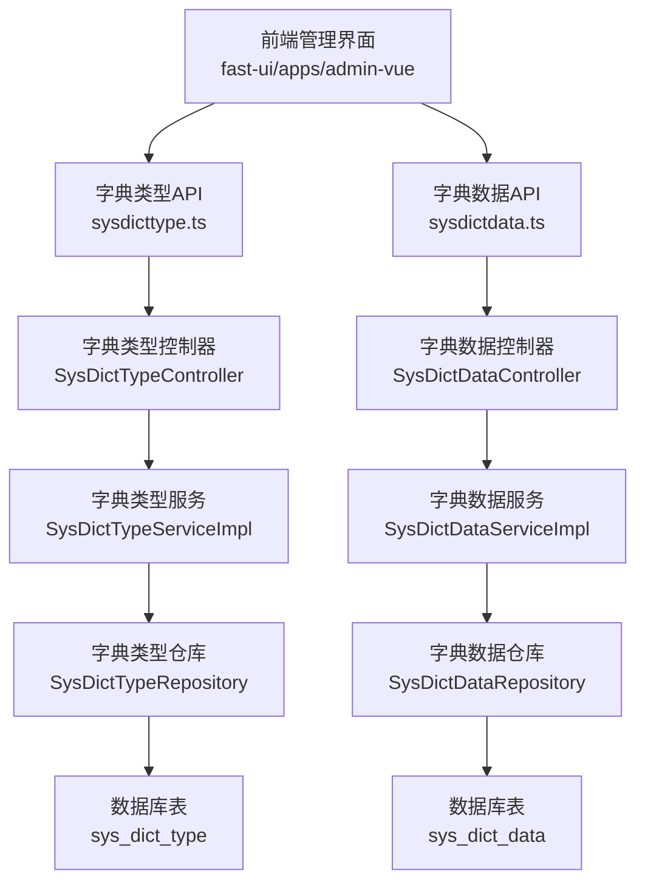
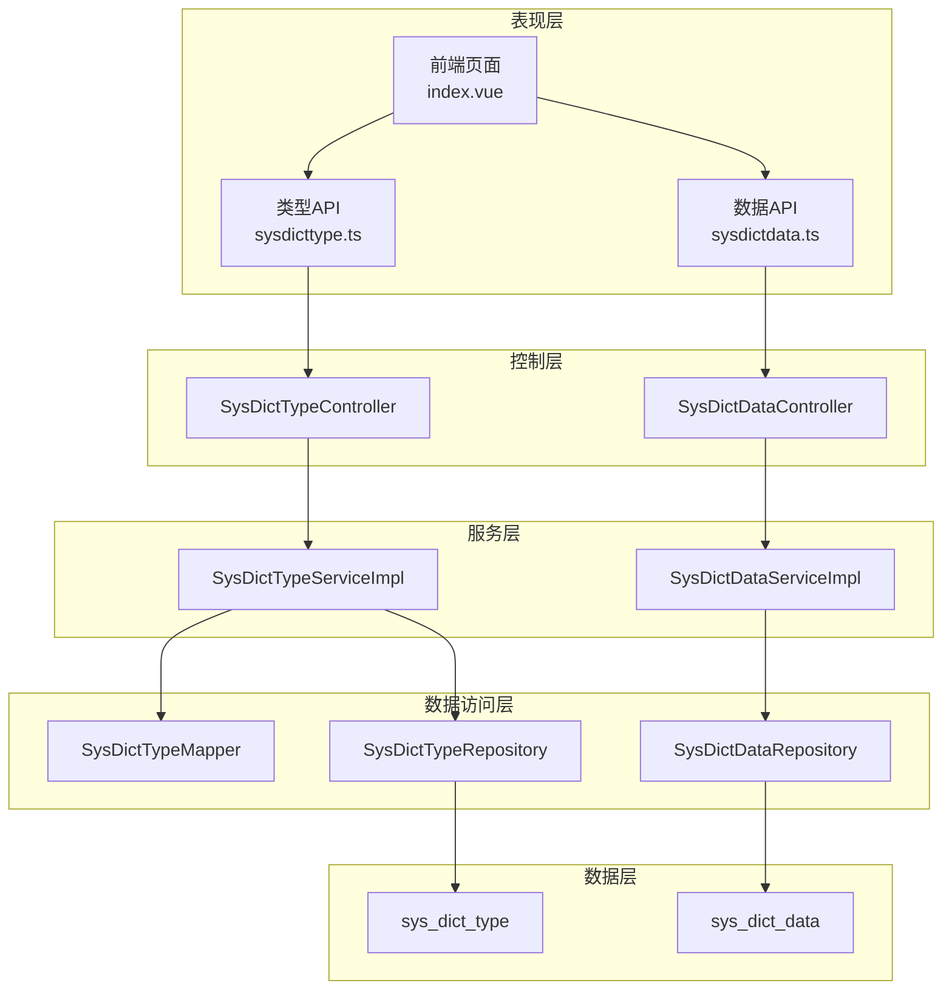
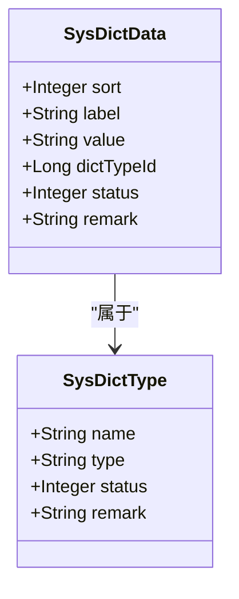
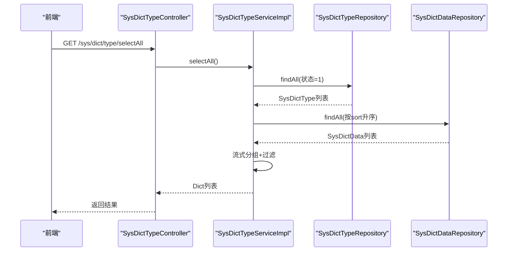
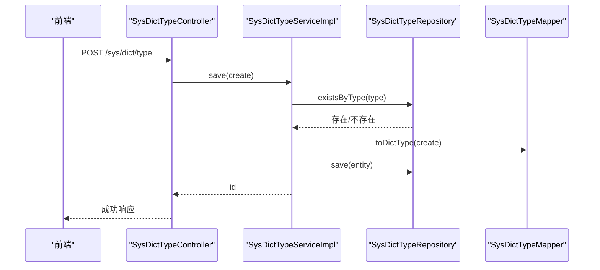
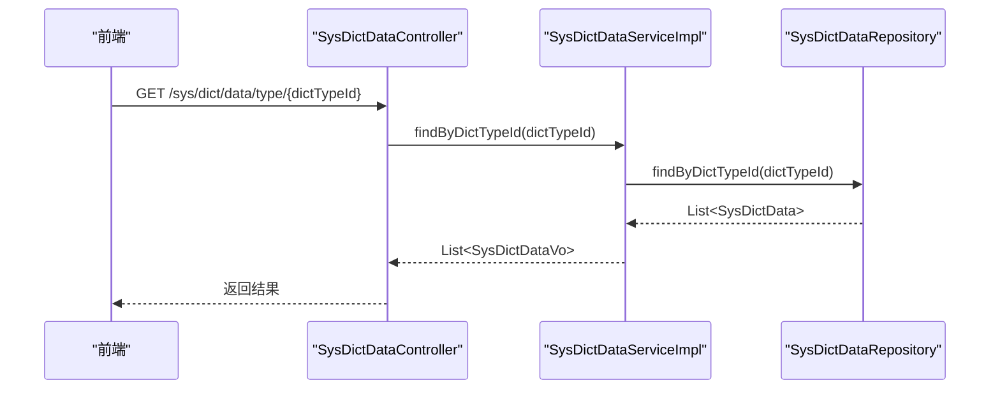
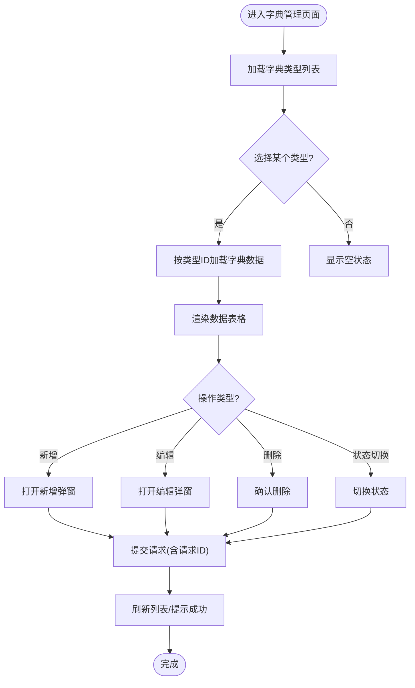
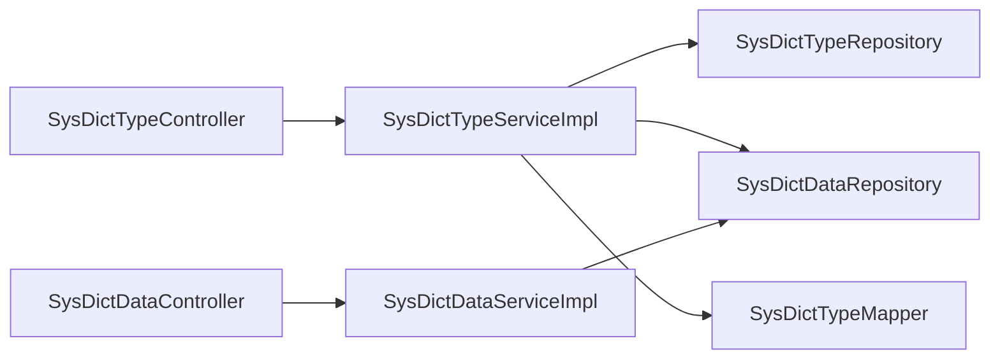

# 字典配置管理

<cite>
**本文引用的文件**
- [SysDictType.java](file://system-module/src/main/java/com/ fastproject/system/domain/SysDictType.java)
- [SysDictData.java](file://system-module/src/main/java/com/ fastproject/system/domain/SysDictData.java)
- [SysDictTypeService.java](file://system-module/src/main/java/com/ fastproject/system/service/SysDictTypeService.java)
- [SysDictTypeServiceImpl.java](file://system-module/src/main/java/com/ fastproject/system/service/impl/SysDictTypeServiceImpl.java)
- [SysDictDataService.java](file://system-module/src/main/java/com/ fastproject/system/service/SysDictDataService.java)
- [SysDictDataServiceImpl.java](file://system-module/src/main/java/com/ fastproject/system/service/impl/SysDictDataServiceImpl.java)
- [SysDictTypeController.java](file://run-admin/src/main/java/com/ fastproject/module/system/controller/SysDictTypeController.java)
- [SysDictDataController.java](file://run-admin/src/main/java/com/ fastproject/module/system/controller/SysDictDataController.java)
- [SysDictTypeMapper.java](file://system-module/src/main/java/com/ fastproject/system/mapper/SysDictTypeMapper.java)
- [Dict.java](file://system-module/src/main/java/com/ fastproject/system/vo/dictdata/Dict.java)
- [SysDictTypeCreate.java](file://system-module/src/main/java/com/ fastproject/system/vo/dicttype/SysDictTypeCreate.java)
- [SysDictTypeUpdate.java](file://system-module/src/main/java/com/ fastproject/system/vo/dicttype/SysDictTypeUpdate.java)
- [SysDictTypeQuery.java](file://system-module/src/main/java/com/ fastproject/system/vo/dicttype/SysDictTypeQuery.java)
- [SysDictDataCreate.java](file://system-module/src/main/java/com/ fastproject/system/vo/dictdata/SysDictDataCreate.java)
- [SysDictDataUpdate.java](file://system-module/src/main/java/com/ fastproject/system/vo/dictdata/SysDictDataUpdate.java)
- [SysDictDataQuery.java](file://system-module/src/main/java/com/ fastproject/system/vo/dictdata/SysDictDataQuery.java)
- [sysdicttype.ts](file://fast-ui/apps/admin-vue/src/api/system/sysdicttype.ts)
- [sysdictdata.ts](file://fast-ui/apps/admin-vue/src/api/system/sysdictdata.ts)
- [index.vue](file://fast-ui/apps/admin-vue/src/views/system/sysdict/index.vue)
</cite>

## 目录
1. [简介](#简介)
2. [项目结构](#项目结构)
3. [核心组件](#核心组件)
4. [架构总览](#架构总览)
5. [详细组件分析](#详细组件分析)
6. [依赖关系分析](#依赖关系分析)
7. [性能考虑](#性能考虑)
8. [故障排查指南](#故障排查指南)
9. [结论](#结论)
10. [附录](#附录)

## 简介
本文件围绕“字典配置管理”功能，系统化阐述数据字典的设计原理、字典类型与字典数据的管理流程、动态查询机制、缓存策略以及国际化支持方案。文档覆盖从数据库模型到后端服务、从控制器接口到前端API与页面组件的全链路实现，帮助开发者快速理解并扩展字典能力。

## 项目结构
字典配置管理功能主要分布在以下模块与目录中：
- 后端系统模块（system-module）：领域模型、服务层、数据访问层、映射器与VO类
- 运行模块（run-admin）：字典类型的控制器与字典数据的控制器
- 前端管理界面（fast-ui/admin-vue）：字典类型与字典数据的API封装与页面视图

图表来源
- [SysDictTypeController.java](file://run-admin/src/main/java/com/ fastproject/module/system/controller/SysDictTypeController.java#L25-L109)
- [SysDictDataController.java](file://run-admin/src/main/java/com/ fastproject/module/system/controller/SysDictDataController.java#L25-L101)
- [SysDictTypeServiceImpl.java](file://system-module/src/main/java/com/ fastproject/system/service/impl/SysDictTypeServiceImpl.java#L41-L179)
- [SysDictDataServiceImpl.java](file://system-module/src/main/java/com/ fastproject/system/service/impl/SysDictDataServiceImpl.java#L32-L25)

章节来源
- [SysDictTypeController.java](file://run-admin/src/main/java/com/ fastproject/module/system/controller/SysDictTypeController.java#L25-L109)
- [SysDictDataController.java](file://run-admin/src/main/java/com/ fastproject/module/system/controller/SysDictDataController.java#L25-L101)

## 核心组件
- 数据模型
  - 字典类型实体：包含名称、类型、状态、备注等字段
  - 字典数据实体：包含排序、标签、值、类型ID、状态、备注等字段
- 服务接口与实现
  - 字典类型服务：提供新增、修改、删除、分页查询、全量查询、按状态查询、聚合查询等能力
  - 字典数据服务：提供新增、修改、删除、批量删除、分页查询、按ID查询、按类型ID查询等能力
- 控制器接口
  - 字典类型控制器：提供REST接口，支持分页、详情、列表、下拉选择、批量删除等
  - 字典数据控制器：提供REST接口，支持分页、详情、按类型ID查询、批量删除等
- 前端API与页面
  - 类型与数据API封装：统一请求方法与返回结构
  - 页面视图：字典类型与字典数据的增删改查与状态切换

章节来源
- [SysDictType.java](file://system-module/src/main/java/com/ fastproject/system/domain/SysDictType.java#L20-L41)
- [SysDictData.java](file://system-module/src/main/java/com/ fastproject/system/domain/SysDictData.java#L20-L51)
- [SysDictTypeService.java](file://system-module/src/main/java/com/ fastproject/system/service/SysDictTypeService.java#L15-L61)
- [SysDictDataService.java](file://system-module/src/main/java/com/ fastproject/system/service/SysDictDataService.java#L14-L50)
- [SysDictTypeController.java](file://run-admin/src/main/java/com/ fastproject/module/system/controller/SysDictTypeController.java#L33-L108)
- [SysDictDataController.java](file://run-admin/src/main/java/com/ fastproject/module/system/controller/SysDictDataController.java#L33-L100)
- [sysdicttype.ts](file://fast-ui/apps/admin-vue/src/api/system/sysdicttype.ts#L41-L101)
- [sysdictdata.ts](file://fast-ui/apps/admin-vue/src/api/system/sysdictdata.ts#L46-L99)
- [index.vue](file://fast-ui/apps/admin-vue/src/views/system/sysdict/index.vue#L361-L594)

## 架构总览
字典配置管理采用经典的分层架构：
- 表现层：前端通过API封装调用后端接口
- 控制层：控制器接收请求，校验权限与幂等性，调用服务层
- 服务层：处理业务逻辑，执行数据聚合与查询
- 数据访问层：基于仓库与映射器进行持久化
- 数据层：MySQL数据库中的字典类型与字典数据表

图表来源
- [SysDictTypeController.java](file://run-admin/src/main/java/com/ fastproject/module/system/controller/SysDictTypeController.java#L25-L109)
- [SysDictDataController.java](file://run-admin/src/main/java/com/ fastproject/module/system/controller/SysDictDataController.java#L25-L101)
- [SysDictTypeServiceImpl.java](file://system-module/src/main/java/com/ fastproject/system/service/impl/SysDictTypeServiceImpl.java#L41-L179)
- [SysDictDataServiceImpl.java](file://system-module/src/main/java/com/ fastproject/system/service/impl/SysDictDataServiceImpl.java#L32-L25)
- [SysDictTypeMapper.java](file://system-module/src/main/java/com/ fastproject/system/mapper/SysDictTypeMapper.java#L13-L27)

## 详细组件分析

### 数据模型与关系
- 字典类型与字典数据为一对多关系：一个字典类型可包含多个字典数据项
- 实体均继承基础实体，支持软删除与逻辑过滤
- 字典数据通过外键关联字典类型ID

图表来源
- [SysDictType.java](file://system-module/src/main/java/com/ fastproject/system/domain/SysDictType.java#L20-L41)
- [SysDictData.java](file://system-module/src/main/java/com/ fastproject/system/domain/SysDictData.java#L20-L51)

章节来源
- [SysDictType.java](file://system-module/src/main/java/com/ fastproject/system/domain/SysDictType.java#L20-L41)
- [SysDictData.java](file://system-module/src/main/java/com/ fastproject/system/domain/SysDictData.java#L20-L51)

### 字典类型服务与聚合查询
- 全量聚合：一次性查询正常状态的字典类型与全部字典数据，按类型ID分组并仅保留正常状态的数据项
- 性能优化：使用流式分组与一次性查询减少数据库往返

图表来源
- [SysDictTypeController.java](file://run-admin/src/main/java/com/ fastproject/module/system/controller/SysDictTypeController.java#L105-L108)
- [SysDictTypeServiceImpl.java](file://system-module/src/main/java/com/ fastproject/system/service/impl/SysDictTypeServiceImpl.java#L141-L178)

章节来源
- [SysDictTypeServiceImpl.java](file://system-module/src/main/java/com/ fastproject/system/service/impl/SysDictTypeServiceImpl.java#L141-L178)
- [Dict.java](file://system-module/src/main/java/com/ fastproject/system/vo/dictdata/Dict.java#L8-L18)

### 字典类型管理API
- 新增：校验类型唯一性后保存
- 修改：校验类型唯一性（排除自身）后更新
- 删除与批量删除：直接删除或批量删除
- 分页查询：支持名称、类型、状态条件
- 列表与下拉选择：全量列表与仅正常状态列表

图表来源
- [SysDictTypeController.java](file://run-admin/src/main/java/com/ fastproject/module/system/controller/SysDictTypeController.java#L33-L39)
- [SysDictTypeServiceImpl.java](file://system-module/src/main/java/com/ fastproject/system/service/impl/SysDictTypeServiceImpl.java#L50-L61)
- [SysDictTypeMapper.java](file://system-module/src/main/java/com/ fastproject/system/mapper/SysDictTypeMapper.java#L22-L26)

章节来源
- [SysDictTypeController.java](file://run-admin/src/main/java/com/ fastproject/module/system/controller/SysDictTypeController.java#L33-L108)
- [SysDictTypeServiceImpl.java](file://system-module/src/main/java/com/ fastproject/system/service/impl/SysDictTypeServiceImpl.java#L50-L125)
- [SysDictTypeCreate.java](file://system-module/src/main/java/com/ fastproject/system/vo/dicttype/SysDictTypeCreate.java#L9-L30)
- [SysDictTypeUpdate.java](file://system-module/src/main/java/com/ fastproject/system/vo/dicttype/SysDictTypeUpdate.java#L9-L35)
- [SysDictTypeQuery.java](file://system-module/src/main/java/com/ fastproject/system/vo/dicttype/SysDictTypeQuery.java#L12-L28)

### 字典数据管理API
- 新增、修改、删除、批量删除
- 分页查询：支持标签、值、类型ID、状态
- 按类型ID查询：用于前端联动选择

图表来源
- [SysDictDataController.java](file://run-admin/src/main/java/com/ fastproject/module/system/controller/SysDictDataController.java#L96-L100)
- [SysDictDataServiceImpl.java](file://system-module/src/main/java/com/ fastproject/system/service/impl/SysDictDataServiceImpl.java#L32-L25)

章节来源
- [SysDictDataController.java](file://run-admin/src/main/java/com/ fastproject/module/system/controller/SysDictDataController.java#L33-L100)
- [SysDictDataServiceImpl.java](file://system-module/src/main/java/com/ fastproject/system/service/impl/SysDictDataServiceImpl.java#L32-L25)
- [SysDictDataCreate.java](file://system-module/src/main/java/com/ fastproject/system/vo/dictdata/SysDictDataCreate.java#L9-L40)
- [SysDictDataUpdate.java](file://system-module/src/main/java/com/ fastproject/system/vo/dictdata/SysDictDataUpdate.java#L9-L45)
- [SysDictDataQuery.java](file://system-module/src/main/java/com/ fastproject/system/vo/dictdata/SysDictDataQuery.java#L12-L33)

### 前端集成与表单组件
- API封装：统一的请求方法与返回结构，便于页面复用
- 页面视图：左侧类型面板与右侧数据表格，支持新增、编辑、删除、状态切换、分页查询
- 表单校验：标签与值必填校验，请求头携带请求ID以支持幂等

图表来源
- [sysdicttype.ts](file://fast-ui/apps/admin-vue/src/api/system/sysdicttype.ts#L41-L101)
- [sysdictdata.ts](file://fast-ui/apps/admin-vue/src/api/system/sysdictdata.ts#L46-L99)
- [index.vue](file://fast-ui/apps/admin-vue/src/views/system/sysdict/index.vue#L361-L594)

章节来源
- [sysdicttype.ts](file://fast-ui/apps/admin-vue/src/api/system/sysdicttype.ts#L41-L101)
- [sysdictdata.ts](file://fast-ui/apps/admin-vue/src/api/system/sysdictdata.ts#L46-L99)
- [index.vue](file://fast-ui/apps/admin-vue/src/views/system/sysdict/index.vue#L361-L594)

## 依赖关系分析
- 控制器依赖服务接口，服务实现依赖仓库与映射器
- 服务层内部存在类型与数据的协作：聚合查询时需要同时访问类型与数据仓库
- 前端API封装与控制器路径一一对应，保证调用一致性

图表来源
- [SysDictTypeController.java](file://run-admin/src/main/java/com/ fastproject/module/system/controller/SysDictTypeController.java#L25-L109)
- [SysDictDataController.java](file://run-admin/src/main/java/com/ fastproject/module/system/controller/SysDictDataController.java#L25-L101)
- [SysDictTypeServiceImpl.java](file://system-module/src/main/java/com/ fastproject/system/service/impl/SysDictTypeServiceImpl.java#L41-L47)
- [SysDictDataServiceImpl.java](file://system-module/src/main/java/com/ fastproject/system/service/impl/SysDictDataServiceImpl.java#L32-L36)
- [SysDictTypeMapper.java](file://system-module/src/main/java/com/ fastproject/system/mapper/SysDictTypeMapper.java#L13-L27)

章节来源
- [SysDictTypeController.java](file://run-admin/src/main/java/com/ fastproject/module/system/controller/SysDictTypeController.java#L25-L109)
- [SysDictDataController.java](file://run-admin/src/main/java/com/ fastproject/module/system/controller/SysDictDataController.java#L25-L101)
- [SysDictTypeServiceImpl.java](file://system-module/src/main/java/com/ fastproject/system/service/impl/SysDictTypeServiceImpl.java#L41-L47)
- [SysDictDataServiceImpl.java](file://system-module/src/main/java/com/ fastproject/system/service/impl/SysDictDataServiceImpl.java#L32-L36)

## 性能考虑
- 聚合查询优化：在类型聚合场景中，先查询正常状态的类型，再一次性查询全部数据并按类型ID分组，避免N+1查询
- 排序与过滤：数据查询默认按排序字段升序排列，便于前端展示与用户选择
- 分页查询：控制器与服务层均支持分页参数，降低单次传输压力
- 幂等与日志：控制器层引入幂等注解与操作日志，提升稳定性与可观测性

## 故障排查指南
- 类型重复：新增或修改字典类型时若类型已存在会抛出业务异常，需检查类型唯一性
- 类型不存在：修改时若类型不存在会抛出业务异常，需确认ID有效性
- 权限不足：控制器使用权限注解保护接口，无权限时返回授权失败
- 幂等冲突：同一请求在短时间内重复提交会被幂等拦截，建议前端重试时更换请求ID

章节来源
- [SysDictTypeServiceImpl.java](file://system-module/src/main/java/com/ fastproject/system/service/impl/SysDictTypeServiceImpl.java#L53-L73)
- [SysDictTypeController.java](file://run-admin/src/main/java/com/ fastproject/module/system/controller/SysDictTypeController.java#L34-L50)
- [SysDictDataController.java](file://run-admin/src/main/java/com/ fastproject/module/system/controller/SysDictDataController.java#L36-L50)

## 结论
该字典配置管理功能以清晰的分层架构与完善的接口设计实现了类型与数据的全生命周期管理。通过聚合查询与分页查询的结合，既满足了后台管理的高效率，也兼顾了前端展示的实时性。建议后续在缓存与国际化方面进一步增强，以支撑更大规模的业务场景。

## 附录

### 完整API文档（后端接口）
- 字典类型
  - 新增：POST /sys/dict/type
  - 修改：PUT /sys/dict/type
  - 删除：DELETE /sys/dict/type/{id}
  - 批量删除：DELETE /sys/dict/type/batch
  - 分页：POST /sys/dict/type/page
  - 详情：GET /sys/dict/type/{id}
  - 列表：GET /sys/dict/type/list
  - 下拉选择：GET /sys/dict/type/selectAll
- 字典数据
  - 新增：POST /sys/dict/data
  - 修改：PUT /sys/dict/data
  - 删除：DELETE /sys/dict/data/{id}
  - 批量删除：DELETE /sys/dict/data/batch
  - 分页：POST /sys/dict/data/page
  - 详情：GET /sys/dict/data/{id}
  - 按类型查询：GET /sys/dict/data/type/{dictTypeId}

章节来源
- [SysDictTypeController.java](file://run-admin/src/main/java/com/ fastproject/module/system/controller/SysDictTypeController.java#L33-L108)
- [SysDictDataController.java](file://run-admin/src/main/java/com/ fastproject/module/system/controller/SysDictDataController.java#L33-L100)

### 前端API文档（类型）
- 分页：POST /sys/dict/type/page
- 详情：GET /sys/dict/type/{id}
- 新增：POST /sys/dict/type
- 修改：PUT /sys/dict/type
- 删除：DELETE /sys/dict/type/{id}
- 批量删除：DELETE /sys/dict/type/batch
- 下拉选择：GET /sys/dict/type/selectAll
- 列表：GET /sys/dict/type/list

章节来源
- [sysdicttype.ts](file://fast-ui/apps/admin-vue/src/api/system/sysdicttype.ts#L41-L101)

### 前端API文档（数据）
- 分页：POST /sys/dict/data/page
- 详情：GET /sys/dict/data/{id}
- 新增：POST /sys/dict/data
- 修改：PUT /sys/dict/data
- 删除：DELETE /sys/dict/data/{id}
- 批量删除：DELETE /sys/dict/data/batch
- 按类型查询：GET /sys/dict/data/type/{dictTypeId}

章节来源
- [sysdictdata.ts](file://fast-ui/apps/admin-vue/src/api/system/sysdictdata.ts#L46-L99)

### 国际化支持建议
- 字典标签与值可作为国际化键值，结合后端语言包与前端翻译库实现多语言展示
- 建议在字典数据中增加语言维度字段或独立的国际化表，避免硬编码

### 缓存策略与实时更新
- 聚合查询结果可缓存于Redis，设置合理TTL并在字典类型或数据变更时主动失效
- 事件驱动：监听字典变更事件，触发缓存清理或异步刷新，确保前端获取最新数据