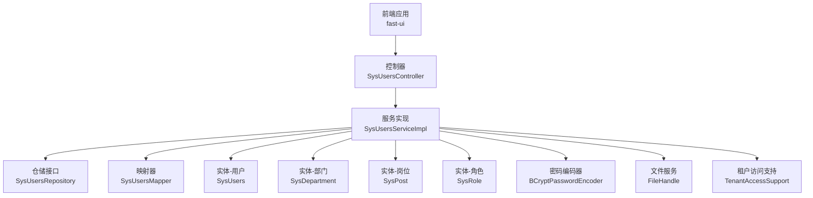
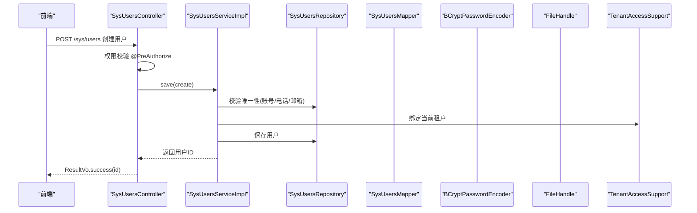
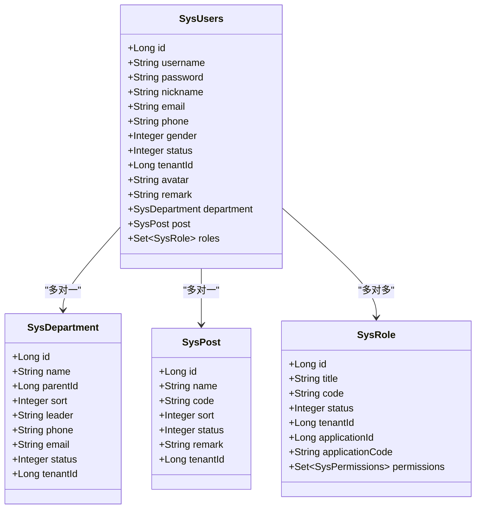
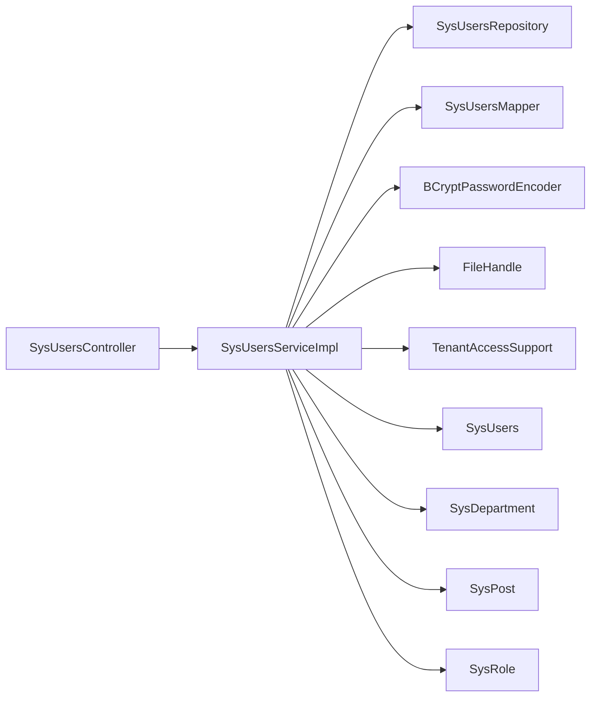

# 用户管理

<cite>
**本文引用的文件**
- [SysUsers.java](file://system-module/src/main/java/com/fastproject/system/domain/SysUsers.java)
- [SysUsersServiceImpl.java](file://system-module/src/main/java/com/fastproject/system/service/impl/SysUsersServiceImpl.java)
- [SysUsersController.java](file://run-admin/src/main/java/com/fastproject/module/system/controller/SysUsersController.java)
- [SysUsersCreate.java](file://system-module/src/main/java/com/fastproject/system/vo/users/SysUsersCreate.java)
- [SysUsersVo.java](file://system-module/src/main/java/com/fastproject/system/vo/users/SysUsersVo.java)
- [SysUsersDetailVo.java](file://system-module/src/main/java/com/fastproject/system/vo/users/SysUsersDetailVo.java)
- [SysUsersQuery.java](file://system-module/src/main/java/com/fastproject/system/vo/users/SysUsersQuery.java)
- [SysUsersMapper.java](file://system-module/src/main/java/com/fastproject/system/mapper/SysUsersMapper.java)
- [SysDepartment.java](file://system-module/src/main/java/com/fastproject/system/domain/SysDepartment.java)
- [SysPost.java](file://system-module/src/main/java/com/fastproject/system/domain/SysPost.java)
- [SysRole.java](file://system-module/src/main/java/com/fastproject/system/domain/SysRole.java)
- [AuthServiceImpl.java](file://run-admin/src/main/java/com/fastproject/module/system/service/impl/AuthServiceImpl.java)
- [sysusers.ts](file://fast-ui/apps/admin-vue/src/api/system/sysusers.ts)
- [AGENTS.md](file://AGENTS.md)
</cite>

## 目录
1. [引言](#引言)
2. [项目结构](#项目结构)
3. [核心组件](#核心组件)
4. [架构总览](#架构总览)
5. [详细组件分析](#详细组件分析)
6. [依赖分析](#依赖分析)
7. [性能考虑](#性能考虑)
8. [故障排查指南](#故障排查指南)
9. [结论](#结论)
10. [附录](#附录)

## 引言
本文件面向“用户管理”功能，系统化梳理用户实体模型设计、用户CRUD操作实现、用户状态管理、用户认证授权机制，以及用户与部门、岗位、角色的关联关系设计。同时覆盖多租户环境下的数据隔离与权限控制策略，提供用户密码管理、用户详情查询、用户列表分页查询等核心能力的API接口文档与安全最佳实践。

## 项目结构
用户管理功能采用“控制器-服务-仓储-映射器-领域模型-VO”的分层架构，遵循统一的CRUD模型组织规范：
- 控制器位于 run-admin 模块，负责暴露REST接口、权限注解与日志注解
- 服务层位于 system-module 模块，承载业务逻辑、唯一性校验、租户校验、状态过滤与多租户绑定
- 领域模型位于 system-module 的 domain 包，对应数据库表，支持逻辑删除与租户范围约束
- VO/DTO 位于 system-module 的 vo 包，按CRUD语义拆分输入输出对象
- 映射器使用 MapStruct 进行实体与VO/DTO转换
- 前端位于 fast-ui，提供API封装与页面交互

图表来源
- [SysUsersController.java](file://run-admin/src/main/java/com/fastproject/module/system/controller/SysUsersController.java#L24-L112)
- [SysUsersServiceImpl.java](file://system-module/src/main/java/com/fastproject/system/service/impl/SysUsersServiceImpl.java#L34-L390)
- [SysUsers.java](file://system-module/src/main/java/com/fastproject/system/domain/SysUsers.java#L15-L95)
- [SysDepartment.java](file://system-module/src/main/java/com/fastproject/system/domain/SysDepartment.java#L12-L60)
- [SysPost.java](file://system-module/src/main/java/com/fastproject/system/domain/SysPost.java#L12-L50)
- [SysRole.java](file://system-module/src/main/java/com/fastproject/system/domain/SysRole.java#L14-L59)

章节来源
- [AGENTS.md](file://AGENTS.md#L313-L380)

## 核心组件
- 用户实体模型：包含账号、密码、昵称、邮箱、电话、性别、状态、租户ID、头像、部门、岗位、角色集合等字段，支持逻辑删除与租户范围约束
- 用户服务实现：提供保存、更新、删除、批量删除、分页查询、详情查询、登录用户查询、用户信息查询、密码重置、个人资料查询与更新、个人密码更新、模糊搜索等能力
- 用户控制器：提供用户创建、更新、删除、批量删除、分页查询、详情查询、密码重置、模糊搜索等REST接口，并集成权限校验与幂等控制
- VO/DTO：包含创建、更新、查询、详情、列表等对象，用于前后端数据传输
- 映射器：将实体与VO/DTO进行转换
- 认证服务：提供登录、验证码、权限路由生成等能力，配合密码加密与令牌工具
- 前端API：封装用户相关请求，支持分页、详情、创建、更新、删除、批量删除、密码更新、搜索等

章节来源
- [SysUsers.java](file://system-module/src/main/java/com/fastproject/system/domain/SysUsers.java#L15-L95)
- [SysUsersServiceImpl.java](file://system-module/src/main/java/com/fastproject/system/service/impl/SysUsersServiceImpl.java#L50-L390)
- [SysUsersController.java](file://run-admin/src/main/java/com/fastproject/module/system/controller/SysUsersController.java#L24-L112)
- [SysUsersCreate.java](file://system-module/src/main/java/com/fastproject/system/vo/users/SysUsersCreate.java#L7-L64)
- [SysUsersVo.java](file://system-module/src/main/java/com/fastproject/system/vo/users/SysUsersVo.java#L10-L63)
- [SysUsersDetailVo.java](file://system-module/src/main/java/com/fastproject/system/vo/users/SysUsersDetailVo.java#L9-L71)
- [SysUsersQuery.java](file://system-module/src/main/java/com/fastproject/system/vo/users/SysUsersQuery.java#L10-L38)
- [SysUsersMapper.java](file://system-module/src/main/java/com/fastproject/system/mapper/SysUsersMapper.java#L14-L30)
- [AuthServiceImpl.java](file://run-admin/src/main/java/com/fastproject/module/system/service/impl/AuthServiceImpl.java#L25-L34)
- [sysusers.ts](file://fast-ui/apps/admin-vue/src/api/system/sysusers.ts#L78-L133)

## 架构总览
用户管理遵循“控制器-服务-仓储-映射器-领域模型”的分层设计，结合多租户访问支持与权限校验，确保数据隔离与操作安全。

图表来源
- [SysUsersController.java](file://run-admin/src/main/java/com/fastproject/module/system/controller/SysUsersController.java#L32-L38)
- [SysUsersServiceImpl.java](file://system-module/src/main/java/com/fastproject/system/service/impl/SysUsersServiceImpl.java#L50-L84)

## 详细组件分析

### 用户实体模型设计
- 字段设计：账号、密码、昵称、邮箱、电话、性别、状态、租户ID、头像、个人简介等
- 关联关系：与部门为多对一；与岗位为多对一；与角色为多对多
- 约束：逻辑删除与租户范围限制，确保查询默认过滤已删除与跨租户数据

图表来源
- [SysUsers.java](file://system-module/src/main/java/com/fastproject/system/domain/SysUsers.java#L15-L95)
- [SysDepartment.java](file://system-module/src/main/java/com/fastproject/system/domain/SysDepartment.java#L12-L60)
- [SysPost.java](file://system-module/src/main/java/com/fastproject/system/domain/SysPost.java#L12-L50)
- [SysRole.java](file://system-module/src/main/java/com/fastproject/system/domain/SysRole.java#L14-L59)

章节来源
- [SysUsers.java](file://system-module/src/main/java/com/fastproject/system/domain/SysUsers.java#L15-L95)

### 用户CRUD操作实现
- 保存用户：校验账号/电话/邮箱唯一性，绑定当前租户，设置角色、部门、岗位，持久化
- 更新用户：校验唯一性，校验租户访问权限，更新角色、部门、岗位，处理头像URL保留逻辑，持久化
- 删除用户：校验租户访问权限，执行删除
- 批量删除：逐个校验租户访问权限，执行批量删除
- 分页查询：基于Specification拼装查询条件，自动注入租户过滤，支持账号、昵称、邮箱、电话、性别过滤
- 详情查询：加载用户及角色，转换头像URL，返回详情VO
- 登录用户查询：根据用户名查询登录用户信息
- 用户信息查询：根据用户ID查询基本信息并转换头像URL
- 密码重置：校验租户访问权限，使用BCrypt加密后保存
- 个人资料查询：返回用户基本信息、部门名称、岗位名称、角色标题列表，转换头像URL
- 个人资料更新：校验手机号与邮箱唯一性，更新个人资料，处理头像ID与URL
- 个人密码更新：校验旧密码正确性，使用BCrypt加密后保存
- 模糊搜索：按账号与昵称模糊匹配，限制返回数量

章节来源
- [SysUsersServiceImpl.java](file://system-module/src/main/java/com/fastproject/system/service/impl/SysUsersServiceImpl.java#L50-L390)

### 用户状态管理
- 用户状态字段用于标识启用/停用等状态，可在查询与展示中作为筛选条件
- 服务层在分页查询与详情查询中均会应用租户范围约束，确保状态变更不影响其他租户

章节来源
- [SysUsers.java](file://system-module/src/main/java/com/fastproject/system/domain/SysUsers.java#L54-L56)
- [SysUsersQuery.java](file://system-module/src/main/java/com/fastproject/system/vo/users/SysUsersQuery.java#L14-L36)

### 用户认证授权机制
- 控制器使用Spring Security注解进行权限校验
- 认证服务实现登录、验证码、权限路由生成，使用BCrypt进行密码加密
- 令牌工具与Redis缓存用于会话与验证码存储

章节来源
- [SysUsersController.java](file://run-admin/src/main/java/com/fastproject/module/system/controller/SysUsersController.java#L33-L101)
- [AuthServiceImpl.java](file://run-admin/src/main/java/com/fastproject/module/system/service/impl/AuthServiceImpl.java#L25-L34)

### 用户与部门、岗位、角色的关联关系设计
- 用户与部门：多对一关联，支持设置或清空部门
- 用户与岗位：多对一关联，支持设置或清空岗位
- 用户与角色：多对多关联，支持设置角色集合，更新时先清空再重新赋值

章节来源
- [SysUsers.java](file://system-module/src/main/java/com/fastproject/system/domain/SysUsers.java#L71-L93)

### 多租户环境下用户数据隔离与权限控制策略
- 实体实现租户范围接口，查询默认应用租户过滤
- 服务层在保存、更新、删除、查询等操作前，通过租户访问支持进行权限校验与范围绑定
- 分页查询与详情查询均自动注入租户过滤条件

章节来源
- [SysUsers.java](file://system-module/src/main/java/com/fastproject/system/domain/SysUsers.java#L21-L21)
- [SysUsersServiceImpl.java](file://system-module/src/main/java/com/fastproject/system/service/impl/SysUsersServiceImpl.java#L205-L222)

### 用户密码管理
- 密码重置：管理员重置指定用户密码，使用BCrypt加密后保存
- 个人密码更新：用户凭旧密码更新个人密码，使用BCrypt校验与加密
- 登录密码校验：认证服务使用BCrypt进行密码匹配

章节来源
- [SysUsersServiceImpl.java](file://system-module/src/main/java/com/fastproject/system/service/impl/SysUsersServiceImpl.java#L280-L289)
- [SysUsersServiceImpl.java](file://system-module/src/main/java/com/fastproject/system/service/impl/SysUsersServiceImpl.java#L355-L366)
- [AuthServiceImpl.java](file://run-admin/src/main/java/com/fastproject/module/system/service/impl/AuthServiceImpl.java#L34-L34)

### 用户详情查询与用户列表分页查询
- 详情查询：返回用户基本信息、部门ID、岗位ID、角色ID列表与角色列表，转换头像URL
- 列表分页：支持账号、昵称、邮箱、电话、性别过滤，自动注入租户过滤，批量转换头像URL

章节来源
- [SysUsersServiceImpl.java](file://system-module/src/main/java/com/fastproject/system/service/impl/SysUsersServiceImpl.java#L155-L246)
- [SysUsersDetailVo.java](file://system-module/src/main/java/com/fastproject/system/vo/users/SysUsersDetailVo.java#L9-L71)
- [SysUsersVo.java](file://system-module/src/main/java/com/fastproject/system/vo/users/SysUsersVo.java#L10-L63)

### API接口文档
以下为用户管理相关接口的请求参数与响应格式说明（以路径、方法、权限点、幂等与日志注解为依据）：

- 创建用户
  - 方法与路径：POST /sys/users
  - 权限点：admin:system:user:add
  - 幂等：是（前缀 add:sys:user:）
  - 日志：业务-新增
  - 请求体：SysUsersCreate
  - 响应：ResultVo<Object>，包含用户ID
  - 前端封装：参考 sysusers.ts 的 createUser

- 更新用户
  - 方法与路径：PUT /sys/users
  - 权限点：admin:system:user:update
  - 幂等：是（前缀 update:sys:user:）
  - 日志：业务-修改
  - 请求体：SysUserUpdate
  - 响应：ResultVo<Object>
  - 前端封装：参考 sysusers.ts 的 updateUser

- 删除用户
  - 方法与路径：DELETE /sys/users/{id}
  - 权限点：admin:system:user:delete
  - 日志：业务-删除
  - 请求参数：id（路径变量）
  - 响应：ResultVo<Object>
  - 前端封装：参考 sysusers.ts 的 deleteUser

- 批量删除用户
  - 方法与路径：DELETE /sys/users/batch
  - 权限点：admin:system:user:delete
  - 日志：业务-删除
  - 请求体：List<Long>（用户ID数组）
  - 响应：ResultVo<Object>
  - 前端封装：参考 sysusers.ts 的 batchDeleteUser

- 分页查询用户
  - 方法与路径：POST /sys/users/page
  - 权限点：admin:system:user:page
  - 请求体：SysUsersQuery（包含分页参数与过滤条件）
  - 响应：ResultVo<PageVo<List<SysUsersVo>>>
  - 前端封装：参考 sysusers.ts 的 getPage

- 获取用户详情
  - 方法与路径：GET /sys/users/{id}
  - 权限点：admin:system:user:page
  - 请求参数：id（路径变量）
  - 响应：ResultVo<SysUsersDetailVo>
  - 前端封装：参考 sysusers.ts 的 getUserById

- 修改用户密码
  - 方法与路径：PUT /sys/users/password
  - 权限点：admin:system:user:update
  - 幂等：是（前缀 update:sys:user:password:）
  - 日志：业务-修改
  - 请求体：SysUserPasswordUpdate
  - 响应：ResultVo<Object>
  - 前端封装：参考 sysusers.ts 的 updateUserPassword

- 搜索用户（关键词）
  - 方法与路径：GET /sys/users/search
  - 请求参数：keyword（查询参数）
  - 响应：ResultVo<List<SysUsersVo>>
  - 前端封装：参考 sysusers.ts 的 searchUsers

章节来源
- [SysUsersController.java](file://run-admin/src/main/java/com/fastproject/module/system/controller/SysUsersController.java#L29-L111)
- [sysusers.ts](file://fast-ui/apps/admin-vue/src/api/system/sysusers.ts#L78-L133)

### 权限验证流程与安全最佳实践
- 权限验证：控制器使用 @PreAuthorize 注解结合权限点进行校验
- 幂等控制：使用 @Idempotent 注解避免重复提交
- 日志审计：使用 @Log 注解记录业务操作类型与动作
- 安全最佳实践：
  - 密码统一使用BCrypt加密存储
  - 头像URL处理：仅当非HTTP开头时才更新头像ID，避免覆盖真实URL
  - 唯一性校验：创建与更新时对账号、电话、邮箱进行唯一性检查
  - 租户隔离：所有读写操作均应用租户过滤与访问校验
  - 输入校验：使用 @Validated 对请求体进行参数校验

章节来源
- [SysUsersController.java](file://run-admin/src/main/java/com/fastproject/module/system/controller/SysUsersController.java#L33-L101)
- [SysUsersServiceImpl.java](file://system-module/src/main/java/com/fastproject/system/service/impl/SysUsersServiceImpl.java#L54-L62)
- [SysUsersServiceImpl.java](file://system-module/src/main/java/com/fastproject/system/service/impl/SysUsersServiceImpl.java#L127-L129)

## 依赖分析
用户管理模块内部依赖清晰，职责分离明确，控制器仅负责接口暴露与权限控制，服务层承担业务逻辑与租户校验，仓储与映射器分别负责数据访问与对象转换。

图表来源
- [SysUsersController.java](file://run-admin/src/main/java/com/fastproject/module/system/controller/SysUsersController.java#L24-L112)
- [SysUsersServiceImpl.java](file://system-module/src/main/java/com/fastproject/system/service/impl/SysUsersServiceImpl.java#L34-L48)

章节来源
- [SysUsersServiceImpl.java](file://system-module/src/main/java/com/fastproject/system/service/impl/SysUsersServiceImpl.java#L34-L48)

## 性能考虑
- 分页查询：合理设置分页大小，避免一次性加载过多数据
- 头像URL批量转换：分页查询时对头像ID进行批量URL转换，减少多次远程调用
- 唯一性校验：在保存与更新时进行唯一性检查，避免后续失败回滚
- 租户过滤：在Specification中统一注入租户过滤条件，避免遗漏导致跨租户数据泄露

## 故障排查指南
- 用户不存在：在更新、删除、详情查询、密码重置等场景下，若用户不存在会抛出业务异常
- 无权操作：在保存、更新、删除、详情查询等场景下，若无租户访问权限会抛出业务异常
- 唯一性冲突：账号、电话、邮箱重复时会抛出业务异常
- 旧密码不正确：个人密码更新时若旧密码不匹配会抛出业务异常
- 头像URL为空：若文件服务无法解析头像ID，将回退为原始头像ID

章节来源
- [SysUsersServiceImpl.java](file://system-module/src/main/java/com/fastproject/system/service/impl/SysUsersServiceImpl.java#L90-L91)
- [SysUsersServiceImpl.java](file://system-module/src/main/java/com/fastproject/system/service/impl/SysUsersServiceImpl.java#L138-L141)
- [SysUsersServiceImpl.java](file://system-module/src/main/java/com/fastproject/system/service/impl/SysUsersServiceImpl.java#L282-L284)
- [SysUsersServiceImpl.java](file://system-module/src/main/java/com/fastproject/system/service/impl/SysUsersServiceImpl.java#L355-L358)
- [SysUsersServiceImpl.java](file://system-module/src/main/java/com/fastproject/system/service/impl/SysUsersServiceImpl.java#L346-L349)

## 结论
用户管理功能通过清晰的分层架构、完善的租户隔离与权限控制、严谨的密码管理与输入校验，实现了高内聚低耦合的用户CRUD能力。结合前端API封装与统一的权限点命名约定，能够快速扩展与维护。

## 附录
- 命名约定与开发顺序：建议遵循项目既定的命名与开发顺序，确保一致性与可维护性
- 新增模型接入：新增模型时需补齐实体、仓储、VO、映射器、服务、控制器与前端API/页面

章节来源
- [AGENTS.md](file://AGENTS.md#L468-L531)