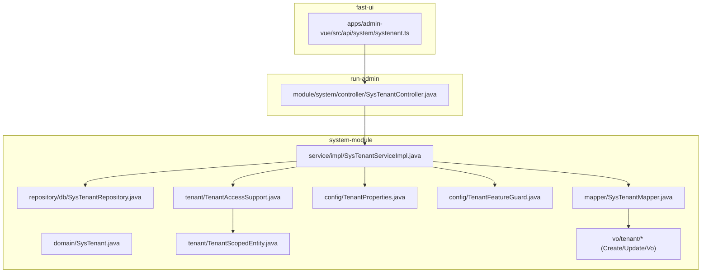
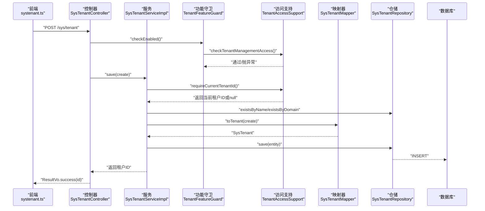
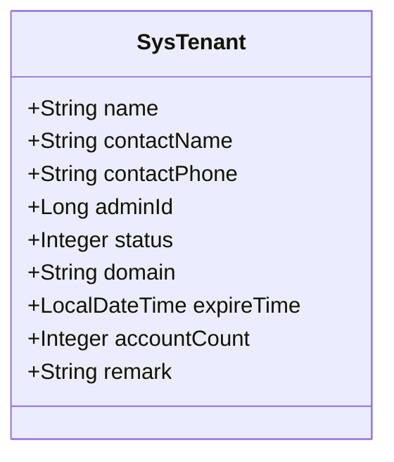
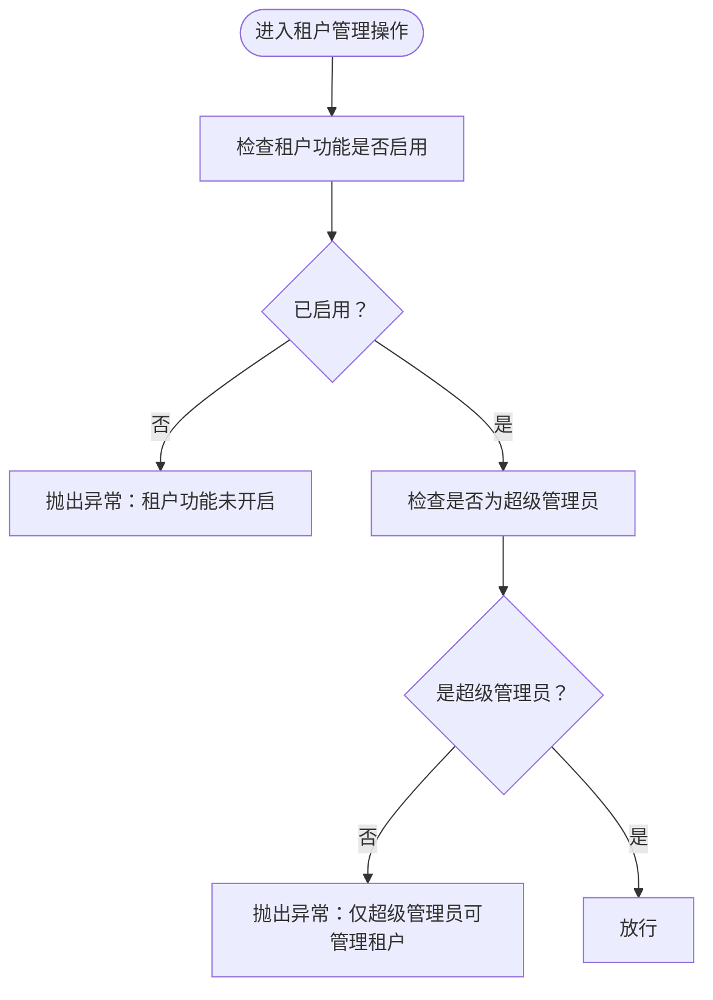
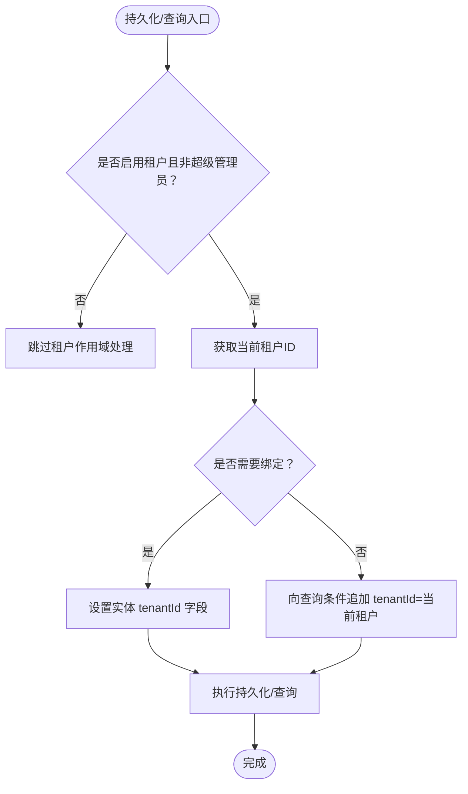
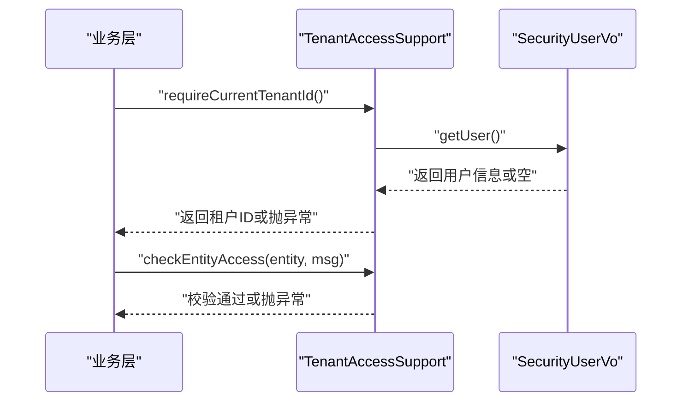
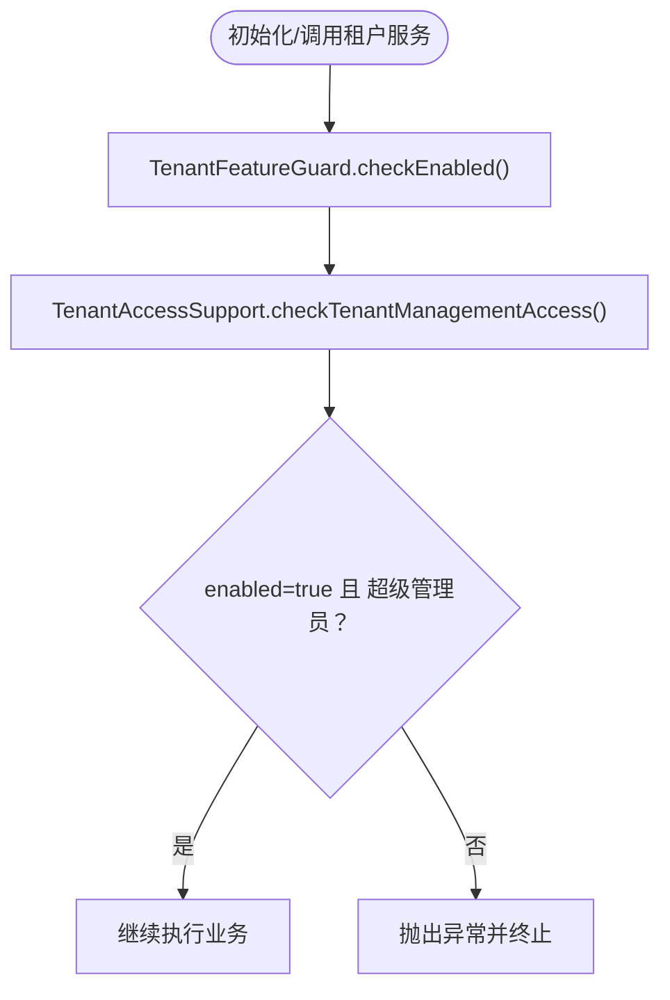
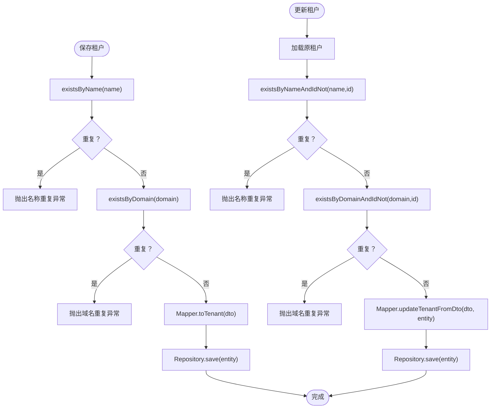
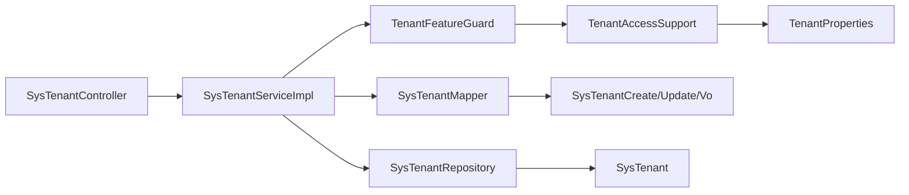

# 租户管理

<cite>
**本文引用的文件**
- [TenantAccessSupport.java](file://system-module/src/main/java/com//fastproject/system/tenant/TenantAccessSupport.java)
- [TenantScopedEntity.java](file://system-module/src/main/java/com//fastproject/system/tenant/TenantScopedEntity.java)
- [TenantProperties.java](file://system-module/src/main/java/com//fastproject/system/config/TenantProperties.java)
- [TenantFeatureGuard.java](file://system-module/src/main/java/com/fastproject/system/config/TenantFeatureGuard.java)
- [SysTenant.java](file://system-module/src/main/java/com/fastproject/system/domain/SysTenant.java)
- [SysTenantServiceImpl.java](file://system-module/src/main/java/com/ fastproject/system/service/impl/SysTenantServiceImpl.java)
- [SysTenantController.java](file://run-admin/src/main/java/com/ fastproject/module/system/controller/SysTenantController.java)
- [SysTenantMapper.java](file://system-module/src/main/java/com/ fastproject/system/mapper/SysTenantMapper.java)
- [SysTenantCreate.java](file://system-module/src/main/java/com/ fastproject/system/vo/tenant/SysTenantCreate.java)
- [SysTenantUpdate.java](file://system-module/src/main/java/com/ fastproject/system/vo/tenant/SysTenantUpdate.java)
- [SysTenantVo.java](file://system-module/src/main/java/com/ fastproject/system/vo/tenant/SysTenantVo.java)
- [SysTenantRepository.java](file://system-module/src/main/java/com/ fastproject/system/repository/db/SysTenantRepository.java)
- [systenant.ts](file://fast-ui/apps/admin-vue/src/api/system/systenant.ts)
</cite>

## 目录
1. [简介](#简介)
2. [项目结构](#项目结构)
3. [核心组件](#核心组件)
4. [架构总览](#架构总览)
5. [详细组件分析](#详细组件分析)
6. [依赖关系分析](#依赖关系分析)
7. [性能考量](#性能考量)
8. [故障排查指南](#故障排查指南)
9. [结论](#结论)
10. [附录：多租户API文档](#附录多租户api文档)

## 简介
本技术文档围绕多租户架构中的“租户管理”能力进行系统化梳理，重点覆盖以下方面：
- 多租户架构设计与数据隔离策略
- 租户配置管理与功能开关
- 租户访问控制与权限校验
- 租户实体模型与租户作用域实体实现
- 租户中间件与数据库连接池管理策略
- 完整的多租户API文档与前端对接说明

通过本文档，读者可以理解从“租户注册、配置更新、访问控制”到“租户间数据完全隔离”的端到端实现路径。

## 项目结构
租户管理功能主要分布在 system-module（后端服务模块）与 run-admin（管理端控制器）以及 fast-ui（前端API调用）中：
- system-module：包含租户领域模型、服务实现、仓储、映射器、配置与守卫、以及VO/DTO定义
- run-admin：提供租户管理的REST接口
- fast-ui：提供前端对租户接口的调用封装

图表来源
- [SysTenantController.java](file://run-admin/src/main/java/com/ fastproject/module/system/controller/SysTenantController.java#L1-L93)
- [SysTenantServiceImpl.java](file://system-module/src/main/java/com/ fastproject/system/service/impl/SysTenantServiceImpl.java#L1-L143)
- [SysTenantRepository.java](file://system-module/src/main/java/com/ fastproject/system/repository/db/SysTenantRepository.java#L1-L33)
- [SysTenantMapper.java](file://system-module/src/main/java/com/ fastproject/system/mapper/SysTenantMapper.java#L1-L50)
- [TenantProperties.java](file://system-module/src/main/java/com/ fastproject/system/config/TenantProperties.java#L1-L22)
- [TenantFeatureGuard.java](file://system-module/src/main/java/com/ fastproject/system/config/TenantFeatureGuard.java#L1-L20)
- [TenantAccessSupport.java](file://system-module/src/main/java/com/ fastproject/system/tenant/TenantAccessSupport.java#L1-L106)
- [TenantScopedEntity.java](file://system-module/src/main/java/com/ fastproject/system/tenant/TenantScopedEntity.java#L1-L12)
- [SysTenantCreate.java](file://system-module/src/main/java/com/ fastproject/system/vo/tenant/SysTenantCreate.java#L1-L56)
- [SysTenantUpdate.java](file://system-module/src/main/java/com/ fastproject/system/vo/tenant/SysTenantUpdate.java#L1-L61)
- [SysTenantVo.java](file://system-module/src/main/java/com/ fastproject/system/vo/tenant/SysTenantVo.java#L1-L66)
- [systenant.ts](file://fast-ui/apps/admin-vue/src/api/system/systenant.ts#L86-L129)

章节来源
- [SysTenantController.java](file://run-admin/src/main/java/com/ fastproject/module/system/controller/SysTenantController.java#L1-L93)
- [SysTenantServiceImpl.java](file://system-module/src/main/java/com/ fastproject/system/service/impl/SysTenantServiceImpl.java#L1-L143)
- [SysTenantRepository.java](file://system-module/src/main/java/com/ fastproject/system/repository/db/SysTenantRepository.java#L1-L33)
- [SysTenantMapper.java](file://system-module/src/main/java/com/ fastproject/system/mapper/SysTenantMapper.java#L1-L50)
- [TenantProperties.java](file://system-module/src/main/java/com/ fastproject/system/config/TenantProperties.java#L1-L22)
- [TenantFeatureGuard.java](file://system-module/src/main/java/com/ fastproject/system/config/TenantFeatureGuard.java#L1-L20)
- [TenantAccessSupport.java](file://system-module/src/main/java/com/ fastproject/system/tenant/TenantAccessSupport.java#L1-L106)
- [TenantScopedEntity.java](file://system-module/src/main/java/com/ fastproject/system/tenant/TenantScopedEntity.java#L1-L12)
- [SysTenantCreate.java](file://system-module/src/main/java/com/ fastproject/system/vo/tenant/SysTenantCreate.java#L1-L56)
- [SysTenantUpdate.java](file://system-module/src/main/java/com/ fastproject/system/vo/tenant/SysTenantUpdate.java#L1-L61)
- [SysTenantVo.java](file://system-module/src/main/java/com/ fastproject/system/vo/tenant/SysTenantVo.java#L1-L66)
- [systenant.ts](file://fast-ui/apps/admin-vue/src/api/system/systenant.ts#L86-L129)

## 核心组件
- 配置与守卫
  - TenantProperties：读取配置 fastproject.tenant.enabled，决定租户功能是否启用
  - TenantFeatureGuard：对外暴露 checkEnabled，统一拦截非管理员或未启用时的租户管理操作
- 访问支持
  - TenantAccessSupport：提供租户ID解析、租户作用域应用、实体访问校验、租户管理权限校验等能力
  - TenantScopedEntity：标记需要参与租户隔离的数据实体，具备 tenantId 的存取能力
- 领域模型与服务
  - SysTenant：租户实体，基于 SQLRestriction 和 SQLDelete 实现软删除与默认过滤
  - SysTenantServiceImpl：租户业务逻辑，包含新增、更新、删除、分页查询、唯一性校验等
  - SysTenantMapper：DTO/VO 与实体之间的映射
  - SysTenantRepository：租户仓储，提供名称/域名唯一性校验与分页查询
- 控制器与前端
  - SysTenantController：提供 REST 接口，配合权限注解与幂等注解
  - systenant.ts：前端封装的租户API调用

章节来源
- [TenantProperties.java](file://system-module/src/main/java/com/ fastproject/system/config/TenantProperties.java#L1-L22)
- [TenantFeatureGuard.java](file://system-module/src/main/java/com/ fastproject/system/config/TenantFeatureGuard.java#L1-L20)
- [TenantAccessSupport.java](file://system-module/src/main/java/com/ fastproject/system/tenant/TenantAccessSupport.java#L1-L106)
- [TenantScopedEntity.java](file://system-module/src/main/java/com/ fastproject/system/tenant/TenantScopedEntity.java#L1-L12)
- [SysTenant.java](file://system-module/src/main/java/com/ fastproject/system/domain/SysTenant.java#L1-L69)
- [SysTenantServiceImpl.java](file://system-module/src/main/java/com/ fastproject/system/service/impl/SysTenantServiceImpl.java#L1-L143)
- [SysTenantMapper.java](file://system-module/src/main/java/com/ fastproject/system/mapper/SysTenantMapper.java#L1-L50)
- [SysTenantRepository.java](file://system-module/src/main/java/com/ fastproject/system/repository/db/SysTenantRepository.java#L1-L33)
- [SysTenantController.java](file://run-admin/src/main/java/com/ fastproject/module/system/controller/SysTenantController.java#L1-L93)
- [systenant.ts](file://fast-ui/apps/admin-vue/src/api/system/systenant.ts#L86-L129)

## 架构总览
下图展示了从HTTP请求到数据库写入的完整链路，以及租户功能开关、访问控制与实体隔离的关键节点：

图表来源
- [SysTenantController.java](file://run-admin/src/main/java/com/ fastproject/module/system/controller/SysTenantController.java#L33-L39)
- [SysTenantServiceImpl.java](file://system-module/src/main/java/com/ fastproject/system/service/impl/SysTenantServiceImpl.java#L44-L62)
- [TenantFeatureGuard.java](file://system-module/src/main/java/com/ fastproject/system/config/TenantFeatureGuard.java#L16-L18)
- [TenantAccessSupport.java](file://system-module/src/main/java/com/ fastproject/system/tenant/TenantAccessSupport.java#L55-L64)
- [SysTenantMapper.java](file://system-module/src/main/java/com/ fastproject/system/mapper/SysTenantMapper.java#L35-L36)
- [SysTenantRepository.java](file://system-module/src/main/java/com/ fastproject/system/repository/db/SysTenantRepository.java#L14-L21)

## 详细组件分析

### 组件一：租户实体模型设计
- SysTenant：继承基础实体，使用 SQLRestriction 与 SQLDelete 实现软删除与默认过滤；字段覆盖租户名称、联系人、管理员ID、状态、域名、过期时间、账号额度、备注等
- 作用：作为租户维度的核心数据载体，贯穿于创建、查询、更新、删除等全生命周期

图表来源
- [SysTenant.java](file://system-module/src/main/java/com/ fastproject/system/domain/SysTenant.java#L22-L68)

章节来源
- [SysTenant.java](file://system-module/src/main/java/com/ fastproject/system/domain/SysTenant.java#L1-L69)

### 组件二：租户特征守卫机制
- TenantFeatureGuard：对外提供 checkEnabled，内部委托 TenantAccessSupport 执行租户管理权限校验
- TenantAccessSupport.checkTenantManagementAccess：当租户功能未启用或当前用户非超级管理员时，抛出业务异常

图表来源
- [TenantFeatureGuard.java](file://system-module/src/main/java/com/ fastproject/system/config/TenantFeatureGuard.java#L16-L18)
- [TenantAccessSupport.java](file://system-module/src/main/java/com/ fastproject/system/tenant/TenantAccessSupport.java#L97-L104)

章节来源
- [TenantFeatureGuard.java](file://system-module/src/main/java/com/ fastproject/system/config/TenantFeatureGuard.java#L1-L20)
- [TenantAccessSupport.java](file://system-module/src/main/java/com/ fastproject/system/tenant/TenantAccessSupport.java#L1-L106)

### 组件三：租户作用域实体实现
- TenantScopedEntity：定义实体需具备的 tenantId 存取能力
- TenantAccessSupport.applyTenantPredicate：在JPA Specification中动态追加 tenantId 条件，确保查询自动带入当前租户作用域
- TenantAccessSupport.bindCurrentTenant：在持久化前为实体绑定当前租户ID，保证数据写入时具备租户上下文

图表来源
- [TenantAccessSupport.java](file://system-module/src/main/java/com/ fastproject/system/tenant/TenantAccessSupport.java#L37-L78)
- [TenantScopedEntity.java](file://system-module/src/main/java/com/ fastproject/system/tenant/TenantScopedEntity.java#L6-L11)

章节来源
- [TenantAccessSupport.java](file://system-module/src/main/java/com/ fastproject/system/tenant/TenantAccessSupport.java#L1-L106)
- [TenantScopedEntity.java](file://system-module/src/main/java/com/ fastproject/system/tenant/TenantScopedEntity.java#L1-L12)

### 组件四：租户访问控制策略
- 当前租户ID解析：优先从登录用户上下文中解析，若为空则回退到用户扩展信息中的租户ID
- 访问校验：针对目标租户ID或实体 tenantId 进行比对，不一致则抛出业务异常
- 超级管理员豁免：ID为1的超级管理员不受租户作用域限制

图表来源
- [TenantAccessSupport.java](file://system-module/src/main/java/com/ fastproject/system/tenant/TenantAccessSupport.java#L41-L95)

章节来源
- [TenantAccessSupport.java](file://system-module/src/main/java/com/ fastproject/system/tenant/TenantAccessSupport.java#L1-L106)

### 组件五：租户配置管理与功能开关
- TenantProperties：读取 fastproject.tenant.enabled，作为全局开关
- SysTenantServiceImpl：所有租户管理操作均前置 checkEnabled，确保功能未开启时无法进行任何租户操作

图表来源
- [TenantProperties.java](file://system-module/src/main/java/com/ fastproject/system/config/TenantProperties.java#L14-L21)
- [TenantFeatureGuard.java](file://system-module/src/main/java/com/ fastproject/system/config/TenantFeatureGuard.java#L16-L18)
- [SysTenantServiceImpl.java](file://system-module/src/main/java/com/ fastproject/system/service/impl/SysTenantServiceImpl.java#L46-L47)

章节来源
- [TenantProperties.java](file://system-module/src/main/java/com/ fastproject/system/config/TenantProperties.java#L1-L22)
- [TenantFeatureGuard.java](file://system-module/src/main/java/com/ fastproject/system/config/TenantFeatureGuard.java#L1-L20)
- [SysTenantServiceImpl.java](file://system-module/src/main/java/com/ fastproject/system/service/impl/SysTenantServiceImpl.java#L1-L143)

### 组件六：租户服务与仓储
- 唯一性约束：新增/更新时分别校验名称与域名的唯一性，并在更新时排除自身ID
- 分页查询：基于 Specification 动态拼接 like/等值条件，支持按名称、联系人、域名、状态筛选
- 映射转换：使用 MapStruct 将 DTO/VO 与实体互转，忽略空值以避免误清空字段

图表来源
- [SysTenantServiceImpl.java](file://system-module/src/main/java/com/ fastproject/system/service/impl/SysTenantServiceImpl.java#L49-L84)
- [SysTenantRepository.java](file://system-module/src/main/java/com/ fastproject/system/repository/db/SysTenantRepository.java#L14-L31)
- [SysTenantMapper.java](file://system-module/src/main/java/com/ fastproject/system/mapper/SysTenantMapper.java#L28-L36)

章节来源
- [SysTenantServiceImpl.java](file://system-module/src/main/java/com/ fastproject/system/service/impl/SysTenantServiceImpl.java#L1-L143)
- [SysTenantRepository.java](file://system-module/src/main/java/com/ fastproject/system/repository/db/SysTenantRepository.java#L1-L33)
- [SysTenantMapper.java](file://system-module/src/main/java/com/ fastproject/system/mapper/SysTenantMapper.java#L1-L50)

### 组件七：租户中间件与数据库连接池管理策略
- 中间件层面：通过 TenantAccessSupport 在业务层注入租户上下文，结合 Spring Security 注解实现权限拦截
- 数据库连接池：建议在多租户场景下采用“按租户隔离”的连接池策略（例如按租户ID路由至独立数据源或连接池），以实现资源隔离与性能优化。当前代码未直接体现连接池实现细节，但可通过 DataSource/EntityManagerFactory 的租户路由扩展点接入

章节来源
- [TenantAccessSupport.java](file://system-module/src/main/java/com/ fastproject/system/tenant/TenantAccessSupport.java#L1-L106)

## 依赖关系分析
- 控制器依赖服务，服务依赖仓储、映射器、配置守卫与访问支持
- 访问支持依赖配置属性与令牌工具，用于解析当前用户与租户上下文
- 实体与仓储共同构成数据层，映射器负责数据传输对象转换

图表来源
- [SysTenantController.java](file://run-admin/src/main/java/com/ fastproject/module/system/controller/SysTenantController.java#L28-L28)
- [SysTenantServiceImpl.java](file://system-module/src/main/java/com/ fastproject/system/service/impl/SysTenantServiceImpl.java#L38-L41)
- [SysTenantRepository.java](file://system-module/src/main/java/com/ fastproject/system/repository/db/SysTenantRepository.java#L12-L12)
- [SysTenantMapper.java](file://system-module/src/main/java/com/ fastproject/system/mapper/SysTenantMapper.java#L23-L23)
- [TenantFeatureGuard.java](file://system-module/src/main/java/com/ fastproject/system/config/TenantFeatureGuard.java#L14-L14)
- [TenantAccessSupport.java](file://system-module/src/main/java/com/ fastproject/system/tenant/TenantAccessSupport.java#L25-L26)
- [TenantProperties.java](file://system-module/src/main/java/com/ fastproject/system/config/TenantProperties.java#L14-L14)
- [SysTenantCreate.java](file://system-module/src/main/java/com/ fastproject/system/vo/tenant/SysTenantCreate.java#L9-L9)
- [SysTenantUpdate.java](file://system-module/src/main/java/com/ fastproject/system/vo/tenant/SysTenantUpdate.java#L9-L9)
- [SysTenantVo.java](file://system-module/src/main/java/com/ fastproject/system/vo/tenant/SysTenantVo.java#L9-L9)

章节来源
- [SysTenantController.java](file://run-admin/src/main/java/com/ fastproject/module/system/controller/SysTenantController.java#L1-L93)
- [SysTenantServiceImpl.java](file://system-module/src/main/java/com/ fastproject/system/service/impl/SysTenantServiceImpl.java#L1-L143)
- [SysTenantRepository.java](file://system-module/src/main/java/com/ fastproject/system/repository/db/SysTenantRepository.java#L1-L33)
- [SysTenantMapper.java](file://system-module/src/main/java/com/ fastproject/system/mapper/SysTenantMapper.java#L1-L50)
- [TenantFeatureGuard.java](file://system-module/src/main/java/com/ fastproject/system/config/TenantFeatureGuard.java#L1-L20)
- [TenantAccessSupport.java](file://system-module/src/main/java/com/ fastproject/system/tenant/TenantAccessSupport.java#L1-L106)
- [TenantProperties.java](file://system-module/src/main/java/com/ fastproject/system/config/TenantProperties.java#L1-L22)
- [SysTenantCreate.java](file://system-module/src/main/java/com/ fastproject/system/vo/tenant/SysTenantCreate.java#L1-L56)
- [SysTenantUpdate.java](file://system-module/src/main/java/com/ fastproject/system/vo/tenant/SysTenantUpdate.java#L1-L61)
- [SysTenantVo.java](file://system-module/src/main/java/com/ fastproject/system/vo/tenant/SysTenantVo.java#L1-L66)

## 性能考量
- 查询性能：通过 applyTenantPredicate 自动追加租户过滤条件，避免全表扫描；建议在 tenantId 上建立索引
- 写入性能：Mapper 使用 NullValuePropertyMappingStrategy.IGNORE，减少不必要的字段更新
- 幂等性：控制器使用幂等注解，降低重复提交带来的写入压力
- 连接池策略：建议按租户维度路由至独立数据源或连接池，避免跨租户争用

## 故障排查指南
- “租户功能未开启”：确认配置 fastproject.tenant.enabled=true，否则 TenantAccessSupport 将拒绝租户管理操作
- “当前用户未绑定租户”：登录用户上下文缺少租户ID，需先完成租户绑定流程
- “无权访问当前租户数据”：尝试访问其他租户数据，被访问支持校验拦截
- “租户名称/域名重复”：新增或更新时触发唯一性校验，需调整名称或域名

章节来源
- [TenantAccessSupport.java](file://system-module/src/main/java/com/ fastproject/system/tenant/TenantAccessSupport.java#L55-L104)
- [SysTenantServiceImpl.java](file://system-module/src/main/java/com/ fastproject/system/service/impl/SysTenantServiceImpl.java#L49-L84)

## 结论
该租户管理方案通过“配置守卫 + 访问支持 + 作用域实体 + 仓储约束”的组合，实现了：
- 功能开关可控、权限边界清晰
- 租户间数据完全隔离、查询自动带入租户上下文
- 新增/更新/删除/分页查询等核心能力完备
- 前后端协作明确，具备良好的扩展性与维护性

## 附录：多租户API文档

- 接口：创建租户
  - 方法：POST
  - 路径：/sys/tenant
  - 权限：admin:system:tenant:add
  - 请求体：SysTenantCreate
  - 返回：ResultVo<Long>
  - 前端调用：createTenant(data, requestId)

- 接口：更新租户
  - 方法：PUT
  - 路径：/sys/tenant
  - 权限：admin:system:tenant:update
  - 请求体：SysTenantUpdate
  - 返回：ResultVo<Void>
  - 前端调用：updateTenant(data, requestId)

- 接口：删除租户
  - 方法：DELETE
  - 路径：/sys/tenant/{id}
  - 权限：admin:system:tenant:delete
  - 返回：ResultVo<Void>

- 接口：批量删除租户
  - 方法：DELETE
  - 路径：/sys/tenant/batch
  - 权限：admin:system:tenant:delete
  - 请求体：number[]
  - 返回：ResultVo<Void>

- 接口：分页查询租户
  - 方法：POST
  - 路径：/sys/tenant/page
  - 权限：admin:system:tenant:page
  - 请求体：SysTenantQuery
  - 返回：ResultVo<PageVo<SysTenantVo>>

- 接口：获取租户详情
  - 方法：GET
  - 路径：/sys/tenant/{id}
  - 权限：admin:system:tenant:page
  - 返回：ResultVo<SysTenantVo>

章节来源
- [SysTenantController.java](file://run-admin/src/main/java/com/ fastproject/module/system/controller/SysTenantController.java#L33-L91)
- [systenant.ts](file://fast-ui/apps/admin-vue/src/api/system/systenant.ts#L86-L129)