# 系统管理模块

<cite>
**本文引用的文件**
- [SysUsers.java](file://system-module/src/main/java/com/fastproject/system/domain/SysUsers.java)
- [SysRole.java](file://system-module/src/main/java/com/fastproject/system/domain/SysRole.java)
- [SysDepartment.java](file://system-module/src/main/java/com/fastproject/system/domain/SysDepartment.java)
- [SysPost.java](file://system-module/src/main/java/com/fastproject/system/domain/SysPost.java)
- [SysTenant.java](file://system-module/src/main/java/com/fastproject/system/domain/SysTenant.java)
- [SysPermissions.java](file://system-module/src/main/java/com/fastproject/system/domain/SysPermissions.java)
- [SysDictType.java](file://system-module/src/main/java/com/fastproject/system/domain/SysDictType.java)
- [SysDictData.java](file://system-module/src/main/java/com/fastproject/system/domain/SysDictData.java)
- [SysConfig.java](file://system-module/src/main/java/com/fastproject/system/domain/SysConfig.java)
- [BaseEntity.java](file://common/src/main/java/com/fastproject/db/BaseEntity.java)
- [TenantScopedEntity.java](file://system-module/src/main/java/com/fastproject/system/tenant/TenantScopedEntity.java)
- [TenantAccessSupport.java](file://system-module/src/main/java/com/fastproject/system/tenant/TenantAccessSupport.java)
- [SysUsersServiceImpl.java](file://system-module/src/main/java/com/fastproject/system/service/impl/SysUsersServiceImpl.java)
- [SysRoleServiceImpl.java](file://system-module/src/main/java/com/fastproject/system/service/impl/SysRoleServiceImpl.java)
</cite>

## 目录
1. [引言](#引言)
2. [项目结构](#项目结构)
3. [核心组件](#核心组件)
4. [架构总览](#架构总览)
5. [详细组件分析](#详细组件分析)
6. [依赖关系分析](#依赖关系分析)
7. [性能考虑](#性能考虑)
8. [故障排查指南](#故障排查指南)
9. [结论](#结论)
10. [附录](#附录)

## 引言
本技术文档聚焦系统管理模块，围绕用户管理、角色权限管理、部门岗位管理、租户管理、字典配置管理等核心能力，系统阐述实体模型设计、服务层接口与实现、数据访问层策略以及业务逻辑处理。同时，深入解析多租户架构下的数据隔离机制与权限控制策略，覆盖用户认证授权流程、菜单权限动态加载、操作日志记录等关键特性，并提供完整的API接口说明、配置参数与使用示例，以及模块间依赖关系与扩展点设计。

## 项目结构
系统管理模块位于 system-module 工程内，采用领域驱动的分层组织方式：
- domain 层：定义核心实体模型，统一继承 BaseEntity 并通过注解实现软删除与租户隔离。
- tenant 层：提供多租户访问控制支持，包括租户ID解析、断言与谓词注入。
- service 层：实现业务逻辑，如用户、角色、部门、岗位、租户、字典、配置等的增删改查与校验。
- repository 层：基于 Spring Data JPA 的仓储接口，配合 Specification 实现动态查询。
- mapper 层：负责实体与 VO/DTO 的映射转换（在具体实现类中体现）。
- common：公共基础类，如 BaseEntity 提供通用主键、审计字段与雪花ID监听器。

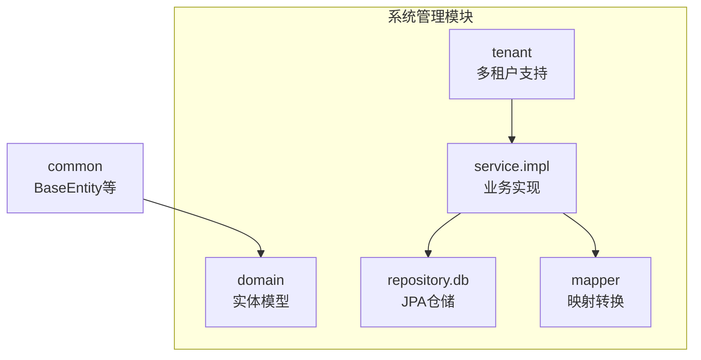

**图表来源**
- [SysUsers.java](file://system-module/src/main/java/com/fastproject/system/domain/SysUsers.java#L1-L95)
- [BaseEntity.java](file://common/src/main/java/com/fastproject/db/BaseEntity.java#L1-L48)
- [TenantAccessSupport.java](file://system-module/src/main/java/com/fastproject/system/tenant/TenantAccessSupport.java#L1-L106)
- [SysUsersServiceImpl.java](file://system-module/src/main/java/com/fastproject/system/service/impl/SysUsersServiceImpl.java#L1-L390)

**章节来源**
- [SysUsers.java](file://system-module/src/main/java/com/fastproject/system/domain/SysUsers.java#L1-L95)
- [SysRole.java](file://system-module/src/main/java/com/fastproject/system/domain/SysRole.java#L1-L59)
- [SysDepartment.java](file://system-module/src/main/java/com/fastproject/system/domain/SysDepartment.java#L1-L60)
- [SysPost.java](file://system-module/src/main/java/com/fastproject/system/domain/SysPost.java#L1-L50)
- [SysTenant.java](file://system-module/src/main/java/com/fastproject/system/domain/SysTenant.java#L1-L69)
- [SysPermissions.java](file://system-module/src/main/java/com/fastproject/system/domain/SysPermissions.java#L1-L78)
- [SysDictType.java](file://system-module/src/main/java/com/fastproject/system/domain/SysDictType.java#L1-L42)
- [SysDictData.java](file://system-module/src/main/java/com/fastproject/system/domain/SysDictData.java#L1-L52)
- [SysConfig.java](file://system-module/src/main/java/com/fastproject/system/domain/SysConfig.java#L1-L52)
- [BaseEntity.java](file://common/src/main/java/com/fastproject/db/BaseEntity.java#L1-L48)

## 核心组件
- 用户管理：支持用户注册、登录、个人信息维护、密码修改、头像上传与URL转换、角色与部门/岗位关联、分页查询与条件过滤。
- 角色权限管理：支持角色的新增、编辑、删除、批量删除、分页查询；角色与权限集合的绑定。
- 部门岗位管理：支持部门与岗位的树形结构、状态管理、父子关系、排序与查询。
- 租户管理：支持租户的创建、更新、查询、状态与域名管理、过期时间与配额控制。
- 字典配置管理：支持字典类型与字典数据的增删改查、按类型查询、状态与排序管理。
- 多租户隔离：通过 TenantScopedEntity 接口与 TenantAccessSupport 辅助类，在实体层面与查询层面实施租户隔离与权限校验。

**章节来源**
- [SysUsersServiceImpl.java](file://system-module/src/main/java/com/fastproject/system/service/impl/SysUsersServiceImpl.java#L50-L390)
- [SysRoleServiceImpl.java](file://system-module/src/main/java/com/fastproject/system/service/impl/SysRoleServiceImpl.java#L65-L185)
- [TenantAccessSupport.java](file://system-module/src/main/java/com/fastproject/system/tenant/TenantAccessSupport.java#L66-L104)

## 架构总览
系统管理模块遵循分层架构与领域建模原则：
- 实体层：所有业务实体继承 BaseEntity，具备统一的审计字段与软删除能力；部分实体实现 TenantScopedEntity 接口以参与多租户隔离。
- 服务层：面向用例编排，负责参数校验、业务规则、事务边界与跨仓储协调。
- 数据访问层：基于 JPA Specification 动态拼接查询条件，结合 TenantAccessSupport 注入租户谓词。
- 多租户控制：在保存、更新、删除、查询、访问校验等关键路径上统一应用租户ID断言与过滤。

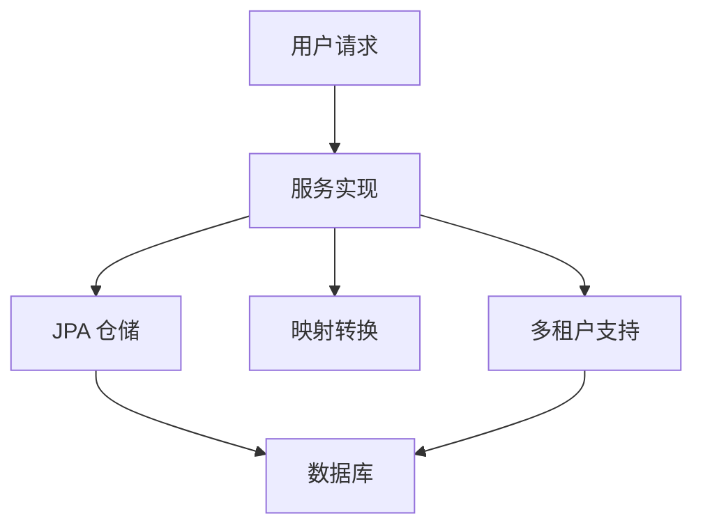

**图表来源**
- [SysUsersServiceImpl.java](file://system-module/src/main/java/com/fastproject/system/service/impl/SysUsersServiceImpl.java#L196-L246)
- [SysRoleServiceImpl.java](file://system-module/src/main/java/com/fastproject/system/service/impl/SysRoleServiceImpl.java#L159-L183)
- [TenantAccessSupport.java](file://system-module/src/main/java/com/fastproject/system/tenant/TenantAccessSupport.java#L66-L78)

## 详细组件分析

### 用户管理组件分析
用户管理围绕 SysUsers 实体展开，涵盖用户基本信息、角色集合、部门与岗位关联、头像URL转换、密码加密与安全处理等。

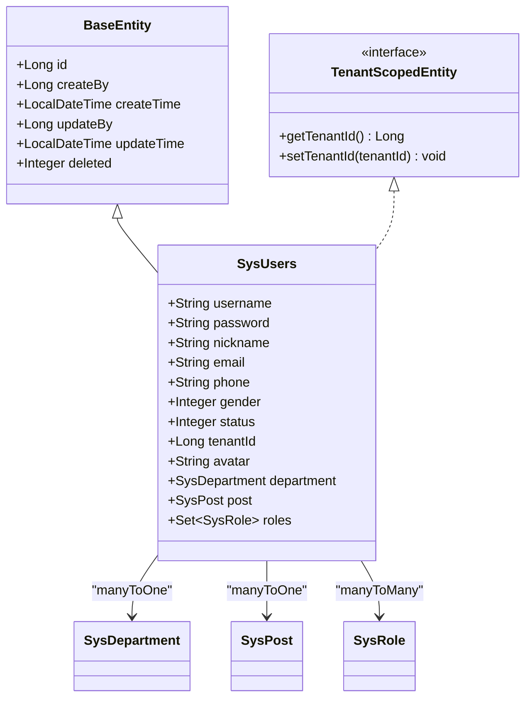

**图表来源**
- [SysUsers.java](file://system-module/src/main/java/com/fastproject/system/domain/SysUsers.java#L15-L95)
- [SysDepartment.java](file://system-module/src/main/java/com/fastproject/system/domain/SysDepartment.java#L12-L60)
- [SysPost.java](file://system-module/src/main/java/com/fastproject/system/domain/SysPost.java#L12-L50)
- [SysRole.java](file://system-module/src/main/java/com/fastproject/system/domain/SysRole.java#L14-L59)
- [BaseEntity.java](file://common/src/main/java/com/fastproject/db/BaseEntity.java#L14-L47)
- [TenantScopedEntity.java](file://system-module/src/main/java/com/fastproject/system/tenant/TenantScopedEntity.java#L6-L11)

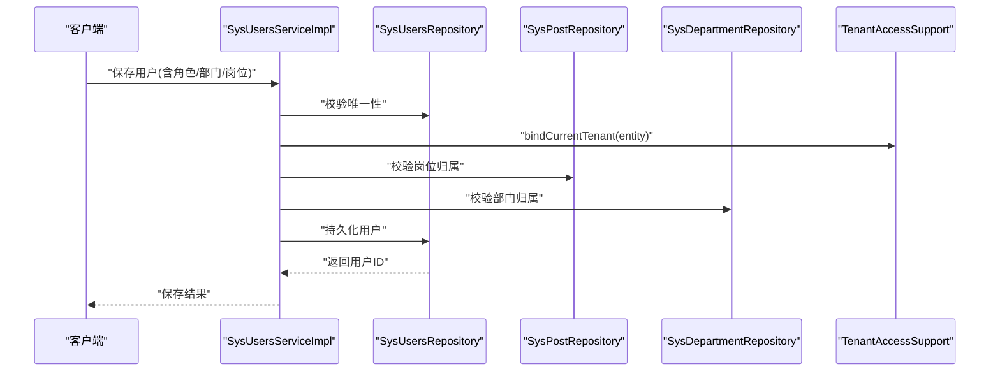

**图表来源**
- [SysUsersServiceImpl.java](file://system-module/src/main/java/com/fastproject/system/service/impl/SysUsersServiceImpl.java#L52-L84)

**章节来源**
- [SysUsersServiceImpl.java](file://system-module/src/main/java/com/fastproject/system/service/impl/SysUsersServiceImpl.java#L50-L390)
- [SysUsers.java](file://system-module/src/main/java/com/fastproject/system/domain/SysUsers.java#L15-L95)

### 角色权限管理组件分析
角色管理围绕 SysRole 实体展开，支持角色与权限集合的绑定、状态筛选与分页查询。

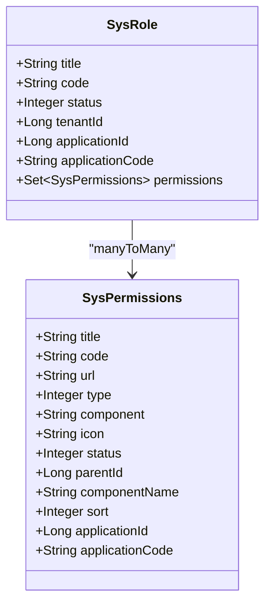

**图表来源**
- [SysRole.java](file://system-module/src/main/java/com/fastproject/system/domain/SysRole.java#L14-L59)
- [SysPermissions.java](file://system-module/src/main/java/com/fastproject/system/domain/SysPermissions.java#L11-L78)

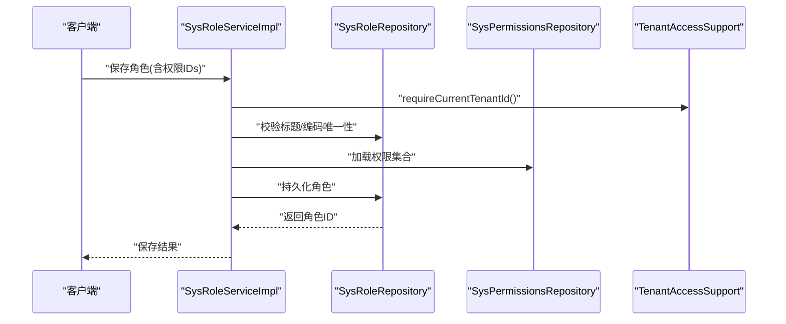

**图表来源**
- [SysRoleServiceImpl.java](file://system-module/src/main/java/com/fastproject/system/service/impl/SysRoleServiceImpl.java#L67-L88)

**章节来源**
- [SysRoleServiceImpl.java](file://system-module/src/main/java/com/fastproject/system/service/impl/SysRoleServiceImpl.java#L65-L185)
- [SysRole.java](file://system-module/src/main/java/com/fastproject/system/domain/SysRole.java#L14-L59)

### 部门岗位管理组件分析
部门与岗位实体均继承 BaseEntity 并实现 TenantScopedEntity，支持状态、排序、父子关系与租户隔离。

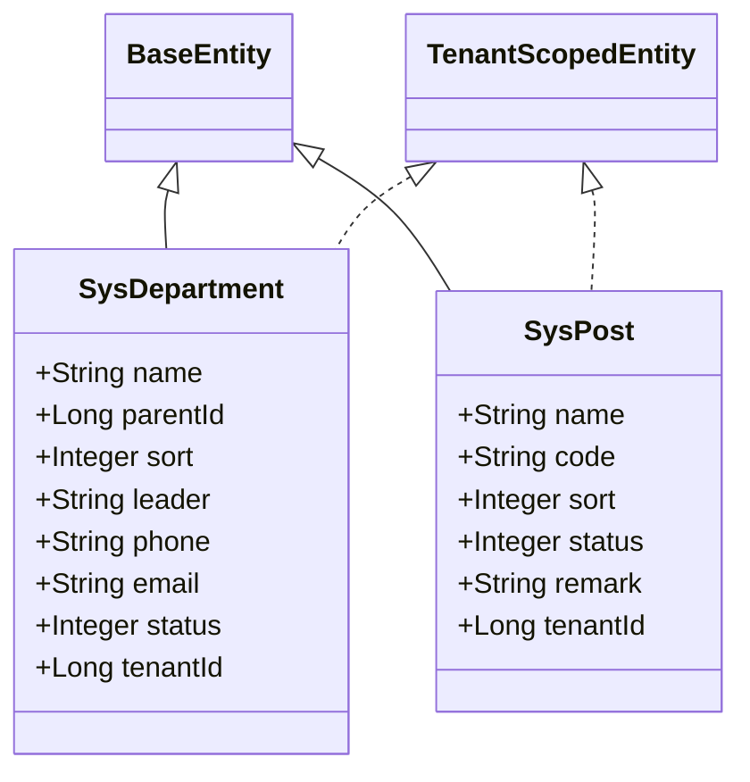

**图表来源**
- [SysDepartment.java](file://system-module/src/main/java/com/fastproject/system/domain/SysDepartment.java#L12-L60)
- [SysPost.java](file://system-module/src/main/java/com/fastproject/system/domain/SysPost.java#L12-L50)
- [BaseEntity.java](file://common/src/main/java/com/fastproject/db/BaseEntity.java#L14-L47)
- [TenantScopedEntity.java](file://system-module/src/main/java/com/fastproject/system/tenant/TenantScopedEntity.java#L6-L11)

**章节来源**
- [SysDepartment.java](file://system-module/src/main/java/com/fastproject/system/domain/SysDepartment.java#L12-L60)
- [SysPost.java](file://system-module/src/main/java/com/fastproject/system/domain/SysPost.java#L12-L50)

### 租户管理组件分析
租户实体 SysTenant 不直接实现 TenantScopedEntity，但通过 TenantAccessSupport 在业务层进行租户功能开关、超级管理员校验与租户ID断言。

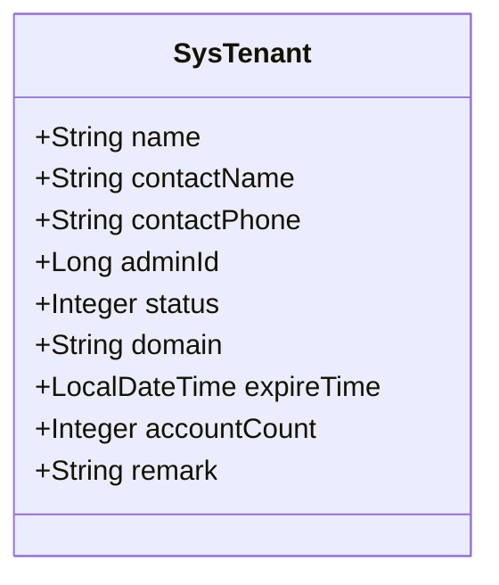

**图表来源**
- [SysTenant.java](file://system-module/src/main/java/com/fastproject/system/domain/SysTenant.java#L16-L69)

**章节来源**
- [SysTenant.java](file://system-module/src/main/java/com/fastproject/system/domain/SysTenant.java#L16-L69)
- [TenantAccessSupport.java](file://system-module/src/main/java/com/fastproject/system/tenant/TenantAccessSupport.java#L97-L104)

### 字典配置管理组件分析
字典类型与字典数据用于系统配置与下拉选择，支持状态与排序管理。

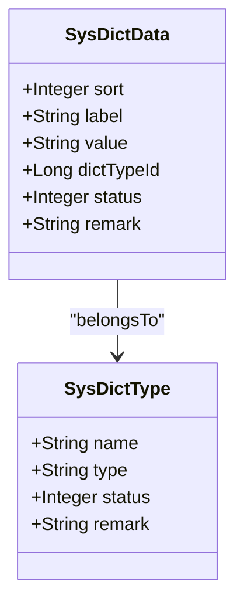

**图表来源**
- [SysDictType.java](file://system-module/src/main/java/com/fastproject/system/domain/SysDictType.java#L14-L42)
- [SysDictData.java](file://system-module/src/main/java/com/fastproject/system/domain/SysDictData.java#L14-L52)

**章节来源**
- [SysDictType.java](file://system-module/src/main/java/com/fastproject/system/domain/SysDictType.java#L14-L42)
- [SysDictData.java](file://system-module/src/main/java/com/fastproject/system/domain/SysDictData.java#L14-L52)

### 多租户架构与权限控制
多租户通过以下机制实现：
- 实体标记：实现 TenantScopedEntity 的实体在保存时自动绑定当前租户ID。
- 查询注入：在 Specification 中动态添加 tenantId = 当前租户 的谓词。
- 访问校验：在读取/更新/删除前校验目标实体是否属于当前租户。
- 功能开关：仅当租户功能启用且非超级管理员时才强制应用租户范围。

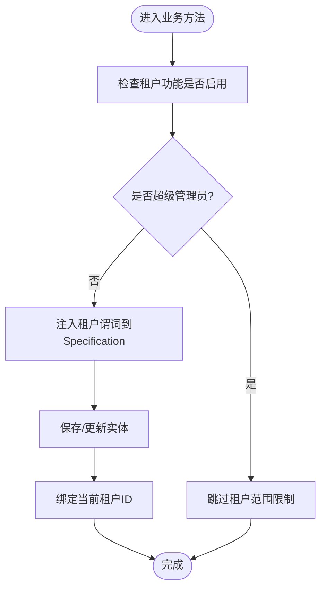

**图表来源**
- [TenantAccessSupport.java](file://system-module/src/main/java/com/fastproject/system/tenant/TenantAccessSupport.java#L28-L78)

**章节来源**
- [TenantScopedEntity.java](file://system-module/src/main/java/com/fastproject/system/tenant/TenantScopedEntity.java#L6-L11)
- [TenantAccessSupport.java](file://system-module/src/main/java/com/fastproject/system/tenant/TenantAccessSupport.java#L66-L104)

## 依赖关系分析
系统管理模块内部依赖清晰，职责分离明确：
- 服务实现依赖仓储接口与映射器，确保业务逻辑与数据访问解耦。
- 多租户支持贯穿服务层关键路径，避免在各业务方法重复实现。
- 实体统一继承 BaseEntity，减少重复代码并保证审计字段一致性。

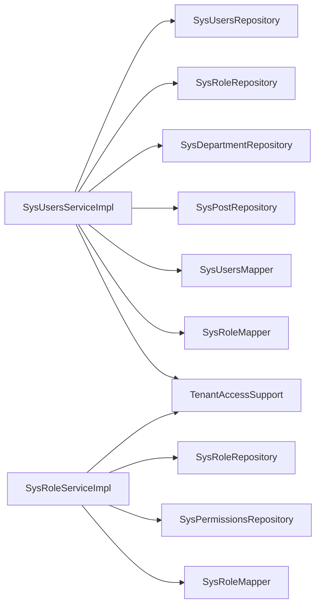

**图表来源**
- [SysUsersServiceImpl.java](file://system-module/src/main/java/com/fastproject/system/service/impl/SysUsersServiceImpl.java#L39-L48)
- [SysRoleServiceImpl.java](file://system-module/src/main/java/com/fastproject/system/service/impl/SysRoleServiceImpl.java#L45-L49)

**章节来源**
- [SysUsersServiceImpl.java](file://system-module/src/main/java/com/fastproject/system/service/impl/SysUsersServiceImpl.java#L39-L48)
- [SysRoleServiceImpl.java](file://system-module/src/main/java/com/fastproject/system/service/impl/SysRoleServiceImpl.java#L45-L49)

## 性能考虑
- 分页查询：服务层统一使用 PageRequest 指定排序与分页，避免一次性加载全量数据。
- 动态查询：通过 Specification 组合条件，减少冗余SQL与不必要的连接。
- 批量处理：批量删除与批量头像URL转换采用集合操作，降低IO次数。
- 缓存友好：建议在网关或前端对菜单权限与用户信息进行缓存，减少后端压力。
- 审计字段：BaseEntity 统一记录创建/更新人与时间，便于追踪与性能分析。

## 故障排查指南
- 无权访问当前租户数据：检查当前用户是否绑定租户ID，确认租户功能是否启用。
- 角色/部门/岗位不属于当前租户：在保存/更新用户时，确保传入的关联ID属于当前租户。
- 账号/电话/邮箱重复：保存/更新用户前会进行唯一性校验，需清理冲突数据。
- 密码修改失败：旧密码不匹配会导致业务异常，需核对输入。
- 头像URL为空：若文件ID无效或存储服务不可用，将回退为原始ID。

**章节来源**
- [TenantAccessSupport.java](file://system-module/src/main/java/com/fastproject/system/tenant/TenantAccessSupport.java#L80-L95)
- [SysUsersServiceImpl.java](file://system-module/src/main/java/com/fastproject/system/service/impl/SysUsersServiceImpl.java#L54-L62)
- [SysUsersServiceImpl.java](file://system-module/src/main/java/com/fastproject/system/service/impl/SysUsersServiceImpl.java#L360-L365)

## 结论
系统管理模块通过清晰的领域建模与分层架构，实现了用户、角色、部门、岗位、租户、字典与配置等核心能力的统一管理。多租户隔离与权限控制在服务层关键路径得到一致落实，保障了数据安全与业务合规。建议在实际部署中结合网关与前端缓存优化查询性能，并完善操作日志与审计追踪以满足监管要求。

## 附录

### API 接口概览（按模块）
- 用户管理
  - 新增用户：POST /system/users
  - 修改用户：PUT /system/users/{id}
  - 删除用户：DELETE /system/users/{id}
  - 批量删除：DELETE /system/users/batch
  - 分页查询：GET /system/users/page
  - 搜索用户：GET /system/users/search
  - 获取用户详情：GET /system/users/{id}
  - 获取用户信息：GET /system/users/info/{userId}
  - 重置密码：PUT /system/users/password
  - 获取个人资料：GET /system/users/profile/{userId}
  - 更新个人资料：PUT /system/users/profile/{userId}
  - 修改个人密码：PUT /system/users/profile/password
- 角色管理
  - 新增角色：POST /system/roles
  - 修改角色：PUT /system/roles/{id}
  - 删除角色：DELETE /system/roles/{id}
  - 批量删除：DELETE /system/roles/batch
  - 分页查询：GET /system/roles/page
  - 下拉列表：GET /system/roles/select
- 部门管理
  - 新增部门：POST /system/departments
  - 修改部门：PUT /system/departments/{id}
  - 删除部门：DELETE /system/departments/{id}
  - 批量删除：DELETE /system/departments/batch
  - 分页查询：GET /system/departments/page
  - 树形查询：GET /system/departments/tree
- 岗位管理
  - 新增岗位：POST /system/posts
  - 修改岗位：PUT /system/posts/{id}
  - 删除岗位：DELETE /system/posts/{id}
  - 批量删除：DELETE /system/posts/batch
  - 分页查询：GET /system/posts/page
  - 下拉列表：GET /system/posts/select
- 租户管理
  - 新增租户：POST /system/tenants
  - 修改租户：PUT /system/tenants/{id}
  - 删除租户：DELETE /system/tenants/{id}
  - 分页查询：GET /system/tenants/page
- 字典类型管理
  - 新增类型：POST /system/dict/types
  - 修改类型：PUT /system/dict/types/{id}
  - 删除类型：DELETE /system/dict/types/{id}
  - 分页查询：GET /system/dict/types/page
  - 列表查询：GET /system/dict/types/all
- 字典数据管理
  - 新增数据：POST /system/dict/data
  - 修改数据：PUT /system/dict/data/{id}
  - 删除数据：DELETE /system/dict/data/{id}
  - 分页查询：GET /system/dict/data/page
  - 按类型查询：GET /system/dict/data/type/{dictTypeId}

### 配置参数说明
- 租户功能开关
  - 参数：fastproject.tenant.enabled
  - 默认值：false
  - 说明：启用后强制应用多租户隔离与权限校验
- 超级管理员ID
  - 参数：固定常量 1L
  - 说明：超级管理员不受租户范围限制

### 使用示例
- 用户新增（含角色/部门/岗位）
  - 请求体包含用户名、手机号、邮箱、性别、状态、头像ID、角色ID列表、部门ID、岗位ID
  - 返回用户ID
- 角色新增（含权限）
  - 请求体包含角色标题、编码、状态、权限ID列表
  - 返回角色ID
- 分页查询（带条件）
  - 查询参数：用户名、昵称、邮箱、电话、性别、页码、每页数量
  - 返回总数与列表