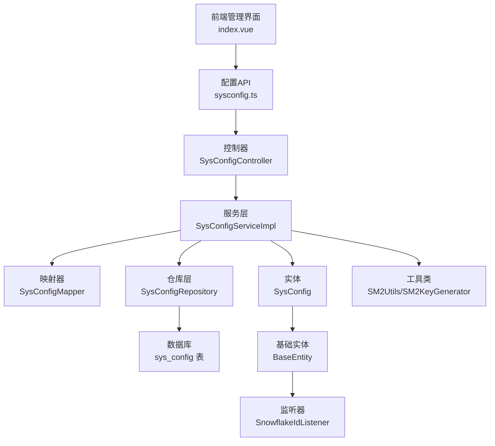
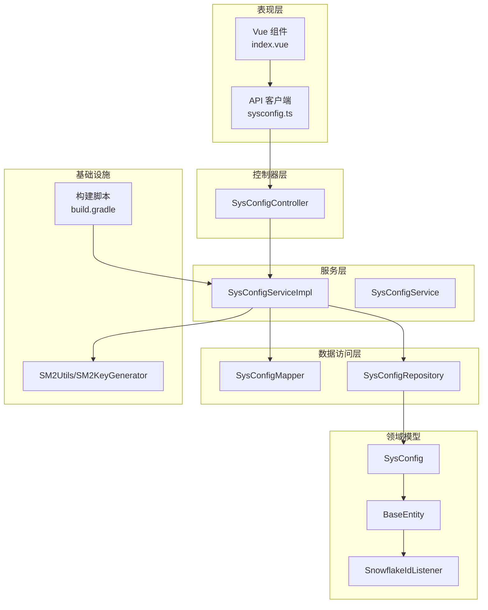
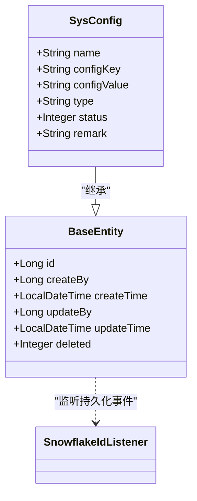
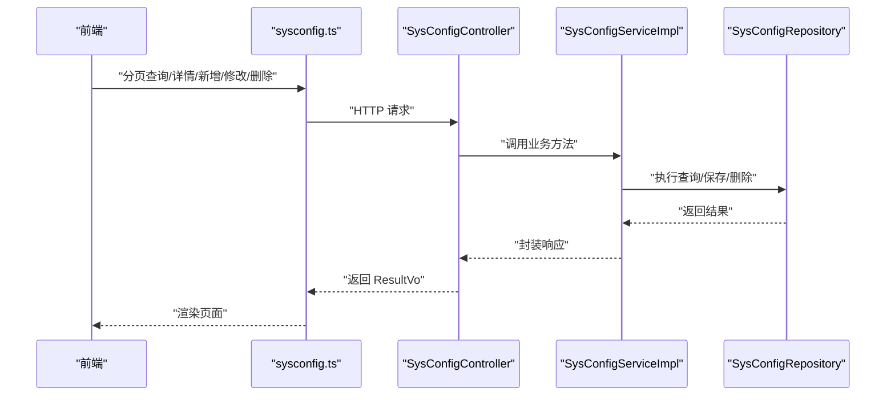
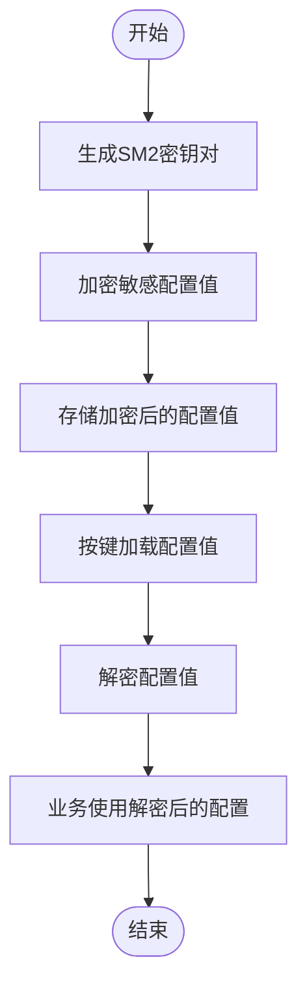
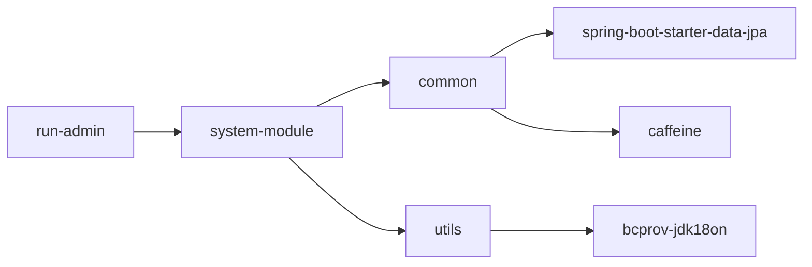

# 系统配置管理

<cite>
**本文引用的文件**
- [SysConfig.java](file://system-module/src/main/java/com/fastproject/system/domain/SysConfig.java)
- [SysConfigRepository.java](file://system-module/src/main/java/com/fastproject/system/repository/db/SysConfigRepository.java)
- [SysConfigMapper.java](file://system-module/src/main/java/com/fastproject/system/mapper/SysConfigMapper.java)
- [SysConfigService.java](file://system-module/src/main/java/com/fastproject/system/service/SysConfigService.java)
- [SysConfigServiceImpl.java](file://system-module/src/main/java/com/fastproject/system/service/impl/SysConfigServiceImpl.java)
- [SysConfigController.java](file://run-admin/src/main/java/com/fastproject/module/system/controller/SysConfigController.java)
- [sysconfig.ts](file://fast-ui/apps/admin-vue/src/api/system/sysconfig.ts)
- [index.vue](file://fast-ui/apps/admin-vue/src/views/system/sysconfig/index.vue)
- [BaseEntity.java](file://common/src/main/java/com/fastproject/db/BaseEntity.java)
- [SnowflakeIdListener.java](file://common/src/main/java/com/fastproject/db/SnowflakeIdListener.java)
- [SM2Utils.java](file://utils/src/main/java/com/fastproject/utils/sm/SM2Utils.java)
- [SM2KeyGenerator.java](file://utils/src/main/java/com/fastproject/utils/sm/SM2KeyGenerator.java)
- [build.gradle](file://build.gradle)
</cite>

## 目录
1. [简介](#简介)
2. [项目结构](#项目结构)
3. [核心组件](#核心组件)
4. [架构总览](#架构总览)
5. [详细组件分析](#详细组件分析)
6. [依赖关系分析](#依赖关系分析)
7. [性能考虑](#性能考虑)
8. [故障排查指南](#故障排查指南)
9. [结论](#结论)
10. [附录](#附录)

## 简介
本文件面向系统配置管理功能，提供从架构设计到实现细节的完整技术文档。内容涵盖系统参数配置设计、配置项管理机制、配置数据持久化存储、运行时配置更新策略、配置分类管理、敏感配置加密存储、配置版本控制与回滚机制、系统启动参数与业务配置项管理、第三方集成配置、配置的增删改查、导入导出与备份恢复、配置缓存机制与配置变更通知系统等。

## 项目结构
系统配置管理采用典型的分层架构：
- 前端：基于 Vue 的管理界面，提供配置项的增删改查、分页查询、状态切换、批量操作等交互。
- 控制器层：RESTful API，负责权限校验、幂等性控制、日志记录、请求转发。
- 服务层：业务逻辑封装，包含数据校验、分页查询、配置值检索等。
- 数据访问层：JPA Repository 提供数据持久化能力，支持条件查询与逻辑删除。
- 实体与映射：JPA 实体定义配置表结构，MapStruct 负责 DTO 与实体之间的转换。
- 基础设施：通用实体基类与监听器负责主键生成、审计字段填充与逻辑删除。
- 安全与工具：提供 SM2 加密工具用于敏感配置的加密存储。

图表来源
- [SysConfigController.java](file://run-admin/src/main/java/com/fastproject/module/system/controller/SysConfigController.java#L25-L93)
- [SysConfigServiceImpl.java](file://system-module/src/main/java/com/fastproject/system/service/impl/SysConfigServiceImpl.java#L32-L124)
- [SysConfigRepository.java](file://system-module/src/main/java/com/fastproject/system/repository/db/SysConfigRepository.java#L12-L28)
- [SysConfig.java](file://system-module/src/main/java/com/fastproject/system/domain/SysConfig.java#L20-L51)
- [BaseEntity.java](file://common/src/main/java/com/fastproject/db/BaseEntity.java#L14-L47)
- [SnowflakeIdListener.java](file://common/src/main/java/com/fastproject/db/SnowflakeIdListener.java#L14-L53)
- [SM2Utils.java](file://utils/src/main/java/com/fastproject/utils/sm/SM2Utils.java#L77-L94)
- [SM2KeyGenerator.java](file://utils/src/main/java/com/fastproject/utils/sm/SM2KeyGenerator.java#L16-L32)

章节来源
- [SysConfigController.java](file://run-admin/src/main/java/com/fastproject/module/system/controller/SysConfigController.java#L25-L93)
- [SysConfigServiceImpl.java](file://system-module/src/main/java/com/fastproject/system/service/impl/SysConfigServiceImpl.java#L32-L124)
- [SysConfigRepository.java](file://system-module/src/main/java/com/fastproject/system/repository/db/SysConfigRepository.java#L12-L28)
- [SysConfig.java](file://system-module/src/main/java/com/fastproject/system/domain/SysConfig.java#L20-L51)
- [BaseEntity.java](file://common/src/main/java/com/fastproject/db/BaseEntity.java#L14-L47)
- [SnowflakeIdListener.java](file://common/src/main/java/com/fastproject/db/SnowflakeIdListener.java#L14-L53)
- [SM2Utils.java](file://utils/src/main/java/com/fastproject/utils/sm/SM2Utils.java#L77-L94)
- [SM2KeyGenerator.java](file://utils/src/main/java/com/fastproject/utils/sm/SM2KeyGenerator.java#L16-L32)

## 核心组件
- 实体层：SysConfig 定义配置项的字段与逻辑删除策略；BaseEntity 提供统一的审计字段与主键生成；SnowflakeIdListener 在持久化前后自动填充审计信息。
- 数据访问层：SysConfigRepository 提供按键查询、唯一性校验、分页查询等能力。
- 映射层：SysConfigMapper 使用 MapStruct 将 DTO 与实体进行双向转换，并忽略空值映射。
- 服务层：SysConfigService 定义配置管理的核心接口；SysConfigServiceImpl 实现保存、更新、删除、分页查询、按键取值等逻辑。
- 控制器层：SysConfigController 提供 RESTful API，包含权限控制、幂等性、日志记录等横切关注点。
- 前端层：index.vue 提供表格、表单、分页、状态切换、批量删除等交互；sysconfig.ts 定义与后端通信的接口方法。
- 安全与工具：SM2Utils/SM2KeyGenerator 提供国密 SM2 加密与密钥对生成，用于敏感配置的加密存储。

章节来源
- [SysConfig.java](file://system-module/src/main/java/com/fastproject/system/domain/SysConfig.java#L20-L51)
- [BaseEntity.java](file://common/src/main/java/com/fastproject/db/BaseEntity.java#L14-L47)
- [SnowflakeIdListener.java](file://common/src/main/java/com/fastproject/db/SnowflakeIdListener.java#L14-L53)
- [SysConfigRepository.java](file://system-module/src/main/java/com/fastproject/system/repository/db/SysConfigRepository.java#L12-L28)
- [SysConfigMapper.java](file://system-module/src/main/java/com/fastproject/system/mapper/SysConfigMapper.java#L13-L27)
- [SysConfigService.java](file://system-module/src/main/java/com/fastproject/system/service/SysConfigService.java#L14-L50)
- [SysConfigServiceImpl.java](file://system-module/src/main/java/com/fastproject/system/service/impl/SysConfigServiceImpl.java#L32-L124)
- [SysConfigController.java](file://run-admin/src/main/java/com/fastproject/module/system/controller/SysConfigController.java#L25-L93)
- [sysconfig.ts](file://fast-ui/apps/admin-vue/src/api/system/sysconfig.ts#L46-L99)
- [index.vue](file://fast-ui/apps/admin-vue/src/views/system/sysconfig/index.vue#L333-L574)
- [SM2Utils.java](file://utils/src/main/java/com/fastproject/utils/sm/SM2Utils.java#L77-L94)
- [SM2KeyGenerator.java](file://utils/src/main/java/com/fastproject/utils/sm/SM2KeyGenerator.java#L16-L32)

## 架构总览
系统配置管理遵循“表现层-控制器层-服务层-数据访问层-数据库”的分层架构，结合 MapStruct 的类型安全映射、JPA 的条件查询与逻辑删除、以及 SM2 的敏感配置加密，形成一套可扩展、可维护、可审计的配置管理体系。

图表来源
- [SysConfigController.java](file://run-admin/src/main/java/com/fastproject/module/system/controller/SysConfigController.java#L25-L93)
- [SysConfigServiceImpl.java](file://system-module/src/main/java/com/fastproject/system/service/impl/SysConfigServiceImpl.java#L32-L124)
- [SysConfigMapper.java](file://system-module/src/main/java/com/fastproject/system/mapper/SysConfigMapper.java#L13-L27)
- [SysConfigRepository.java](file://system-module/src/main/java/com/fastproject/system/repository/db/SysConfigRepository.java#L12-L28)
- [SysConfig.java](file://system-module/src/main/java/com/fastproject/system/domain/SysConfig.java#L20-L51)
- [BaseEntity.java](file://common/src/main/java/com/fastproject/db/BaseEntity.java#L14-L47)
- [SnowflakeIdListener.java](file://common/src/main/java/com/fastproject/db/SnowflakeIdListener.java#L14-L53)
- [SM2Utils.java](file://utils/src/main/java/com/fastproject/utils/sm/SM2Utils.java#L77-L94)
- [SM2KeyGenerator.java](file://utils/src/main/java/com/fastproject/utils/sm/SM2KeyGenerator.java#L16-L32)
- [build.gradle](file://build.gradle#L64-L77)

## 详细组件分析

### 实体与数据模型
- SysConfig：定义配置项的名称、键、值、类型、状态、备注等字段；使用逻辑删除注解以支持软删除。
- BaseEntity：统一提供主键、创建/更新审计字段与逻辑删除字段；SnowflakeIdListener 在持久化前后自动填充。
- 关系图如下：

图表来源
- [SysConfig.java](file://system-module/src/main/java/com/fastproject/system/domain/SysConfig.java#L20-L51)
- [BaseEntity.java](file://common/src/main/java/com/fastproject/db/BaseEntity.java#L14-L47)
- [SnowflakeIdListener.java](file://common/src/main/java/com/fastproject/db/SnowflakeIdListener.java#L14-L53)

章节来源
- [SysConfig.java](file://system-module/src/main/java/com/fastproject/system/domain/SysConfig.java#L20-L51)
- [BaseEntity.java](file://common/src/main/java/com/fastproject/db/BaseEntity.java#L14-L47)
- [SnowflakeIdListener.java](file://common/src/main/java/com/fastproject/db/SnowflakeIdListener.java#L14-L53)

### 数据访问与查询
- SysConfigRepository：提供按键查询、唯一性校验、分页查询等能力；使用 JPA Specification 支持动态条件查询。
- SysConfigServiceImpl：在服务层实现分页查询与按键取值逻辑，结合 QueryHelp 完成复杂查询条件组装。

图表来源
- [SysConfigController.java](file://run-admin/src/main/java/com/fastproject/module/system/controller/SysConfigController.java#L25-L93)
- [SysConfigServiceImpl.java](file://system-module/src/main/java/com/fastproject/system/service/impl/SysConfigServiceImpl.java#L96-L124)
- [SysConfigRepository.java](file://system-module/src/main/java/com/fastproject/system/repository/db/SysConfigRepository.java#L12-L28)
- [sysconfig.ts](file://fast-ui/apps/admin-vue/src/api/system/sysconfig.ts#L46-L99)

章节来源
- [SysConfigRepository.java](file://system-module/src/main/java/com/fastproject/system/repository/db/SysConfigRepository.java#L12-L28)
- [SysConfigServiceImpl.java](file://system-module/src/main/java/com/fastproject/system/service/impl/SysConfigServiceImpl.java#L96-L124)

### 映射与转换
- SysConfigMapper：使用 MapStruct 将 SysConfigCreate/SysConfigUpdate 与 SysConfig 实体进行转换，并在更新时忽略空值映射，避免误清空字段。

章节来源
- [SysConfigMapper.java](file://system-module/src/main/java/com/fastproject/system/mapper/SysConfigMapper.java#L13-L27)

### 控制器与权限控制
- SysConfigController：提供配置项的增删改查、分页、详情、批量删除等接口；使用注解进行权限校验、幂等性控制与日志记录。

章节来源
- [SysConfigController.java](file://run-admin/src/main/java/com/fastproject/module/system/controller/SysConfigController.java#L25-L93)

### 前端交互与API
- sysconfig.ts：定义与后端交互的接口，包括分页查询、详情、新增、修改、删除、批量删除、按键取值等。
- index.vue：提供表格展示、表单编辑、状态切换、批量删除等交互逻辑。

章节来源
- [sysconfig.ts](file://fast-ui/apps/admin-vue/src/api/system/sysconfig.ts#L46-L99)
- [index.vue](file://fast-ui/apps/admin-vue/src/views/system/sysconfig/index.vue#L333-L574)

### 敏感配置加密存储
- SM2Utils：提供 SM2 加密与解密能力，支持敏感配置的加密存储与解密读取。
- SM2KeyGenerator：生成 SM2 公私钥对，用于加密与解密流程。

图表来源
- [SM2Utils.java](file://utils/src/main/java/com/fastproject/utils/sm/SM2Utils.java#L77-L94)
- [SM2KeyGenerator.java](file://utils/src/main/java/com/fastproject/utils/sm/SM2KeyGenerator.java#L16-L32)

章节来源
- [SM2Utils.java](file://utils/src/main/java/com/fastproject/utils/sm/SM2Utils.java#L77-L94)
- [SM2KeyGenerator.java](file://utils/src/main/java/com/fastproject/utils/sm/SM2KeyGenerator.java#L16-L32)

### 配置分类管理
- 类型字段：SysConfig 的 type 字段可用于区分配置类型（如系统参数、业务配置、第三方集成配置），服务层在分页查询中支持按类型过滤。

章节来源
- [SysConfig.java](file://system-module/src/main/java/com/fastproject/system/domain/SysConfig.java#L40-L40)
- [SysConfigServiceImpl.java](file://system-module/src/main/java/com/fastproject/system/service/impl/SysConfigServiceImpl.java#L104-L106)

### 配置版本控制与回滚机制
- 当前实现未提供显式的配置版本控制与回滚机制。建议引入配置历史表与版本号字段，在更新配置时保留历史版本以便回滚。

章节来源
- [SysConfigServiceImpl.java](file://system-module/src/main/java/com/fastproject/system/service/impl/SysConfigServiceImpl.java#L38-L95)

### 配置缓存机制与变更通知
- 当前实现未提供配置缓存与变更通知机制。建议引入缓存层（如 Caffeine）与事件总线，在配置更新时触发通知，确保运行时配置的及时生效。

章节来源
- [build.gradle](file://build.gradle#L67-L67)

## 依赖关系分析
- 构建脚本声明了 Caffeine 缓存依赖，可用于后续配置缓存实现。
- 项目模块间通过接口与 VO 进行解耦，控制器依赖服务接口，服务依赖仓库接口，保证良好的分层与可测试性。

图表来源
- [build.gradle](file://build.gradle#L64-L89)

章节来源
- [build.gradle](file://build.gradle#L64-L89)

## 性能考虑
- 查询优化：利用 JPA Specification 动态拼接查询条件，避免全表扫描；合理使用索引（如 configKey）提升按键查询性能。
- 缓存策略：引入本地缓存（Caffeine）缓存常用配置值，减少数据库访问频率；设置合理的过期策略与失效策略。
- 幂等性：控制器层已使用幂等注解防止重复提交，建议在高频更新场景下增加分布式锁或队列化处理。
- 日志与监控：结合日志注解与指标埋点，监控配置管理接口的 QPS、延迟与错误率。

## 故障排查指南
- 配置键冲突：保存或更新时若发现配置键已存在，将抛出业务异常。请检查键的唯一性约束。
- 逻辑删除：实体使用逻辑删除，查询时需注意 SQLRestriction 条件；如出现“数据不存在”，请检查 deleted 字段。
- 权限不足：控制器使用权限注解保护接口，请确认当前用户具备相应权限。
- 加密异常：敏感配置加密/解密失败时，检查密钥对生成与公私钥格式是否正确。

章节来源
- [SysConfigRepository.java](file://system-module/src/main/java/com/fastproject/system/repository/db/SysConfigRepository.java#L17-L22)
- [SysConfig.java](file://system-module/src/main/java/com/fastproject/system/domain/SysConfig.java#L18-L19)
- [SysConfigController.java](file://run-admin/src/main/java/com/fastproject/module/system/controller/SysConfigController.java#L34-L36)
- [SM2Utils.java](file://utils/src/main/java/com/fastproject/utils/sm/SM2Utils.java#L77-L94)

## 结论
系统配置管理功能已实现基础的增删改查、分页查询与按键取值能力，并通过实体基类与监听器实现了统一的审计与逻辑删除。建议后续增强以下能力：敏感配置加密存储、配置版本控制与回滚、配置缓存与变更通知、配置导入导出与备份恢复等，以满足生产环境对安全性、可靠性与可运维性的更高要求。

## 附录

### API 文档（系统配置管理）
- 新增配置
  - 方法：POST
  - 路径：/sys/config
  - 权限：admin:system:config:add
  - 幂等：是
  - 请求体：SysConfigCreate
  - 返回：ResultVo<Object>
- 修改配置
  - 方法：PUT
  - 路径：/sys/config
  - 权限：admin:system:config:update
  - 幂等：是
  - 请求体：SysConfigUpdate
  - 返回：ResultVo<Object>
- 删除配置
  - 方法：DELETE
  - 路径：/sys/config/{id}
  - 权限：admin:system:config:delete
  - 返回：ResultVo<Object>
- 批量删除
  - 方法：DELETE
  - 路径：/sys/config/batch
  - 权限：admin:system:config:delete
  - 请求体：List<Long>
  - 返回：ResultVo<Object>
- 分页查询
  - 方法：POST
  - 路径：/sys/config/page
  - 权限：admin:system:config:page
  - 请求体：SysConfigQuery
  - 返回：ResultVo<PageVo<List<SysConfigVo>>>
- 详情查询
  - 方法：GET
  - 路径：/sys/config/{id}
  - 权限：admin:system:config:page
  - 返回：ResultVo<SysConfigVo>
- 按键取值
  - 方法：GET
  - 路径：/sys/config/key/{configKey}
  - 返回：ResultVo<String>

章节来源
- [SysConfigController.java](file://run-admin/src/main/java/com/fastproject/module/system/controller/SysConfigController.java#L33-L91)
- [sysconfig.ts](file://fast-ui/apps/admin-vue/src/api/system/sysconfig.ts#L46-L99)