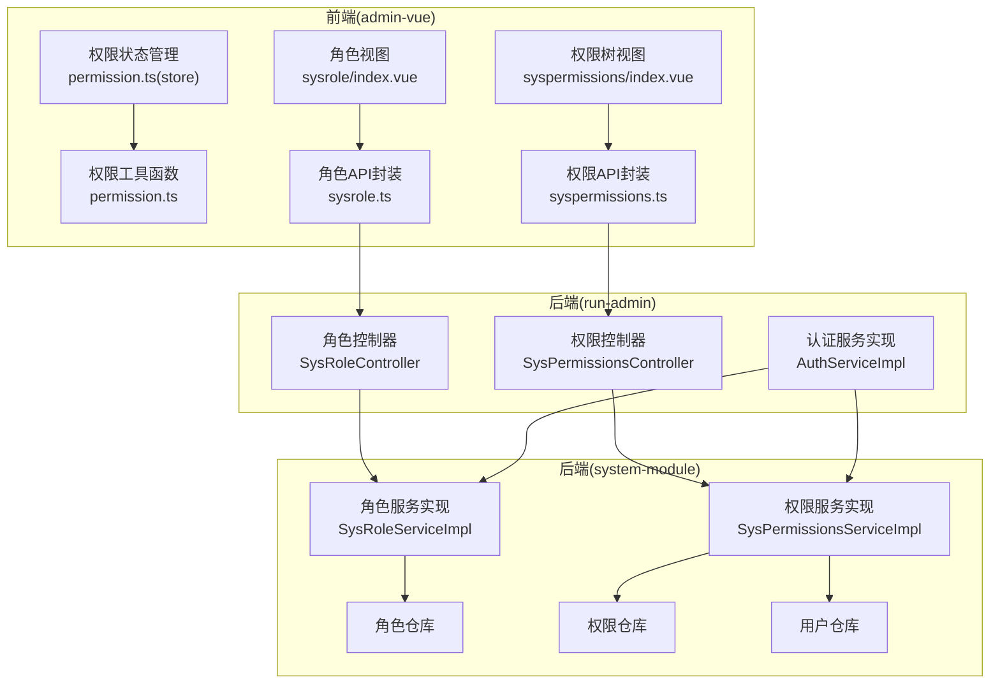
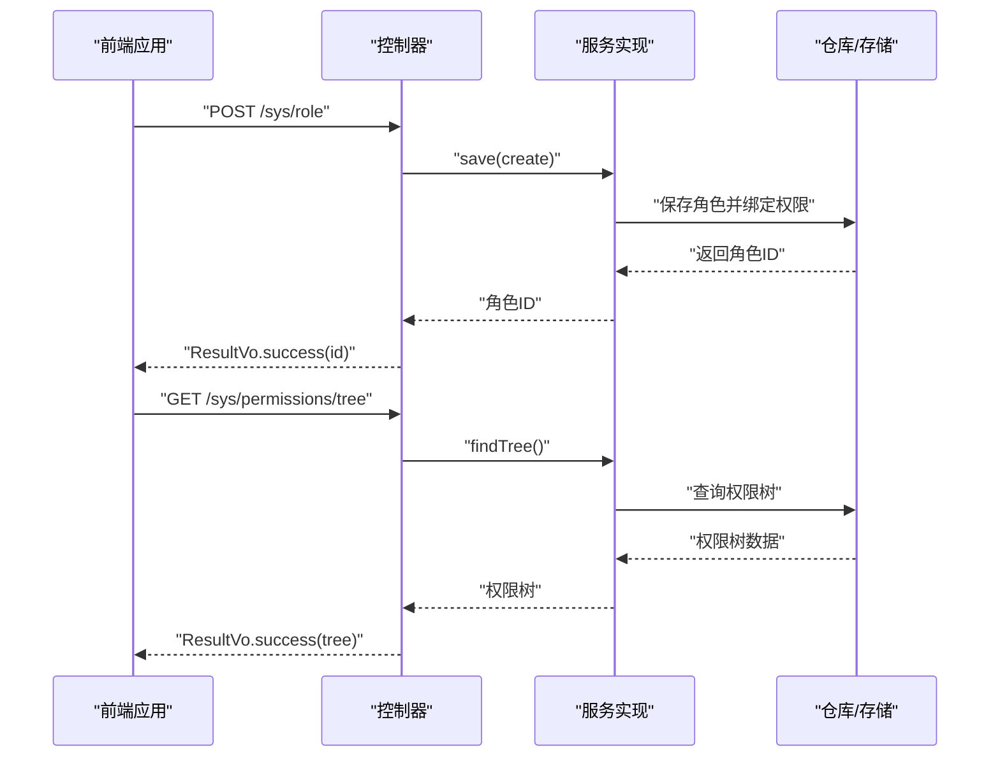
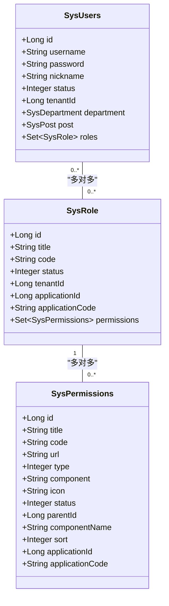
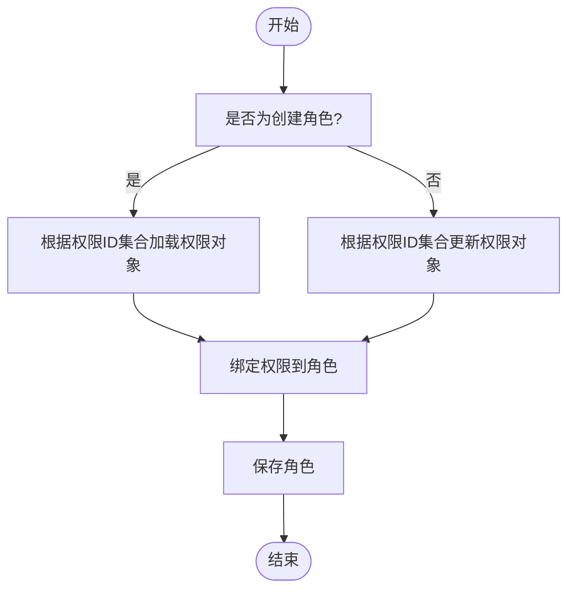
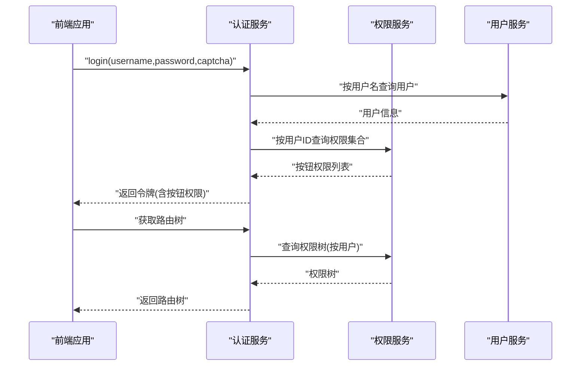
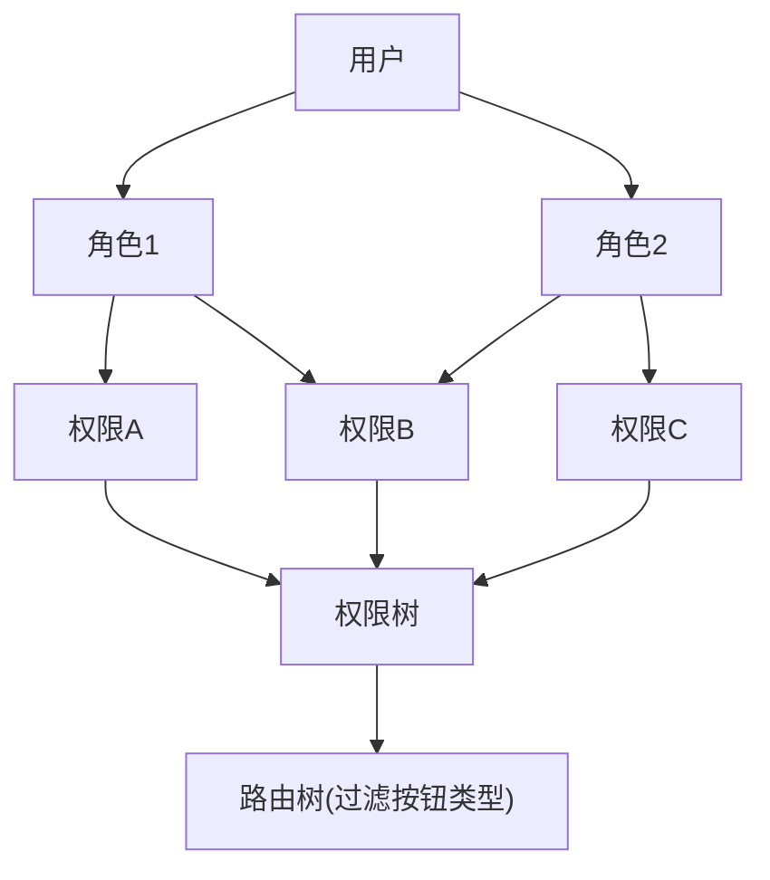
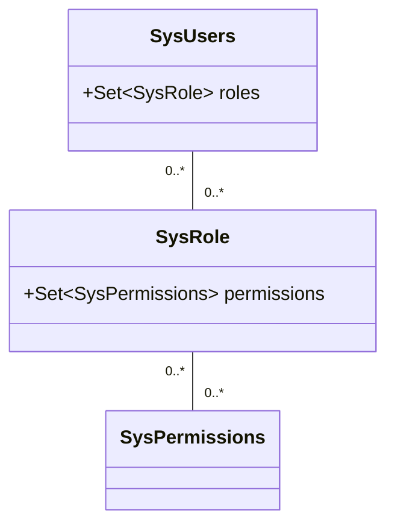
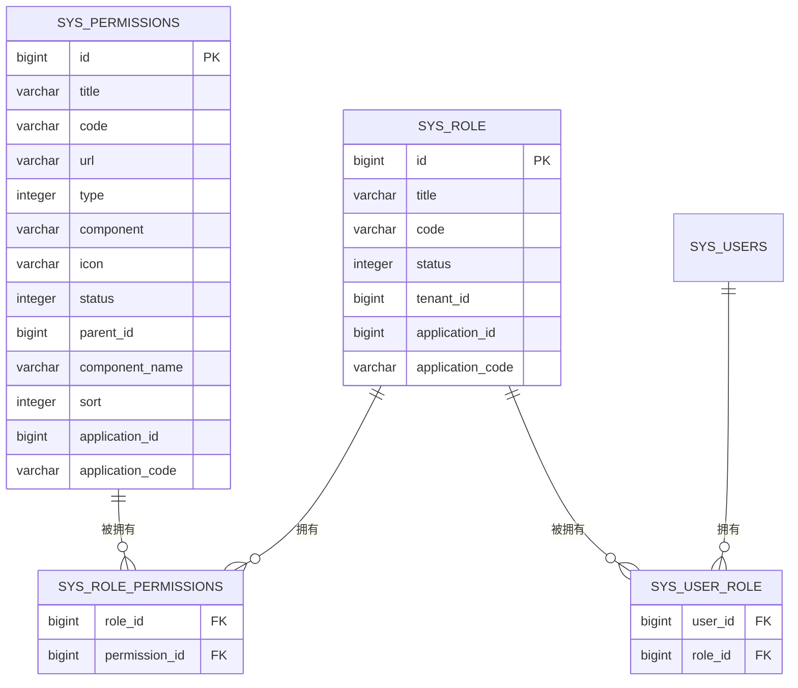
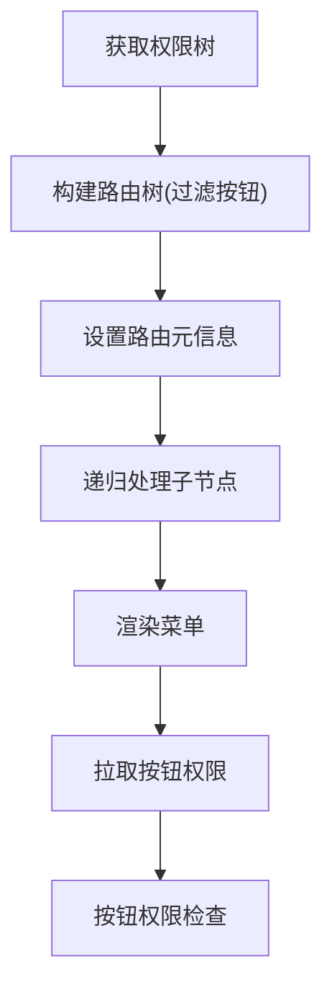
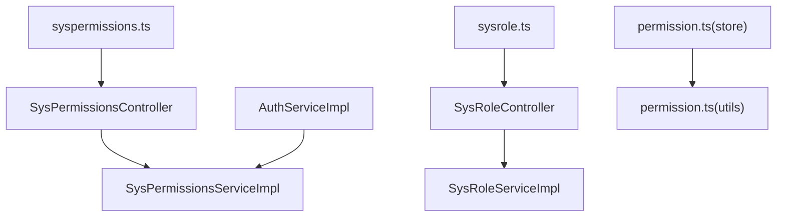

# 角色权限管理

<cite>
**本文引用的文件**
- [系统模块-角色实体](file://system-module/src/main/java/com/ffastproject/system/domain/SysRole.java)
- [系统模块-权限实体](file://system-module/src/main/java/com/fastproject/system/domain/SysPermissions.java)
- [系统模块-用户实体](file://system-module/src/main/java/com/fastproject/system/domain/SysUsers.java)
- [系统模块-角色服务实现](file://system-module/src/main/java/com/fastproject/system/service/impl/SysRoleServiceImpl.java)
- [系统模块-权限服务实现](file://system-module/src/main/java/com/fastproject/system/service/impl/SysPermissionsServiceImpl.java)
- [运行管理-角色控制器](file://run-admin/src/main/java/com/fastproject/module/system/controller/SysRoleController.java)
- [运行管理-权限控制器](file://run-admin/src/main/java/com/fastproject/module/system/controller/SysPermissionsController.java)
- [运行管理-认证服务实现](file://run-admin/src/main/java/com/fastproject/module/system/service/impl/AuthServiceImpl.java)
- [前端-权限工具函数](file://fast-ui/apps/admin-vue/src/utils/permission.ts)
- [前端-权限状态管理](file://fast-ui/apps/admin-vue/src/stores/modules/permission.ts)
- [前端-权限API封装](file://fast-ui/apps/admin-vue/src/api/system/syspermissions.ts)
- [前端-角色API封装](file://fast-ui/apps/admin-vue/src/api/system/sysrole.ts)
- [前端-权限树视图](file://fast-ui/apps/admin-vue/src/views/system/syspermissions/index.vue)
- [前端-角色视图](file://fast-ui/apps/admin-vue/src/views/system/sysrole/index.vue)
</cite>

## 目录
1. [引言](#引言)
2. [项目结构](#项目结构)
3. [核心组件](#核心组件)
4. [架构总览](#架构总览)
5. [详细组件分析](#详细组件分析)
6. [依赖关系分析](#依赖关系分析)
7. [性能考虑](#性能考虑)
8. [故障排查指南](#故障排查指南)
9. [结论](#结论)
10. [附录](#附录)

## 引言
本文件面向角色权限管理功能，系统性阐述RBAC（基于角色的访问控制）模型在本项目中的实现方式，涵盖角色实体模型设计、角色权限分配机制、菜单权限动态加载与权限验证流程。文档同时说明角色与用户的多对多关系、角色与权限的关联关系设计，以及RBAC模型的实现原理与权限继承机制。最后提供完整的权限控制API文档与性能优化建议。

## 项目结构
角色权限管理涉及后端系统模块与运行管理模块，以及前端admin-vue应用。后端通过Spring MVC控制器暴露REST接口，服务层负责业务逻辑与数据访问，实体层定义持久化模型；前端通过API封装与状态管理实现菜单动态生成与按钮权限控制。

**图表来源**
- [运行管理-角色控制器](file://run-admin/src/main/java/com/fastproject/module/system/controller/SysRoleController.java#L21-L99)
- [运行管理-权限控制器](file://run-admin/src/main/java/com/fastproject/module/system/controller/SysPermissionsController.java#L20-L98)
- [运行管理-认证服务实现](file://run-admin/src/main/java/com/fastproject/module/system/service/impl/AuthServiceImpl.java#L25-L158)
- [系统模块-角色服务实现](file://system-module/src/main/java/com/fastproject/system/service/impl/SysRoleServiceImpl.java#L40-L185)
- [系统模块-权限服务实现](file://system-module/src/main/java/com/fastproject/system/service/impl/SysPermissionsServiceImpl.java#L33-L182)

**章节来源**
- [运行管理-角色控制器](file://run-admin/src/main/java/com/fastproject/module/system/controller/SysRoleController.java#L21-L99)
- [运行管理-权限控制器](file://run-admin/src/main/java/com/fastproject/module/system/controller/SysPermissionsController.java#L20-L98)
- [运行管理-认证服务实现](file://run-admin/src/main/java/com/fastproject/module/system/service/impl/AuthServiceImpl.java#L25-L158)
- [系统模块-角色服务实现](file://system-module/src/main/java/com/fastproject/system/service/impl/SysRoleServiceImpl.java#L40-L185)
- [系统模块-权限服务实现](file://system-module/src/main/java/com/fastproject/system/service/impl/SysPermissionsServiceImpl.java#L33-L182)

## 核心组件
- 角色实体：定义角色标题、编码、状态、租户信息及与权限的多对多关联。
- 权限实体：定义权限标题、编码、URL、类型、组件、图标、状态、父子关系、排序等。
- 用户实体：定义用户基本信息与与角色的多对多关联。
- 角色服务：提供角色的增删改查、分页查询、权限ID集合绑定等。
- 权限服务：提供权限的增删改查、树形结构查询、用户权限集合查询、树形权限构建等。
- 认证服务：负责登录校验、验证码校验、按钮权限提取、路由树构建等。
- 前端权限工具：提供按钮权限检查、批量权限检查等工具方法。
- 前端权限状态：统一管理路由与按钮权限数据，支持懒加载与重置。

**章节来源**
- [系统模块-角色实体](file://system-module/src/main/java/com/fastproject/system/domain/SysRole.java#L14-L59)
- [系统模块-权限实体](file://system-module/src/main/java/com/fastproject/system/domain/SysPermissions.java#L11-L78)
- [系统模块-用户实体](file://system-module/src/main/java/com/fastproject/system/domain/SysUsers.java#L15-L95)
- [系统模块-角色服务实现](file://system-module/src/main/java/com/fastproject/system/service/impl/SysRoleServiceImpl.java#L65-L118)
- [系统模块-权限服务实现](file://system-module/src/main/java/com/fastproject/system/service/impl/SysPermissionsServiceImpl.java#L46-L182)
- [运行管理-认证服务实现](file://run-admin/src/main/java/com/fastproject/module/system/service/impl/AuthServiceImpl.java#L36-L156)
- [前端-权限工具函数](file://fast-ui/apps/admin-vue/src/utils/permission.ts#L1-L47)
- [前端-权限状态管理](file://fast-ui/apps/admin-vue/src/stores/modules/permission.ts#L45-L87)

## 架构总览
本系统采用前后端分离架构，后端通过Spring MVC控制器暴露REST接口，前端通过Axios调用接口，结合Vuex Store进行权限数据管理与路由生成。

**图表来源**
- [运行管理-角色控制器](file://run-admin/src/main/java/com/fastproject/module/system/controller/SysRoleController.java#L38-L45)
- [运行管理-权限控制器](file://run-admin/src/main/java/com/fastproject/module/system/controller/SysPermissionsController.java#L90-L96)
- [系统模块-角色服务实现](file://system-module/src/main/java/com/fastproject/system/service/impl/SysRoleServiceImpl.java#L67-L88)
- [系统模块-权限服务实现](file://system-module/src/main/java/com/fastproject/system/service/impl/SysPermissionsServiceImpl.java#L165-L182)

## 详细组件分析

### 角色实体模型设计
角色实体采用JPA注解映射到数据库表，包含标题、编码、状态、租户ID、应用信息等字段，并通过多对多关联维护与权限的关系。该设计支持租户隔离与应用维度的权限控制。

**图表来源**
- [系统模块-角色实体](file://system-module/src/main/java/com/fastproject/system/domain/SysRole.java#L14-L59)
- [系统模块-权限实体](file://system-module/src/main/java/com/fastproject/system/domain/SysPermissions.java#L11-L78)
- [系统模块-用户实体](file://system-module/src/main/java/com/fastproject/system/domain/SysUsers.java#L15-L95)

**章节来源**
- [系统模块-角色实体](file://system-module/src/main/java/com/fastproject/system/domain/SysRole.java#L14-L59)
- [系统模块-权限实体](file://system-module/src/main/java/com/fastproject/system/domain/SysPermissions.java#L11-L78)
- [系统模块-用户实体](file://system-module/src/main/java/com/fastproject/system/domain/SysUsers.java#L15-L95)

### 角色权限分配机制
角色权限分配通过角色服务实现，支持在创建/更新角色时传入权限ID集合，服务层将权限ID转换为权限对象并绑定到角色上。该机制确保角色与权限的关联关系在数据库层面得到维护。

**图表来源**
- [系统模块-角色服务实现](file://system-module/src/main/java/com/fastproject/system/service/impl/SysRoleServiceImpl.java#L81-L84)
- [系统模块-角色服务实现](file://system-module/src/main/java/com/fastproject/system/service/impl/SysRoleServiceImpl.java#L110-L115)

**章节来源**
- [系统模块-角色服务实现](file://system-module/src/main/java/com/fastproject/system/service/impl/SysRoleServiceImpl.java#L65-L118)

### 菜单权限动态加载与权限验证流程
前端通过权限状态管理模块拉取按钮权限与路由树，认证服务在登录时根据用户权限构建路由树并过滤按钮类型权限。权限验证通过前端工具函数进行按钮级别的权限检查。

**图表来源**
- [运行管理-认证服务实现](file://run-admin/src/main/java/com/fastproject/module/system/service/impl/AuthServiceImpl.java#L36-L56)
- [运行管理-认证服务实现](file://run-admin/src/main/java/com/fastproject/module/system/service/impl/AuthServiceImpl.java#L127-L134)
- [系统模块-权限服务实现](file://system-module/src/main/java/com/fastproject/system/service/impl/SysPermissionsServiceImpl.java#L152-L182)

**章节来源**
- [运行管理-认证服务实现](file://run-admin/src/main/java/com/fastproject/module/system/service/impl/AuthServiceImpl.java#L36-L156)
- [系统模块-权限服务实现](file://system-module/src/main/java/com/fastproject/system/service/impl/SysPermissionsServiceImpl.java#L152-L182)
- [前端-权限状态管理](file://fast-ui/apps/admin-vue/src/stores/modules/permission.ts#L45-L87)
- [前端-权限工具函数](file://fast-ui/apps/admin-vue/src/utils/permission.ts#L1-L47)

### RBAC模型实现与权限继承机制
本系统采用标准RBAC模型：用户通过角色获得权限，权限可形成层次化的树形结构。权限继承体现在用户通过其角色继承所有权限，前端在构建路由树时会递归处理子节点，后端在查询用户权限树时也会对权限进行去重与排序。

**图表来源**
- [系统模块-用户实体](file://system-module/src/main/java/com/fastproject/system/domain/SysUsers.java#L87-L93)
- [系统模块-角色实体](file://system-module/src/main/java/com/fastproject/system/domain/SysRole.java#L51-L57)
- [运行管理-认证服务实现](file://run-admin/src/main/java/com/fastproject/module/system/service/impl/AuthServiceImpl.java#L88-L125)

**章节来源**
- [系统模块-用户实体](file://system-module/src/main/java/com/fastproject/system/domain/SysUsers.java#L87-L93)
- [系统模块-角色实体](file://system-module/src/main/java/com/fastproject/system/domain/SysRole.java#L51-L57)
- [运行管理-认证服务实现](file://run-admin/src/main/java/com/fastproject/module/system/service/impl/AuthServiceImpl.java#L88-L125)

### 角色与用户的多对多关系
用户与角色之间通过中间表建立多对多关系，支持一个用户拥有多个角色，一个角色被多个用户共享。该关系在实体类中通过JPA注解声明，并在服务层进行权限继承与查询。

**图表来源**
- [系统模块-用户实体](file://system-module/src/main/java/com/fastproject/system/domain/SysUsers.java#L87-L93)
- [系统模块-角色实体](file://system-module/src/main/java/com/fastproject/system/domain/SysRole.java#L51-L57)

**章节来源**
- [系统模块-用户实体](file://system-module/src/main/java/com/fastproject/system/domain/SysUsers.java#L87-L93)
- [系统模块-角色实体](file://system-module/src/main/java/com/fastproject/system/domain/SysRole.java#L51-L57)

### 角色与权限的关联关系设计
角色与权限通过中间表建立多对多关系，支持角色拥有多个权限，权限可被多个角色共享。权限实体支持父子关系与排序，便于构建树形结构与路由层级。

**图表来源**
- [系统模块-角色实体](file://system-module/src/main/java/com/fastproject/system/domain/SysRole.java#L51-L57)
- [系统模块-权限实体](file://system-module/src/main/java/com/fastproject/system/domain/SysPermissions.java#L11-L78)
- [系统模块-用户实体](file://system-module/src/main/java/com/fastproject/system/domain/SysUsers.java#L87-L93)

**章节来源**
- [系统模块-角色实体](file://system-module/src/main/java/com/fastproject/system/domain/SysRole.java#L51-L57)
- [系统模块-权限实体](file://system-module/src/main/java/com/fastproject/system/domain/SysPermissions.java#L11-L78)
- [系统模块-用户实体](file://system-module/src/main/java/com/fastproject/system/domain/SysUsers.java#L87-L93)

### 权限API文档
- 权限相关API
  - POST /sys/permissions：创建权限
  - PUT /sys/permissions：更新权限
  - DELETE /sys/permissions/{id}：删除权限
  - DELETE /sys/permissions/batch：批量删除权限
  - GET /sys/permissions/page：分页查询权限
  - GET /sys/permissions/{id}：获取权限详情
  - GET /sys/permissions/tree：获取权限树
- 角色相关API
  - POST /sys/role：创建角色
  - PUT /sys/role：更新角色
  - DELETE /sys/role/{id}：删除角色
  - DELETE /sys/role/batch：批量删除角色
  - GET /sys/role/page：分页查询角色
  - GET /sys/role/{id}：获取角色详情
  - GET /sys/role/selectAll：获取角色下拉列表

**章节来源**
- [运行管理-权限控制器](file://run-admin/src/main/java/com/fastproject/module/system/controller/SysPermissionsController.java#L26-L96)
- [运行管理-角色控制器](file://run-admin/src/main/java/com/fastproject/module/system/controller/SysRoleController.java#L27-L97)
- [前端-权限API封装](file://fast-ui/apps/admin-vue/src/api/system/syspermissions.ts#L76-L114)
- [前端-角色API封装](file://fast-ui/apps/admin-vue/src/api/system/sysrole.ts#L71-L100)

### 菜单生成与按钮权限控制
- 菜单生成：认证服务根据权限树构建路由树，过滤按钮类型权限，设置路由元信息（标题、图标、排序、显示状态），递归处理子节点。
- 按钮权限控制：前端权限状态管理模块拉取按钮权限，权限工具函数提供按钮权限检查与批量检查能力。

**图表来源**
- [运行管理-认证服务实现](file://run-admin/src/main/java/com/fastproject/module/system/service/impl/AuthServiceImpl.java#L88-L125)
- [前端-权限状态管理](file://fast-ui/apps/admin-vue/src/stores/modules/permission.ts#L45-L87)
- [前端-权限工具函数](file://fast-ui/apps/admin-vue/src/utils/permission.ts#L1-L47)

**章节来源**
- [运行管理-认证服务实现](file://run-admin/src/main/java/com/fastproject/module/system/service/impl/AuthServiceImpl.java#L88-L125)
- [前端-权限状态管理](file://fast-ui/apps/admin-vue/src/stores/modules/permission.ts#L45-L87)
- [前端-权限工具函数](file://fast-ui/apps/admin-vue/src/utils/permission.ts#L1-L47)

## 依赖关系分析
后端控制器依赖对应的服务实现，服务实现依赖仓库与工具类；前端通过API封装调用后端接口，状态管理与工具函数支撑权限验证与菜单渲染。

**图表来源**
- [运行管理-角色控制器](file://run-admin/src/main/java/com/fastproject/module/system/controller/SysRoleController.java#L21-L99)
- [运行管理-权限控制器](file://run-admin/src/main/java/com/fastproject/module/system/controller/SysPermissionsController.java#L20-L98)
- [运行管理-认证服务实现](file://run-admin/src/main/java/com/fastproject/module/system/service/impl/AuthServiceImpl.java#L25-L158)
- [系统模块-角色服务实现](file://system-module/src/main/java/com/fastproject/system/service/impl/SysRoleServiceImpl.java#L40-L185)
- [系统模块-权限服务实现](file://system-module/src/main/java/com/fastproject/system/service/impl/SysPermissionsServiceImpl.java#L33-L182)
- [前端-权限API封装](file://fast-ui/apps/admin-vue/src/api/system/syspermissions.ts#L76-L114)
- [前端-角色API封装](file://fast-ui/apps/admin-vue/src/api/system/sysrole.ts#L71-L100)
- [前端-权限状态管理](file://fast-ui/apps/admin-vue/src/stores/modules/permission.ts#L45-L87)
- [前端-权限工具函数](file://fast-ui/apps/admin-vue/src/utils/permission.ts#L1-L47)

**章节来源**
- [运行管理-角色控制器](file://run-admin/src/main/java/com/fastproject/module/system/controller/SysRoleController.java#L21-L99)
- [运行管理-权限控制器](file://run-admin/src/main/java/com/fastproject/module/system/controller/SysPermissionsController.java#L20-L98)
- [运行管理-认证服务实现](file://run-admin/src/main/java/com/fastproject/module/system/service/impl/AuthServiceImpl.java#L25-L158)
- [系统模块-角色服务实现](file://system-module/src/main/java/com/fastproject/system/service/impl/SysRoleServiceImpl.java#L40-L185)
- [系统模块-权限服务实现](file://system-module/src/main/java/com/fastproject/system/service/impl/SysPermissionsServiceImpl.java#L33-L182)
- [前端-权限API封装](file://fast-ui/apps/admin-vue/src/api/system/syspermissions.ts#L76-L114)
- [前端-角色API封装](file://fast-ui/apps/admin-vue/src/api/system/sysrole.ts#L71-L100)
- [前端-权限状态管理](file://fast-ui/apps/admin-vue/src/stores/modules/permission.ts#L45-L87)
- [前端-权限工具函数](file://fast-ui/apps/admin-vue/src/utils/permission.ts#L1-L47)

## 性能考虑
- 数据库索引：为角色与权限的常用查询字段（如标题、编码、状态、租户ID）建立索引，提升分页与条件查询性能。
- 关联查询优化：在角色与权限的多对多查询中，尽量使用JOIN与IN子句减少N+1查询问题。
- 缓存策略：利用Redis缓存验证码、用户按钮权限集合与权限树，降低数据库压力与响应时间。
- 前端懒加载：按钮权限与路由树采用按需加载，避免一次性拉取过多数据。
- 排序与去重：权限树构建时进行排序与去重，减少前端渲染负担。

[本节为通用性能建议，不直接分析具体文件]

## 故障排查指南
- 登录失败：检查用户名是否存在、密码是否匹配、验证码是否正确且未过期。
- 权限不足：确认用户角色是否正确绑定权限、权限状态是否启用、应用维度是否匹配。
- 路由不显示：检查权限类型是否为按钮（按钮类型不会出现在路由树中）、状态是否启用、排序是否合理。
- 按钮权限无效：确认按钮权限是否已拉取至前端状态管理、权限标识是否正确。

**章节来源**
- [运行管理-认证服务实现](file://run-admin/src/main/java/com/fastproject/module/system/service/impl/AuthServiceImpl.java#L36-L79)
- [系统模块-权限服务实现](file://system-module/src/main/java/com/fastproject/system/service/impl/SysPermissionsServiceImpl.java#L152-L182)
- [前端-权限状态管理](file://fast-ui/apps/admin-vue/src/stores/modules/permission.ts#L45-L87)
- [前端-权限工具函数](file://fast-ui/apps/admin-vue/src/utils/permission.ts#L1-L47)

## 结论
本项目基于RBAC模型实现了角色权限管理，通过清晰的实体关系、完善的控制器与服务层、以及前端的权限工具与状态管理，完成了角色创建、权限分配、菜单动态加载与按钮权限控制的完整闭环。配合缓存与懒加载策略，系统在功能完整性与性能表现上均具备良好基础。

[本节为总结性内容，不直接分析具体文件]

## 附录
- 角色与权限的树形结构在后端通过权限服务构建，在前端通过路由树渲染，确保权限继承与层级关系的一致性。
- 前端视图组件通过API封装与状态管理实现权限数据的可视化与交互，支持权限树编辑与角色权限绑定操作。

**章节来源**
- [系统模块-权限服务实现](file://system-module/src/main/java/com/fastproject/system/service/impl/SysPermissionsServiceImpl.java#L165-L182)
- [前端-权限树视图](file://fast-ui/apps/admin-vue/src/views/system/syspermissions/index.vue#L494-L517)
- [前端-角色视图](file://fast-ui/apps/admin-vue/src/views/system/sysrole/index.vue#L576-L615)