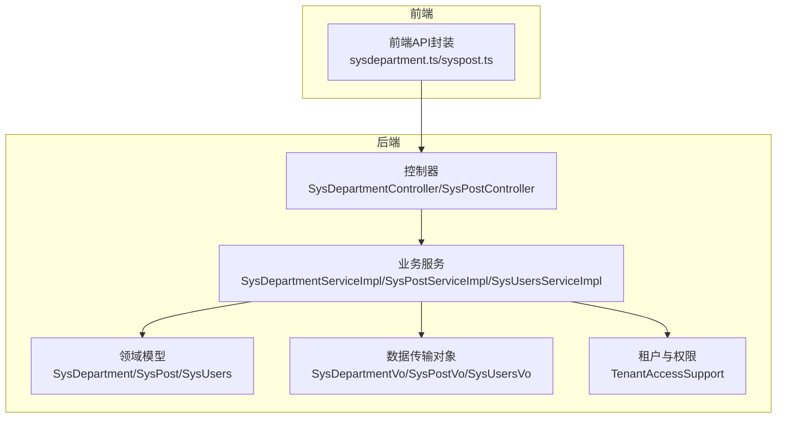
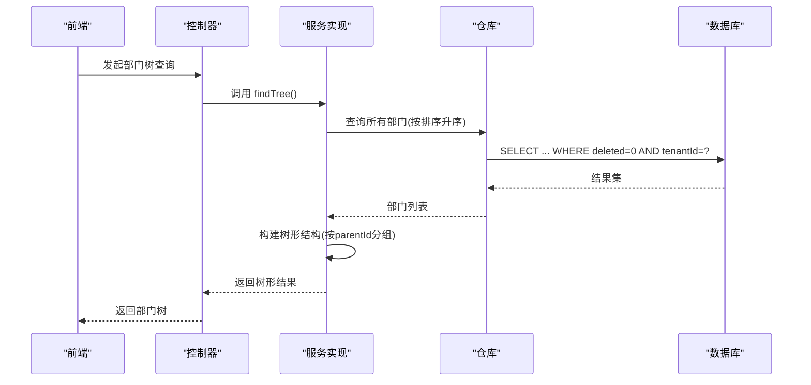
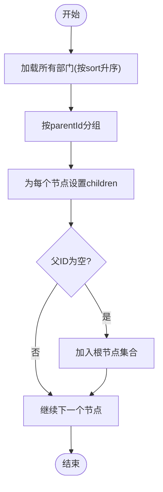
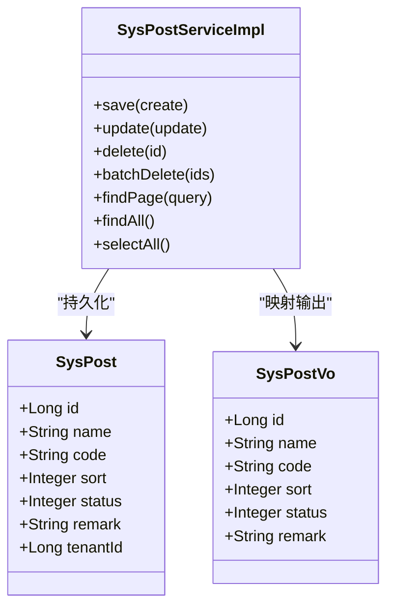
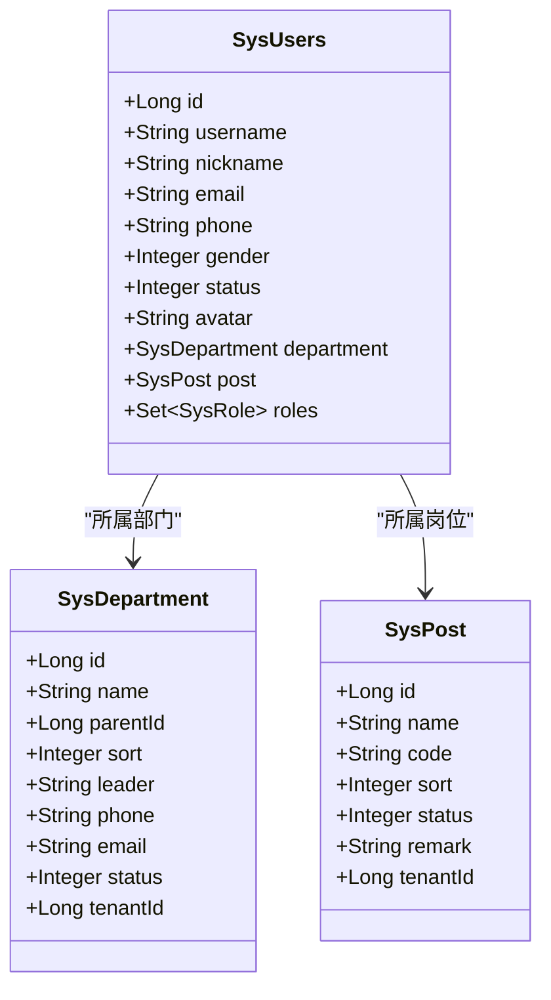
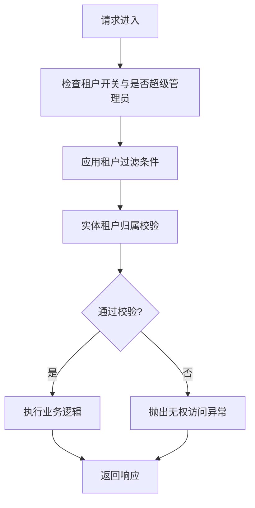
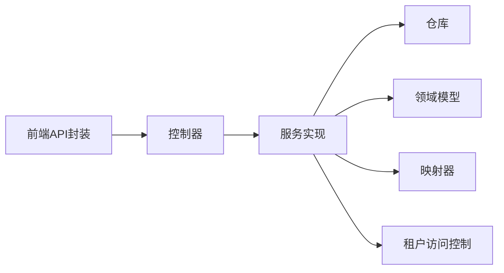

# 部门岗位管理

<cite>
**本文档引用的文件**
- [SysDepartment.java](file://system-module/src/main/java/com/fastproject/system/domain/SysDepartment.java)
- [SysPost.java](file://system-module/src/main/java/com/fastproject/system/domain/SysPost.java)
- [SysUsers.java](file://system-module/src/main/java/com/fastproject/system/domain/SysUsers.java)
- [SysDepartmentVo.java](file://system-module/src/main/java/com/fastproject/system/vo/department/SysDepartmentVo.java)
- [SysPostVo.java](file://system-module/src/main/java/com/fastproject/system/vo/post/SysPostVo.java)
- [SysUsersVo.java](file://system-module/src/main/java/com/fastproject/system/vo/users/SysUsersVo.java)
- [SysDepartmentServiceImpl.java](file://system-module/src/main/java/com/fastproject/system/service/impl/SysDepartmentServiceImpl.java)
- [SysPostServiceImpl.java](file://system-module/src/main/java/com/fastproject/system/service/impl/SysPostServiceImpl.java)
- [SysUsersServiceImpl.java](file://system-module/src/main/java/com/fastproject/system/service/impl/SysUsersServiceImpl.java)
- [SysDepartmentController.java](file://run-admin/src/main/java/com/fastproject/module/system/controller/SysDepartmentController.java)
- [SysPostController.java](file://run-admin/src/main/java/com/fastproject/module/system/controller/SysPostController.java)
- [TenantAccessSupport.java](file://system-module/src/main/java/com/fastproject/system/tenant/TenantAccessSupport.java)
- [sysdepartment.ts](file://fast-ui/apps/admin-vue/src/api/system/sysdepartment.ts)
- [syspost.ts](file://fast-ui/apps/admin-vue/src/api/system/syspost.ts)
</cite>

## 目录
1. [引言](#引言)
2. [项目结构](#项目结构)
3. [核心组件](#核心组件)
4. [架构总览](#架构总览)
5. [详细组件分析](#详细组件分析)
6. [依赖关系分析](#依赖关系分析)
7. [性能考虑](#性能考虑)
8. [故障排查指南](#故障排查指南)
9. [结论](#结论)
10. [附录](#附录)

## 引言
本文件面向“部门岗位管理”功能，系统性阐述组织架构设计、部门树形结构实现、岗位管理机制与人员编制控制。重点覆盖：
- 组织架构设计与部门层级关系
- 部门父子关系与树形查询
- 部门负责人管理与人员分配
- 岗位与用户的关联关系、岗位权限设计与变更流程
- 完整的组织架构API文档（部门树查询、岗位列表、人员统计等）
- 部门数据的递归查询与权限继承机制

## 项目结构
该功能位于后端模块 system-module 与 run-admin 控制器层，前端通过 fast-ui 提供 API 调用封装。核心文件分布如下：
- 领域模型：部门、岗位、用户
- 数据传输对象：部门 VO、岗位 VO、用户 VO
- 业务服务：部门服务、岗位服务、用户服务
- 控制器：部门控制器、岗位控制器
- 权限与租户：多租户访问控制支持
- 前端 API 封装：部门与岗位的前端请求封装

图表来源
- [SysDepartment.java](file://system-module/src/main/java/com/fastproject/system/domain/SysDepartment.java#L11-L58)
- [SysPost.java](file://system-module/src/main/java/com/fastproject/system/domain/SysPost.java#L12-L48)
- [SysUsers.java](file://system-module/src/main/java/com/fastproject/system/domain/SysUsers.java#L15-L94)
- [SysDepartmentVo.java](file://system-module/src/main/java/com/fastproject/system/vo/department/SysDepartmentVo.java#L10-L56)
- [SysPostVo.java](file://system-module/src/main/java/com/fastproject/system/vo/post/SysPostVo.java#L8-L39)
- [SysUsersVo.java](file://system-module/src/main/java/com/fastproject/system/vo/users/SysUsersVo.java#L10-L61)
- [SysDepartmentServiceImpl.java](file://system-module/src/main/java/com/fastproject/system/service/impl/SysDepartmentServiceImpl.java#L36-L184)
- [SysPostServiceImpl.java](file://system-module/src/main/java/com/fastproject/system/service/impl/SysPostServiceImpl.java#L34-L157)
- [SysUsersServiceImpl.java](file://system-module/src/main/java/com/fastproject/system/service/impl/SysUsersServiceImpl.java#L37-L131)
- [SysDepartmentController.java](file://run-admin/src/main/java/com/fastproject/module/system/controller/SysDepartmentController.java#L75-L108)
- [SysPostController.java](file://run-admin/src/main/java/com/fastproject/module/system/controller/SysPostController.java#L26-L108)
- [TenantAccessSupport.java](file://system-module/src/main/java/com/fastproject/system/tenant/TenantAccessSupport.java#L21-L104)
- [sysdepartment.ts](file://fast-ui/apps/admin-vue/src/api/system/sysdepartment.ts#L1-L107)
- [syspost.ts](file://fast-ui/apps/admin-vue/src/api/system/syspost.ts#L1-L81)

章节来源
- [SysDepartment.java](file://system-module/src/main/java/com/fastproject/system/domain/SysDepartment.java#L11-L58)
- [SysPost.java](file://system-module/src/main/java/com/fastproject/system/domain/SysPost.java#L12-L48)
- [SysUsers.java](file://system-module/src/main/java/com/fastproject/system/domain/SysUsers.java#L15-L94)
- [SysDepartmentServiceImpl.java](file://system-module/src/main/java/com/fastproject/system/service/impl/SysDepartmentServiceImpl.java#L36-L184)
- [SysPostServiceImpl.java](file://system-module/src/main/java/com/fastproject/system/service/impl/SysPostServiceImpl.java#L34-L157)
- [SysUsersServiceImpl.java](file://system-module/src/main/java/com/fastproject/system/service/impl/SysUsersServiceImpl.java#L37-L131)
- [SysDepartmentController.java](file://run-admin/src/main/java/com/fastproject/module/system/controller/SysDepartmentController.java#L75-L108)
- [SysPostController.java](file://run-admin/src/main/java/com/fastproject/module/system/controller/SysPostController.java#L26-L108)
- [TenantAccessSupport.java](file://system-module/src/main/java/com/fastproject/system/tenant/TenantAccessSupport.java#L21-L104)
- [sysdepartment.ts](file://fast-ui/apps/admin-vue/src/api/system/sysdepartment.ts#L1-L107)
- [syspost.ts](file://fast-ui/apps/admin-vue/src/api/system/syspost.ts#L1-L81)

## 核心组件
- 领域模型
  - 部门实体：包含名称、父级ID、排序、负责人、电话、邮箱、状态、租户ID等字段，并支持软删除与租户范围限制。
  - 岗位实体：包含名称、编码、排序、状态、备注、租户ID等字段，并支持软删除与租户范围限制。
  - 用户实体：包含账号、密码、昵称、邮箱、电话、性别、状态、头像、部门与岗位关联，以及多对多角色集合。
- 数据传输对象
  - 部门 VO：包含部门基本信息与子部门列表，用于树形展示。
  - 岗位 VO：包含岗位基本信息。
  - 用户 VO：包含用户基本信息及部门ID、岗位ID等。
- 业务服务
  - 部门服务：提供新增、修改、删除、批量删除、分页查询、树形查询、全量查询、正常状态查询等能力。
  - 岗位服务：提供新增、修改、删除、批量删除、分页查询、全量查询、正常状态查询等能力。
  - 用户服务：负责用户创建与更新时的部门与岗位绑定校验与租户访问控制。
- 控制器
  - 部门控制器：提供部门树、全量查询、分页、详情、增删改等接口。
  - 岗位控制器：提供岗位列表、分页、详情、增删改、批量删除等接口。
- 权限与租户
  - 多租户访问控制：自动注入当前租户ID，应用租户过滤条件，校验实体租户归属，支持超级管理员豁免。

章节来源
- [SysDepartment.java](file://system-module/src/main/java/com/fastproject/system/domain/SysDepartment.java#L11-L58)
- [SysPost.java](file://system-module/src/main/java/com/fastproject/system/domain/SysPost.java#L12-L48)
- [SysUsers.java](file://system-module/src/main/java/com/fastproject/system/domain/SysUsers.java#L15-L94)
- [SysDepartmentVo.java](file://system-module/src/main/java/com/fastproject/system/vo/department/SysDepartmentVo.java#L10-L56)
- [SysPostVo.java](file://system-module/src/main/java/com/fastproject/system/vo/post/SysPostVo.java#L8-L39)
- [SysUsersVo.java](file://system-module/src/main/java/com/fastproject/system/vo/users/SysUsersVo.java#L10-L61)
- [SysDepartmentServiceImpl.java](file://system-module/src/main/java/com/fastproject/system/service/impl/SysDepartmentServiceImpl.java#L36-L184)
- [SysPostServiceImpl.java](file://system-module/src/main/java/com/fastproject/system/service/impl/SysPostServiceImpl.java#L34-L157)
- [SysUsersServiceImpl.java](file://system-module/src/main/java/com/fastproject/system/service/impl/SysUsersServiceImpl.java#L37-L131)
- [SysDepartmentController.java](file://run-admin/src/main/java/com/fastproject/module/system/controller/SysDepartmentController.java#L75-L108)
- [SysPostController.java](file://run-admin/src/main/java/com/fastproject/module/system/controller/SysPostController.java#L26-L108)
- [TenantAccessSupport.java](file://system-module/src/main/java/com/fastproject/system/tenant/TenantAccessSupport.java#L21-L104)

## 架构总览
部门与岗位管理采用经典的分层架构：
- 表现层：控制器暴露REST接口
- 应用层：服务实现业务规则与事务控制
- 领域层：实体与仓库处理数据持久化与约束
- 前端层：API封装调用后端接口

图表来源
- [SysDepartmentController.java](file://run-admin/src/main/java/com/fastproject/module/system/controller/SysDepartmentController.java#L96-L100)
- [SysDepartmentServiceImpl.java](file://system-module/src/main/java/com/fastproject/system/service/impl/SysDepartmentServiceImpl.java#L151-L184)
- [TenantAccessSupport.java](file://system-module/src/main/java/com/fastproject/system/tenant/TenantAccessSupport.java#L66-L71)

## 详细组件分析

### 部门树形结构实现
- 数据模型
  - 部门实体包含父级ID字段，支持自关联形成层级结构。
  - 使用软删除与租户过滤，确保查询结果符合当前租户范围。
- 服务实现
  - 先查询所有部门并按排序升序排列，再通过Map按父ID分组构建树形结构。
  - 树根节点为父ID为空或为0的部门集合。
- 前端交互
  - 提供“部门树查询”和“全量正常状态部门树查询”两个接口，分别用于树形展示与选择框使用。

图表来源
- [SysDepartmentServiceImpl.java](file://system-module/src/main/java/com/fastproject/system/service/impl/SysDepartmentServiceImpl.java#L177-L184)
- [SysDepartmentVo.java](file://system-module/src/main/java/com/fastproject/system/vo/department/SysDepartmentVo.java#L54-L56)

章节来源
- [SysDepartment.java](file://system-module/src/main/java/com/fastproject/system/domain/SysDepartment.java#L25-L27)
- [SysDepartmentServiceImpl.java](file://system-module/src/main/java/com/fastproject/system/service/impl/SysDepartmentServiceImpl.java#L151-L184)
- [SysDepartmentVo.java](file://system-module/src/main/java/com/fastproject/system/vo/department/SysDepartmentVo.java#L10-L56)
- [sysdepartment.ts](file://fast-ui/apps/admin-vue/src/api/system/sysdepartment.ts#L95-L107)

### 岗位管理机制
- 数据模型
  - 岗位实体包含名称、编码、排序、状态、备注、租户ID等字段，支持软删除与租户过滤。
- 服务实现
  - 新增/修改前进行编码唯一性校验（排除自身）。
  - 支持分页查询、全量查询、正常状态查询。
- 前端交互
  - 提供岗位列表、分页、详情、增删改、批量删除等接口。

图表来源
- [SysPost.java](file://system-module/src/main/java/com/fastproject/system/domain/SysPost.java#L12-L48)
- [SysPostVo.java](file://system-module/src/main/java/com/fastproject/system/vo/post/SysPostVo.java#L8-L39)
- [SysPostServiceImpl.java](file://system-module/src/main/java/com/fastproject/system/service/impl/SysPostServiceImpl.java#L42-L156)

章节来源
- [SysPost.java](file://system-module/src/main/java/com/fastproject/system/domain/SysPost.java#L12-L48)
- [SysPostServiceImpl.java](file://system-module/src/main/java/com/fastproject/system/service/impl/SysPostServiceImpl.java#L42-L156)
- [SysPostController.java](file://run-admin/src/main/java/com/fastproject/module/system/controller/SysPostController.java#L33-L108)
- [syspost.ts](file://fast-ui/apps/admin-vue/src/api/system/syspost.ts#L43-L81)

### 人员编制控制与部门负责人管理
- 用户与部门/岗位关联
  - 用户实体包含部门与岗位的多对一关联，用户创建/更新时会校验部门与岗位的租户归属。
- 编制控制
  - 通过用户与岗位的关联实现“岗位编制”的概念；前端表单支持选择部门与岗位。
- 部门负责人
  - 部门实体包含负责人字段，可用于标识部门负责人信息。

图表来源
- [SysUsers.java](file://system-module/src/main/java/com/fastproject/system/domain/SysUsers.java#L69-L93)
- [SysDepartment.java](file://system-module/src/main/java/com/fastproject/system/domain/SysDepartment.java#L25-L57)
- [SysPost.java](file://system-module/src/main/java/com/fastproject/system/domain/SysPost.java#L25-L47)

章节来源
- [SysUsersServiceImpl.java](file://system-module/src/main/java/com/fastproject/system/service/impl/SysUsersServiceImpl.java#L69-L83)
- [SysUsersServiceImpl.java](file://system-module/src/main/java/com/fastproject/system/service/impl/SysUsersServiceImpl.java#L109-L131)
- [SysUsersVo.java](file://system-module/src/main/java/com/fastproject/system/vo/users/SysUsersVo.java#L48-L55)
- [SysDepartment.java](file://system-module/src/main/java/com/fastproject/system/domain/SysDepartment.java#L35-L37)

### 权限继承与租户隔离
- 多租户访问控制
  - 自动注入当前租户ID，应用租户过滤条件到查询中。
  - 对实体操作进行租户归属校验，防止跨租户访问。
  - 支持超级管理员豁免策略。
- 权限设计
  - 控制器方法使用基于表达式的权限注解，确保只有具备相应权限的用户才能执行操作。

图表来源
- [TenantAccessSupport.java](file://system-module/src/main/java/com/fastproject/system/tenant/TenantAccessSupport.java#L37-L95)
- [SysDepartmentServiceImpl.java](file://system-module/src/main/java/com/fastproject/system/service/impl/SysDepartmentServiceImpl.java#L152-L156)
- [SysPostServiceImpl.java](file://system-module/src/main/java/com/fastproject/system/service/impl/SysPostServiceImpl.java#L115-L116)

章节来源
- [TenantAccessSupport.java](file://system-module/src/main/java/com/fastproject/system/tenant/TenantAccessSupport.java#L21-L104)
- [SysDepartmentController.java](file://run-admin/src/main/java/com/fastproject/module/system/controller/SysDepartmentController.java#L78-L108)
- [SysPostController.java](file://run-admin/src/main/java/com/fastproject/module/system/controller/SysPostController.java#L33-L108)

## 依赖关系分析
- 组件耦合
  - 控制器依赖服务接口，服务实现依赖仓库与映射器。
  - 领域模型通过注解声明软删除与租户过滤，避免在业务层重复处理。
- 外部依赖
  - 前端通过API封装统一调用后端接口，降低耦合度。
- 可能的循环依赖
  - 当前结构清晰，控制器与服务通过接口解耦，未发现循环依赖迹象。

图表来源
- [sysdepartment.ts](file://fast-ui/apps/admin-vue/src/api/system/sysdepartment.ts#L1-L107)
- [syspost.ts](file://fast-ui/apps/admin-vue/src/api/system/syspost.ts#L1-L81)
- [SysDepartmentController.java](file://run-admin/src/main/java/com/fastproject/module/system/controller/SysDepartmentController.java#L75-L108)
- [SysPostController.java](file://run-admin/src/main/java/com/fastproject/module/system/controller/SysPostController.java#L26-L108)
- [SysDepartmentServiceImpl.java](file://system-module/src/main/java/com/fastproject/system/service/impl/SysDepartmentServiceImpl.java#L36-L184)
- [SysPostServiceImpl.java](file://system-module/src/main/java/com/fastproject/system/service/impl/SysPostServiceImpl.java#L34-L157)
- [TenantAccessSupport.java](file://system-module/src/main/java/com/fastproject/system/tenant/TenantAccessSupport.java#L21-L104)

章节来源
- [sysdepartment.ts](file://fast-ui/apps/admin-vue/src/api/system/sysdepartment.ts#L1-L107)
- [syspost.ts](file://fast-ui/apps/admin-vue/src/api/system/syspost.ts#L1-L81)
- [SysDepartmentController.java](file://run-admin/src/main/java/com/fastproject/module/system/controller/SysDepartmentController.java#L75-L108)
- [SysPostController.java](file://run-admin/src/main/java/com/fastproject/module/system/controller/SysPostController.java#L26-L108)
- [SysDepartmentServiceImpl.java](file://system-module/src/main/java/com/fastproject/system/service/impl/SysDepartmentServiceImpl.java#L36-L184)
- [SysPostServiceImpl.java](file://system-module/src/main/java/com/fastproject/system/service/impl/SysPostServiceImpl.java#L34-L157)
- [TenantAccessSupport.java](file://system-module/src/main/java/com/fastproject/system/tenant/TenantAccessSupport.java#L21-L104)

## 性能考虑
- 查询优化
  - 部门与岗位均按排序字段升序查询，减少前端二次排序成本。
  - 树形构建采用一次查询+内存分组，避免N+1查询问题。
- 事务与一致性
  - 关键操作（如批量删除）使用事务保证一致性。
- 缓存建议
  - 对于高频读取的部门树与岗位列表，可在应用层引入缓存以降低数据库压力（建议在服务层增加缓存策略）。

## 故障排查指南
- 常见异常
  - “部门名称已存在”：新增或修改时名称冲突。
  - “岗位编码已存在”：新增或修改时编码冲突。
  - “该部门下存在子部门，无法删除”：删除前需先清理子部门。
  - “无权访问当前租户数据”：非超级管理员访问其他租户数据。
- 排查步骤
  - 确认当前用户是否为超级管理员或是否绑定了正确租户。
  - 检查是否存在子部门导致删除失败。
  - 核对名称/编码唯一性约束是否被触发。
  - 查看日志中服务层记录的业务日志定位问题。

章节来源
- [SysDepartmentServiceImpl.java](file://system-module/src/main/java/com/fastproject/system/service/impl/SysDepartmentServiceImpl.java#L47-L50)
- [SysPostServiceImpl.java](file://system-module/src/main/java/com/fastproject/system/service/impl/SysPostServiceImpl.java#L47-L50)
- [SysDepartmentServiceImpl.java](file://system-module/src/main/java/com/fastproject/system/service/impl/SysDepartmentServiceImpl.java#L87-L89)
- [TenantAccessSupport.java](file://system-module/src/main/java/com/fastproject/system/tenant/TenantAccessSupport.java#L87-L95)

## 结论
本功能通过清晰的分层架构与完善的租户访问控制，实现了部门树形结构、岗位管理与人员编制控制。服务层提供稳定的业务规则与事务保障，控制器暴露标准化接口，前端通过API封装简化调用。建议在生产环境中结合缓存与监控进一步提升性能与可观测性。

## 附录

### 组织架构API文档

- 部门相关接口
  - GET /sys/department/tree
    - 功能：查询部门树形结构
    - 权限：admin:system:department:page
    - 返回：部门树形列表
  - GET /sys/department/selectAll
    - 功能：查询所有正常状态的部门（树形），用于选择框
    - 返回：正常状态部门树形列表
  - POST /sys/department/page
    - 功能：分页查询部门
    - 权限：admin:system:department:page
    - 请求体：分页参数与筛选条件
    - 返回：分页结果
  - GET /sys/department/{id}
    - 功能：获取部门详情
    - 权限：admin:system:department:page
    - 返回：部门详情
  - POST /sys/department
    - 功能：新增部门
    - 权限：admin:system:department:add
    - 请求体：部门创建参数
    - 返回：部门ID
  - PUT /sys/department
    - 功能：修改部门
    - 权限：admin:system:department:update
    - 请求体：部门更新参数
    - 返回：成功
  - DELETE /sys/department/{id}
    - 功能：删除部门
    - 权限：admin:system:department:delete
    - 返回：成功
  - DELETE /sys/department/batch
    - 功能：批量删除部门
    - 权限：admin:system:department:delete
    - 请求体：部门ID数组
    - 返回：成功

- 岗位相关接口
  - POST /sys/post
    - 功能：新增岗位
    - 权限：admin:system:post:add
    - 请求体：岗位创建参数
    - 返回：岗位ID
  - PUT /sys/post
    - 功能：修改岗位
    - 权限：admin:system:post:update
    - 请求体：岗位更新参数
    - 返回：成功
  - DELETE /sys/post/{id}
    - 功能：删除岗位
    - 权限：admin:system:post:delete
    - 返回：成功
  - DELETE /sys/post/batch
    - 功能：批量删除岗位
    - 权限：admin:system:post:delete
    - 请求体：岗位ID数组
    - 返回：成功
  - POST /sys/post/page
    - 功能：分页查询岗位
    - 权限：admin:system:post:page
    - 请求体：分页参数与筛选条件
    - 返回：分页结果
  - GET /sys/post/{id}
    - 功能：获取岗位详情
    - 权限：admin:system:post:page
    - 返回：岗位详情
  - GET /sys/post/list
    - 功能：查询所有岗位（列表）
    - 权限：admin:system:post:page
    - 返回：岗位列表
  - GET /sys/post/selectAll
    - 功能：查询所有正常状态的岗位（用于选择框）
    - 返回：正常状态岗位列表

章节来源
- [SysDepartmentController.java](file://run-admin/src/main/java/com/fastproject/module/system/controller/SysDepartmentController.java#L78-L108)
- [SysPostController.java](file://run-admin/src/main/java/com/fastproject/module/system/controller/SysPostController.java#L33-L108)
- [sysdepartment.ts](file://fast-ui/apps/admin-vue/src/api/system/sysdepartment.ts#L47-L107)
- [syspost.ts](file://fast-ui/apps/admin-vue/src/api/system/syspost.ts#L43-L81)