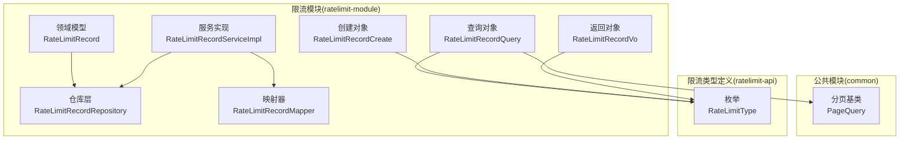
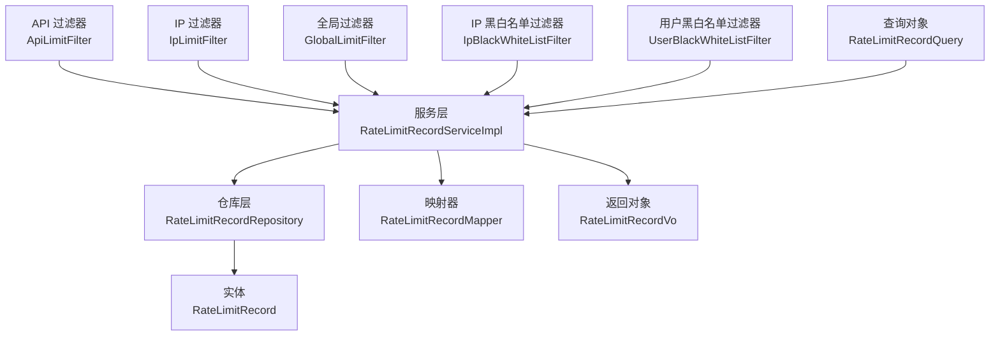
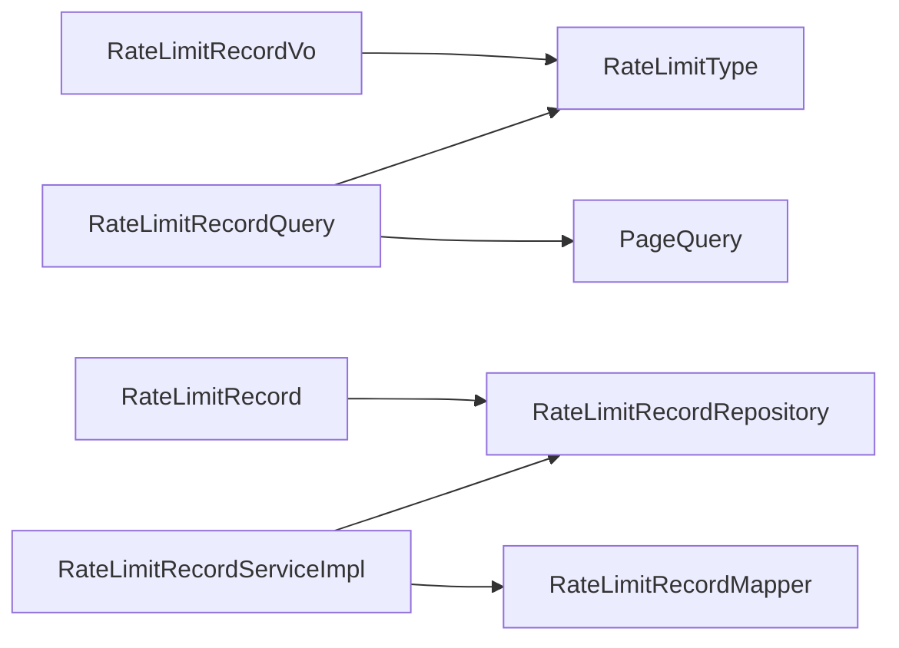

# 监控与记录

<cite>
**本文引用的文件**
- [RateLimitRecord.java](file://ratelimit-module/src/main/java/com//fastproject/ratelimit/domain/RateLimitRecord.java)
- [RateLimitRecordRepository.java](file://ratelimit-module/src/main/java/com//fastproject/ratelimit/repository/db/RateLimitRecordRepository.java)
- [RateLimitRecordServiceImpl.java](file://ratelimit-module/src/main/java/com//fastproject/ratelimit/service/impl/RateLimitRecordServiceImpl.java)
- [RateLimitRecordMapper.java](file://ratelimit-module/src/main/java/com/fastproject/ratelimit/mapper/RateLimitRecordMapper.java)
- [RateLimitRecordQuery.java](file://ratelimit-module/src/main/java/com/fastproject/ratelimit/vo/record/RateLimitRecordQuery.java)
- [RateLimitRecordCreate.java](file://ratelimit-module/src/main/java/com/fastproject/ratelimit/vo/record/RateLimitRecordCreate.java)
- [RateLimitRecordVo.java](file://ratelimit-module/src/main/java/com/fastproject/ratelimit/vo/record/RateLimitRecordVo.java)
- [RateLimitRecordService.java](file://ratelimit-module/src/main/java/com/fastproject/ratelimit/service/RateLimitRecordService.java)
- [RateLimitType.java](file://ratelimit-api/src/main/java/com/fastproject/ratelimit/enums/RateLimitType.java)
- [PageQuery.java](file://common/src/main/java/com/fastproject/db/PageQuery.java)
- [ApiLimitFilter.java](file://ratelimit-module/src/main/java/com/ fastproject/ratelimit/config/ApiLimitFilter.java)
- [IpLimitFilter.java](file://ratelimit-module/src/main/java/com/ fastproject/ratelimit/config/IpLimitFilter.java)
- [GlobalLimitFilter.java](file://ratelimit-module/src/main/java/com/ fastproject/ratelimit/config/GlobalLimitFilter.java)
- [IpBlackWhiteListFilter.java](file://ratelimit-module/src/main/java/com/ fastproject/ratelimit/config/IpBlackWhiteListFilter.java)
- [UserBlackWhiteListFilter.java](file://ratelimit-module/src/main/java/com/ fastproject/ratelimit/config/UserBlackWhiteListFilter.java)
</cite>

## 目录
1. [简介](#简介)
2. [项目结构](#项目结构)
3. [核心组件](#核心组件)
4. [架构总览](#架构总览)
5. [组件详细分析](#组件详细分析)
6. [依赖关系分析](#依赖关系分析)
7. [性能考量](#性能考量)
8. [故障排查指南](#故障排查指南)
9. [结论](#结论)
10. [附录](#附录)

## 简介
本文件围绕“限流监控与记录”主题，系统性梳理限流记录的采集、存储、查询与统计分析能力，明确数据模型、索引设计、API 接口规范、可视化与报表方案以及性能优化建议。通过对限流记录实体、仓库层、服务层、映射器、查询对象及枚举类型的深入分析，帮助读者快速理解并高效使用该监控体系。

## 项目结构
限流监控与记录相关代码主要分布在以下模块与包中：
- 领域模型与仓库层：ratelimit-module 下的 domain、repository/db
- 服务层与映射器：ratelimit-module 下的 service/impl、mapper
- 值对象与查询：ratelimit-module 下的 vo/record
- 枚举类型：ratelimit-api 下的 enums
- 分页基类：common 下的 db

图表来源
- [RateLimitRecord.java](file://ratelimit-module/src/main/java/com/ fastproject/ratelimit/domain/RateLimitRecord.java#L1-L84)
- [RateLimitRecordRepository.java](file://ratelimit-module/src/main/java/com/ fastproject/ratelimit/repository/db/RateLimitRecordRepository.java#L1-L47)
- [RateLimitRecordServiceImpl.java](file://ratelimit-module/src/main/java/com/ fastproject/ratelimit/service/impl/RateLimitRecordServiceImpl.java#L1-L124)
- [RateLimitRecordMapper.java](file://ratelimit-module/src/main/java/com/ fastproject/ratelimit/mapper/RateLimitRecordMapper.java#L1-L27)
- [RateLimitRecordQuery.java](file://ratelimit-module/src/main/java/com/ fastproject/ratelimit/vo/record/RateLimitRecordQuery.java#L1-L62)
- [RateLimitRecordCreate.java](file://ratelimit-module/src/main/java/com/ fastproject/ratelimit/vo/record/RateLimitRecordCreate.java#L1-L68)
- [RateLimitRecordVo.java](file://ratelimit-module/src/main/java/com/ fastproject/ratelimit/vo/record/RateLimitRecordVo.java#L1-L78)
- [PageQuery.java](file://common/src/main/java/com/ fastproject/db/PageQuery.java#L1-L16)
- [RateLimitType.java](file://ratelimit-api/src/main/java/com/ fastproject/ratelimit/enums/RateLimitType.java#L1-L24)

章节来源
- [RateLimitRecord.java](file://ratelimit-module/src/main/java/com/ fastproject/ratelimit/domain/RateLimitRecord.java#L1-L84)
- [RateLimitRecordRepository.java](file://ratelimit-module/src/main/java/com/ fastproject/ratelimit/repository/db/RateLimitRecordRepository.java#L1-L47)
- [RateLimitRecordServiceImpl.java](file://ratelimit-module/src/main/java/com/ fastproject/ratelimit/service/impl/RateLimitRecordServiceImpl.java#L1-L124)
- [RateLimitRecordMapper.java](file://ratelimit-module/src/main/java/com/ fastproject/ratelimit/mapper/RateLimitRecordMapper.java#L1-L27)
- [RateLimitRecordQuery.java](file://ratelimit-module/src/main/java/com/ fastproject/ratelimit/vo/record/RateLimitRecordQuery.java#L1-L62)
- [RateLimitRecordCreate.java](file://ratelimit-module/src/main/java/com/ fastproject/ratelimit/vo/record/RateLimitRecordCreate.java#L1-L68)
- [RateLimitRecordVo.java](file://ratelimit-module/src/main/java/com/ fastproject/ratelimit/vo/record/RateLimitRecordVo.java#L1-L78)
- [RateLimitRecordService.java](file://ratelimit-module/src/main/java/com/ fastproject/ratelimit/service/RateLimitRecordService.java#L1-L45)
- [RateLimitType.java](file://ratelimit-api/src/main/java/com/ fastproject/ratelimit/enums/RateLimitType.java#L1-L24)
- [PageQuery.java](file://common/src/main/java/com/ fastproject/db/PageQuery.java#L1-L16)

## 核心组件
- 数据模型：RateLimitRecord（持久化实体，包含应用编码、限流键、限流类型、目标值、请求方法、URL、IP、用户ID、请求头、查询参数、触发原因等）
- 仓库层：RateLimitRecordRepository（基于 Spring Data JPA 的查询扩展，支持按限流键、类型、目标值、用户ID、IP 等条件检索）
- 服务层：RateLimitRecordServiceImpl（提供保存、更新、删除、批量删除、分页查询等能力；分页默认按主键降序）
- 映射器：RateLimitRecordMapper（负责实体与 VO/DTO 的双向转换）
- 查询对象：RateLimitRecordQuery（继承分页基类，支持多维过滤：应用编码、限流键、限流类型、目标值、URL、IP、用户ID、创建时间区间）
- 创建对象：RateLimitRecordCreate（用于新增限流记录）
- 返回对象：RateLimitRecordVo（对外暴露的视图对象）
- 枚举：RateLimitType（限流类型枚举：全局、IP、用户、API）

章节来源
- [RateLimitRecord.java](file://ratelimit-module/src/main/java/com/ fastproject/ratelimit/domain/RateLimitRecord.java#L1-L84)
- [RateLimitRecordRepository.java](file://ratelimit-module/src/main/java/com/ fastproject/ratelimit/repository/db/RateLimitRecordRepository.java#L1-L47)
- [RateLimitRecordServiceImpl.java](file://ratelimit-module/src/main/java/com/ fastproject/ratelimit/service/impl/RateLimitRecordServiceImpl.java#L1-L124)
- [RateLimitRecordMapper.java](file://ratelimit-module/src/main/java/com/ fastproject/ratelimit/mapper/RateLimitRecordMapper.java#L1-L27)
- [RateLimitRecordQuery.java](file://ratelimit-module/src/main/java/com/ fastproject/ratelimit/vo/record/RateLimitRecordQuery.java#L1-L62)
- [RateLimitRecordCreate.java](file://ratelimit-module/src/main/java/com/ fastproject/ratelimit/vo/record/RateLimitRecordCreate.java#L1-L68)
- [RateLimitRecordVo.java](file://ratelimit-module/src/main/java/com/ fastproject/ratelimit/vo/record/RateLimitRecordVo.java#L1-L78)
- [RateLimitRecordService.java](file://ratelimit-module/src/main/java/com/ fastproject/ratelimit/service/RateLimitRecordService.java#L1-L45)
- [RateLimitType.java](file://ratelimit-api/src/main/java/com/ fastproject/ratelimit/enums/RateLimitType.java#L1-L24)
- [PageQuery.java](file://common/src/main/java/com/ fastproject/db/PageQuery.java#L1-L16)

## 架构总览
限流记录从拦截器/过滤器产生，经由服务层写入数据库，最终通过查询接口对外提供分页查询能力。下图展示了关键组件之间的交互关系：

图表来源
- [ApiLimitFilter.java](file://ratelimit-module/src/main/java/com/ fastproject/ratelimit/config/ApiLimitFilter.java)
- [IpLimitFilter.java](file://ratelimit-module/src/main/java/com/ fastproject/ratelimit/config/IpLimitFilter.java)
- [GlobalLimitFilter.java](file://ratelimit-module/src/main/java/com/ fastproject/ratelimit/config/GlobalLimitFilter.java)
- [IpBlackWhiteListFilter.java](file://ratelimit-module/src/main/java/com/ fastproject/ratelimit/config/IpBlackWhiteListFilter.java)
- [UserBlackWhiteListFilter.java](file://ratelimit-module/src/main/java/com/ fastproject/ratelimit/config/UserBlackWhiteListFilter.java)
- [RateLimitRecordServiceImpl.java](file://ratelimit-module/src/main/java/com/ fastproject/ratelimit/service/impl/RateLimitRecordServiceImpl.java#L1-L124)
- [RateLimitRecordRepository.java](file://ratelimit-module/src/main/java/com/ fastproject/ratelimit/repository/db/RateLimitRecordRepository.java#L1-L47)
- [RateLimitRecord.java](file://ratelimit-module/src/main/java/com/ fastproject/ratelimit/domain/RateLimitRecord.java#L1-L84)
- [RateLimitRecordMapper.java](file://ratelimit-module/src/main/java/com/ fastproject/ratelimit/mapper/RateLimitRecordMapper.java#L1-L27)
- [RateLimitRecordQuery.java](file://ratelimit-module/src/main/java/com/ fastproject/ratelimit/vo/record/RateLimitRecordQuery.java#L1-L62)
- [RateLimitRecordVo.java](file://ratelimit-module/src/main/java/com/ fastproject/ratelimit/vo/record/RateLimitRecordVo.java#L1-L78)

## 组件详细分析

### 数据模型与字段语义
- 字段概览与含义
  - 应用编码：标识产生限流事件的应用来源
  - 限流键：唯一标识限流维度的键值（如限流策略标识）
  - 限流类型：枚举类型，区分全局、IP、用户、API 四种维度
  - 目标值：具体限流对象的目标值（如 IP 地址或用户 ID）
  - 请求方法/URL/IP/用户ID：请求上下文信息
  - 请求头/查询参数：便于复盘与审计
  - 触发原因：限流触发的具体原因描述
  - 创建时间：记录生成时间，用于统计与趋势分析

- 关键字段与索引设计建议
  - 主键：自增主键（由基础实体提供），用于默认排序与定位
  - 常用过滤字段：appCode、limitKey、limitType、targetValue、url、ip、userId、createTime
  - 建议在上述字段上建立合适索引以提升查询性能（具体索引策略需结合业务量与查询模式评估）

章节来源
- [RateLimitRecord.java](file://ratelimit-module/src/main/java/com/ fastproject/ratelimit/domain/RateLimitRecord.java#L1-L84)
- [RateLimitType.java](file://ratelimit-api/src/main/java/com/ fastproject/ratelimit/enums/RateLimitType.java#L1-L24)

### 仓库层与查询能力
- 支持的查询方法
  - 按限流键、限流类型、目标值、用户ID、IP 等条件检索
  - 复合条件查询：限流键+限流类型
- 设计要点
  - 使用 Spring Data JPA 的 Specification 动态拼接查询条件，支持模糊匹配与范围查询
  - 默认排序：按主键降序，确保最新记录优先展示

章节来源
- [RateLimitRecordRepository.java](file://ratelimit-module/src/main/java/com/ fastproject/ratelimit/repository/db/RateLimitRecordRepository.java#L1-L47)
- [RateLimitRecordServiceImpl.java](file://ratelimit-module/src/main/java/com/ fastproject/ratelimit/service/impl/RateLimitRecordServiceImpl.java#L82-L123)

### 服务层处理逻辑
- 能力清单
  - 新增：接收创建对象，映射为实体后持久化
  - 更新：按 ID 定位记录并更新（空值属性忽略映射）
  - 删除与批量删除：支持单条与批量删除
  - 查询详情：按 ID 查询并映射为 VO
  - 分页查询：支持多维过滤与时间区间过滤，默认按主键降序
- 性能与健壮性
  - 使用分页与条件过滤避免全表扫描
  - 对不存在记录的更新场景抛出业务异常，保证数据一致性

章节来源
- [RateLimitRecordService.java](file://ratelimit-module/src/main/java/com/ fastproject/ratelimit/service/RateLimitRecordService.java#L1-L45)
- [RateLimitRecordServiceImpl.java](file://ratelimit-module/src/main/java/com/ fastproject/ratelimit/service/impl/RateLimitRecordServiceImpl.java#L1-L124)
- [RateLimitRecordMapper.java](file://ratelimit-module/src/main/java/com/ fastproject/ratelimit/mapper/RateLimitRecordMapper.java#L1-L27)

### 查询对象与分页机制
- 查询对象字段
  - 继承分页基类，包含当前页与每页大小
  - 支持应用编码、限流键、限流类型、目标值、URL、IP、用户ID、创建时间起止
- 分页与排序
  - 默认按主键降序排列
  - 时间区间支持仅起始、仅结束或完整区间三种形式

章节来源
- [RateLimitRecordQuery.java](file://ratelimit-module/src/main/java/com/ fastproject/ratelimit/vo/record/RateLimitRecordQuery.java#L1-L62)
- [PageQuery.java](file://common/src/main/java/com/ fastproject/db/PageQuery.java#L1-L16)
- [RateLimitRecordServiceImpl.java](file://ratelimit-module/src/main/java/com/ fastproject/ratelimit/service/impl/RateLimitRecordServiceImpl.java#L82-L123)

### 采集路径与触发点
- 采集来源
  - API 限流过滤器、IP 限流过滤器、全局限流过滤器、IP 黑白名单过滤器、用户黑白名单过滤器
- 采集流程
  - 过滤器在判定限流后，构造创建对象并通过服务层写入数据库
  - 写入字段覆盖应用编码、限流键、限流类型、目标值、请求上下文与触发原因等

章节来源
- [ApiLimitFilter.java](file://ratelimit-module/src/main/java/com/ fastproject/ratelimit/config/ApiLimitFilter.java)
- [IpLimitFilter.java](file://ratelimit-module/src/main/java/com/ fastproject/ratelimit/config/IpLimitFilter.java)
- [GlobalLimitFilter.java](file://ratelimit-module/src/main/java/com/ fastproject/ratelimit/config/GlobalLimitFilter.java)
- [IpBlackWhiteListFilter.java](file://ratelimit-module/src/main/java/com/ fastproject/ratelimit/config/IpBlackWhiteListFilter.java)
- [UserBlackWhiteListFilter.java](file://ratelimit-module/src/main/java/com/ fastproject/ratelimit/config/UserBlackWhiteListFilter.java)
- [RateLimitRecordCreate.java](file://ratelimit-module/src/main/java/com/ fastproject/ratelimit/vo/record/RateLimitRecordCreate.java#L1-L68)

### 监控 API 接口文档
- 接口定义
  - 获取详情：GET /api/ratelimit/records/{id}
  - 分页查询：POST /api/ratelimit/records/page
- 请求参数
  - GET：id（路径参数）
  - POST：分页参数 page、pageSize；查询条件 appCode、limitKey、limitType、targetValue、url、ip、userId、createTimeBegin、createTimeEnd
- 响应格式
  - 成功时返回记录详情或分页结果（总数与列表）
  - 异常时返回统一错误信息
- 排序规则
  - 默认按主键降序
- 分页机制
  - page 从 0 开始
  - pageSize 控制每页数量

章节来源
- [RateLimitRecordService.java](file://ratelimit-module/src/main/java/com/ fastproject/ratelimit/service/RateLimitRecordService.java#L1-L45)
- [RateLimitRecordServiceImpl.java](file://ratelimit-module/src/main/java/com/ fastproject/ratelimit/service/impl/RateLimitRecordServiceImpl.java#L82-L123)
- [RateLimitRecordQuery.java](file://ratelimit-module/src/main/java/com/ fastproject/ratelimit/vo/record/RateLimitRecordQuery.java#L1-L62)
- [PageQuery.java](file://common/src/main/java/com/ fastproject/db/PageQuery.java#L1-L16)

### 统计分析与异常检测
- 命中率计算
  - 可基于时间窗口统计“被限流次数”与“总请求次数”的比值
  - 建议按 appCode、limitType、limitKey 等维度分别统计
- 趋势分析
  - 按小时/天聚合限流次数，观察峰值与低谷
  - 结合 URL/IP/用户ID 维度识别热点
- 异常检测
  - 基于历史均值与标准差设定阈值，检测异常激增
  - 对触发原因进行聚类分析，定位高频限流场景

说明：以上为通用统计思路，具体实现需结合业务需求与数据规模进行定制。

### 告警机制与阈值设置
- 告警维度
  - 整体命中率阈值
  - 单个限流键/URL/IP/用户维度的异常激增
- 通知策略
  - 邮件/IM/短信等多通道通知
  - 建议区分严重/警告级别，并设置去重与抑制策略

说明：本节为概念性指导，具体实现需结合现有告警平台与运维流程。

### 可视化方案与报表
- 可视化建议
  - 仪表盘：命中率、趋势曲线、热力图（按 URL/IP/用户）
  - 报表：日/周/月汇总报表，导出 CSV/PDF
- 报表字段
  - 时间、应用编码、限流类型、限流键、目标值、URL、IP、用户ID、触发原因、计数

说明：本节为概念性指导，具体实现需结合前端与 BI 工具。

### 系统调优与容量规划
- 调优方向
  - 基于限流记录识别热点资源，调整限流阈值与维度
  - 通过异常检测提前发现流量突增，扩容前置网关或缓存层
- 容量规划
  - 基于历史趋势预测峰值，预留冗余
  - 对高风险 URL/IP/用户实施隔离与限流兜底

说明：本节为概念性指导，具体实现需结合实际业务与监控数据。

## 依赖关系分析
- 组件耦合
  - 服务层依赖仓库层与映射器，职责清晰
  - 查询对象依赖分页基类与枚举类型，便于扩展
- 外部依赖
  - Spring Data JPA 提供查询与分页能力
  - MapStruct 提供对象映射支持

图表来源
- [RateLimitRecordQuery.java](file://ratelimit-module/src/main/java/com/ fastproject/ratelimit/vo/record/RateLimitRecordQuery.java#L1-L62)
- [RateLimitType.java](file://ratelimit-api/src/main/java/com/ fastproject/ratelimit/enums/RateLimitType.java#L1-L24)
- [PageQuery.java](file://common/src/main/java/com/ fastproject/db/PageQuery.java#L1-L16)
- [RateLimitRecordServiceImpl.java](file://ratelimit-module/src/main/java/com/ fastproject/ratelimit/service/impl/RateLimitRecordServiceImpl.java#L1-L124)
- [RateLimitRecordRepository.java](file://ratelimit-module/src/main/java/com/ fastproject/ratelimit/repository/db/RateLimitRecordRepository.java#L1-L47)
- [RateLimitRecordMapper.java](file://ratelimit-module/src/main/java/com/ fastproject/ratelimit/mapper/RateLimitRecordMapper.java#L1-L27)
- [RateLimitRecord.java](file://ratelimit-module/src/main/java/com/ fastproject/ratelimit/domain/RateLimitRecord.java#L1-L84)
- [RateLimitRecordVo.java](file://ratelimit-module/src/main/java/com/ fastproject/ratelimit/vo/record/RateLimitRecordVo.java#L1-L78)

## 性能考量
- 索引设计
  - 在 appCode、limitKey、limitType、targetValue、url、ip、userId、createTime 等常用过滤字段上建立索引
- 查询优化
  - 使用分页与条件过滤，避免一次性加载大量数据
  - 对时间区间查询采用“先粗后细”策略，减少全表扫描
- 写入优化
  - 批量写入与异步落库可降低写入延迟
- 缓存策略
  - 对热点查询结果进行短期缓存，减轻数据库压力

## 故障排查指南
- 常见问题
  - 查询无结果：检查查询条件是否正确，确认索引是否存在
  - 分页异常：确认 page 从 0 开始，pageSize 合理
  - 更新失败：确认记录存在且未被软删
- 排查步骤
  - 核对创建对象字段是否完整
  - 检查服务层日志与异常栈
  - 验证数据库中记录状态与字段值

章节来源
- [RateLimitRecordServiceImpl.java](file://ratelimit-module/src/main/java/com/ fastproject/ratelimit/service/impl/RateLimitRecordServiceImpl.java#L1-L124)
- [RateLimitRecordMapper.java](file://ratelimit-module/src/main/java/com/ fastproject/ratelimit/mapper/RateLimitRecordMapper.java#L1-L27)

## 结论
本限流监控与记录体系以清晰的分层设计实现了从采集到存储再到查询的闭环。通过完善的查询对象与分页机制，能够满足日常运营与分析需求。建议结合业务场景进一步完善索引、统计分析与告警策略，持续优化系统稳定性与可观测性。

## 附录
- 术语
  - 限流键：唯一标识限流维度的键值
  - 限流类型：全局、IP、用户、API
  - 触发原因：限流触发的具体原因描述
- 参考实现位置
  - 采集：各限流过滤器
  - 存储：服务层写入
  - 查询：分页查询接口