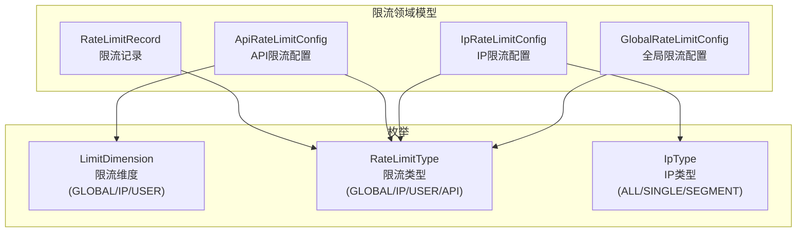
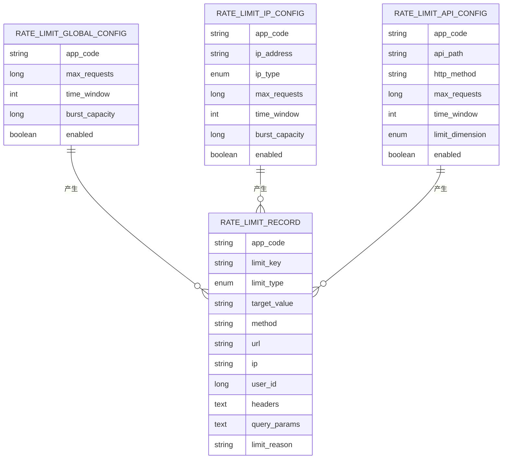
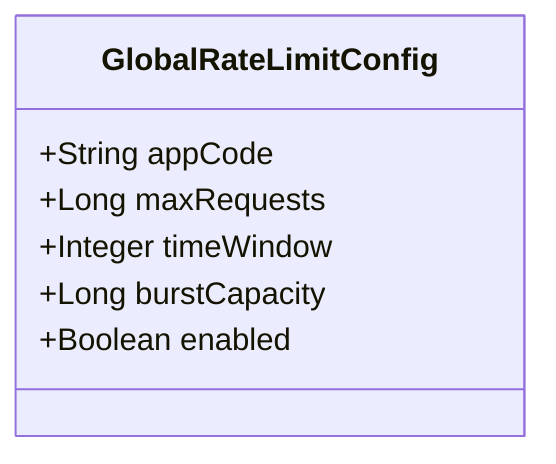
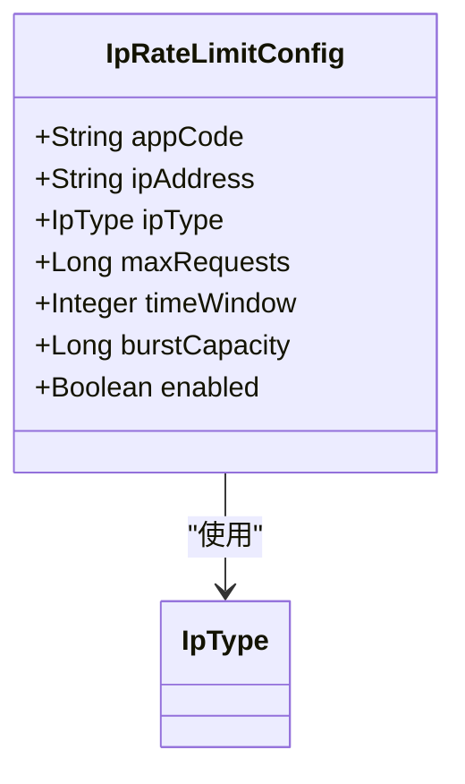
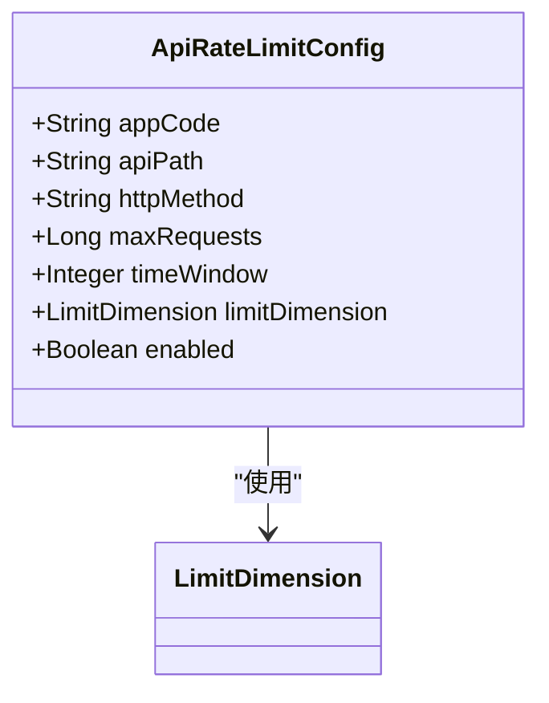
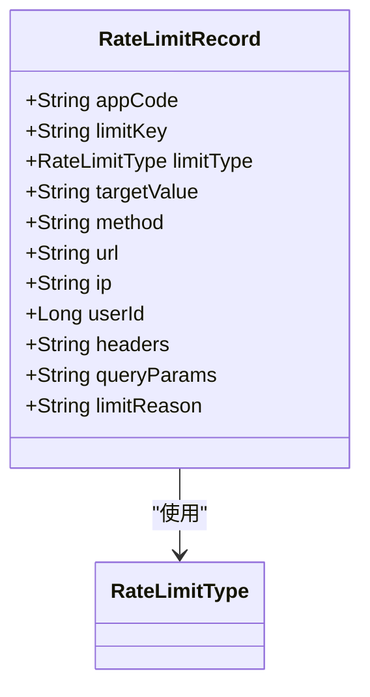
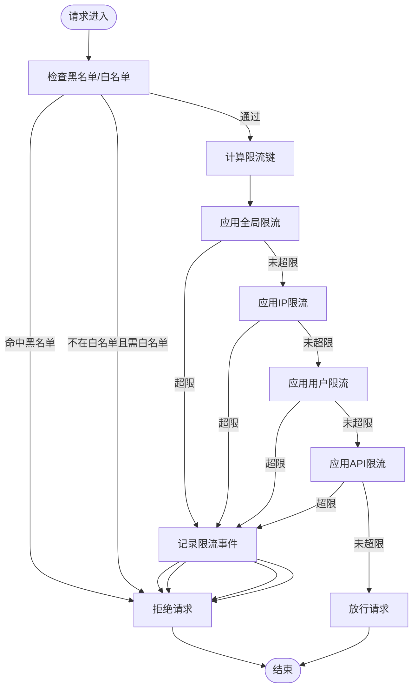
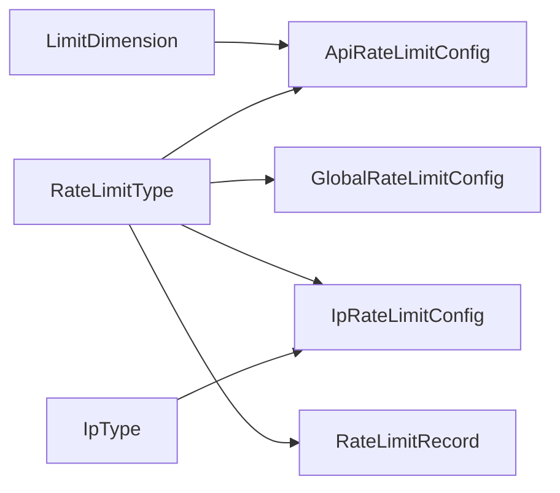

# 限流控制模块

<cite>
**本文引用的文件**
- [GlobalRateLimitConfig.java](file://ratelimit-module/src/main/java/com/fastproject/ratelimit/domain/GlobalRateLimitConfig.java)
- [IpRateLimitConfig.java](file://ratelimit-module/src/main/java/com/fastproject/ratelimit/domain/IpRateLimitConfig.java)
- [ApiRateLimitConfig.java](file://ratelimit-module/src/main/java/com/fastproject/ratelimit/domain/ApiRateLimitConfig.java)
- [RateLimitRecord.java](file://ratelimit-module/src/main/java/com/fastproject/ratelimit/domain/RateLimitRecord.java)
- [LimitDimension.java](file://ratelimit-api/src/main/java/com/fastproject/ratelimit/enums/LimitDimension.java)
- [RateLimitType.java](file://ratelimit-api/src/main/java/com/fastproject/ratelimit/enums/RateLimitType.java)
- [IpType.java](file://ratelimit-api/src/main/java/com/fastproject/ratelimit/enums/IpType.java)
</cite>

## 目录
1. [简介](#简介)
2. [项目结构](#项目结构)
3. [核心组件](#核心组件)
4. [架构总览](#架构总览)
5. [详细组件分析](#详细组件分析)
6. [依赖关系分析](#依赖关系分析)
7. [性能考虑](#性能考虑)
8. [故障排查指南](#故障排查指南)
9. [结论](#结论)
10. [附录](#附录)

## 简介
本技术文档系统性阐述限流控制模块的设计与实现，覆盖多维度限流策略（全局限流、IP限流、用户限流、API限流）与限流算法（滑动窗口、令牌桶）的适用场景与技术要点；说明配置管理、动态更新、限流记录统计、黑名单/白名单机制、限流事件处理与性能监控集成等高级能力；并给出配置参数说明、API 接口规范与使用示例，以及在微服务网关与业务服务中的部署策略与最佳实践。

## 项目结构
限流模块由“领域模型 + 枚举 + 配置与记录”构成，采用按功能域分层组织：
- 领域模型：全局、IP、API、记录等实体定义
- 枚举：限流维度、限流类型、IP类型
- 配置与记录：用于持久化限流策略与触发记录

图表来源
- [GlobalRateLimitConfig.java](file://ratelimit-module/src/main/java/com/fastproject/ratelimit/domain/GlobalRateLimitConfig.java#L1-L50)
- [IpRateLimitConfig.java](file://ratelimit-module/src/main/java/com/fastproject/ratelimit/domain/IpRateLimitConfig.java#L1-L65)
- [ApiRateLimitConfig.java](file://ratelimit-module/src/main/java/com/fastproject/ratelimit/domain/ApiRateLimitConfig.java#L1-L64)
- [RateLimitRecord.java](file://ratelimit-module/src/main/java/com/fastproject/ratelimit/domain/RateLimitRecord.java#L1-L84)
- [LimitDimension.java](file://ratelimit-api/src/main/java/com/fastproject/ratelimit/enums/LimitDimension.java#L1-L20)
- [RateLimitType.java](file://ratelimit-api/src/main/java/com/fastproject/ratelimit/enums/RateLimitType.java#L1-L24)
- [IpType.java](file://ratelimit-api/src/main/java/com/fastproject/ratelimit/enums/IpType.java#L1-L30)

章节来源
- [GlobalRateLimitConfig.java](file://ratelimit-module/src/main/java/com/fastproject/ratelimit/domain/GlobalRateLimitConfig.java#L1-L50)
- [IpRateLimitConfig.java](file://ratelimit-module/src/main/java/com/fastproject/ratelimit/domain/IpRateLimitConfig.java#L1-L65)
- [ApiRateLimitConfig.java](file://ratelimit-module/src/main/java/com/fastproject/ratelimit/domain/ApiRateLimitConfig.java#L1-L64)
- [RateLimitRecord.java](file://ratelimit-module/src/main/java/com/fastproject/ratelimit/domain/RateLimitRecord.java#L1-L84)
- [LimitDimension.java](file://ratelimit-api/src/main/java/com/fastproject/ratelimit/enums/LimitDimension.java#L1-L20)
- [RateLimitType.java](file://ratelimit-api/src/main/java/com/fastproject/ratelimit/enums/RateLimitType.java#L1-L24)
- [IpType.java](file://ratelimit-api/src/main/java/com/fastproject/ratelimit/enums/IpType.java#L1-L30)

## 核心组件
- 全局限流配置：面向应用级整体流量控制，支持 QPS 与时间窗口配置，可选突发容量（令牌桶）。
- IP 限流配置：基于应用代码、IP 地址或 IP 段、IP 类型（全部/单个/段），支持 QPS、时间窗口与突发容量。
- API 限流配置：针对具体 API 路径与 HTTP 方法，结合限流维度（全局/IP/用户）进行精细化控制。
- 限流记录：记录触发限流的关键信息（应用编码、限流键、类型、目标值、请求方法/URL/IP/用户、请求头/查询参数、原因等）。

章节来源
- [GlobalRateLimitConfig.java](file://ratelimit-module/src/main/java/com/fastproject/ratelimit/domain/GlobalRateLimitConfig.java#L10-L50)
- [IpRateLimitConfig.java](file://ratelimit-module/src/main/java/com/fastproject/ratelimit/domain/IpRateLimitConfig.java#L11-L65)
- [ApiRateLimitConfig.java](file://ratelimit-module/src/main/java/com/fastproject/ratelimit/domain/ApiRateLimitConfig.java#L11-L64)
- [RateLimitRecord.java](file://ratelimit-module/src/main/java/com/fastproject/ratelimit/domain/RateLimitRecord.java#L13-L84)

## 架构总览
限流模块通过“配置 + 记录 + 枚举”的数据模型支撑多粒度限流策略，并为后续接入限流算法与拦截器提供统一的数据契约。

图表来源
- [GlobalRateLimitConfig.java](file://ratelimit-module/src/main/java/com/fastproject/ratelimit/domain/GlobalRateLimitConfig.java#L13-L50)
- [IpRateLimitConfig.java](file://ratelimit-module/src/main/java/com/fastproject/ratelimit/domain/IpRateLimitConfig.java#L14-L65)
- [ApiRateLimitConfig.java](file://ratelimit-module/src/main/java/com/fastproject/ratelimit/domain/ApiRateLimitConfig.java#L14-L64)
- [RateLimitRecord.java](file://ratelimit-module/src/main/java/com/fastproject/ratelimit/domain/RateLimitRecord.java#L16-L84)

## 详细组件分析

### 全局限流配置（GlobalRateLimitConfig）
- 关键字段：应用代码、全局最大 QPS、时间窗口（秒）、突发容量、是否启用。
- 适用场景：对整个应用实例或租户进行总体流量约束，适合入口网关或业务服务的总体保护。
- 算法适配：可作为滑动窗口或令牌桶的全局基准；当启用突发容量时更偏向令牌桶。

图表来源
- [GlobalRateLimitConfig.java](file://ratelimit-module/src/main/java/com/fastproject/ratelimit/domain/GlobalRateLimitConfig.java#L13-L50)

章节来源
- [GlobalRateLimitConfig.java](file://ratelimit-module/src/main/java/com/fastproject/ratelimit/domain/GlobalRateLimitConfig.java#L10-L50)

### IP 限流配置（IpRateLimitConfig）
- 关键字段：应用代码、IP 地址或 IP 段、IP 类型（全部/单个/段）、最大 QPS、时间窗口、突发容量、是否启用。
- 适用场景：按来源 IP 或 IP 段进行访问控制，适合反爬虫、防刷、DDoS 前置防护。
- 算法适配：滑动窗口更适合细粒度的每秒请求数控制；令牌桶可平滑突发。

图表来源
- [IpRateLimitConfig.java](file://ratelimit-module/src/main/java/com/fastproject/ratelimit/domain/IpRateLimitConfig.java#L14-L65)
- [IpType.java](file://ratelimit-api/src/main/java/com/fastproject/ratelimit/enums/IpType.java#L11-L30)

章节来源
- [IpRateLimitConfig.java](file://ratelimit-module/src/main/java/com/fastproject/ratelimit/domain/IpRateLimitConfig.java#L11-L65)
- [IpType.java](file://ratelimit-api/src/main/java/com/fastproject/ratelimit/enums/IpType.java#L1-L30)

### API 限流配置（ApiRateLimitConfig）
- 关键字段：应用代码、API 路径、HTTP 方法、最大请求次数、时间窗口、限流维度（全局/IP/用户）、是否启用。
- 适用场景：对特定接口进行精细化限流，结合维度可实现“全局+IP+用户”三层叠加。
- 算法适配：滑动窗口适合固定窗口内的峰值控制；令牌桶适合平滑突发。

图表来源
- [ApiRateLimitConfig.java](file://ratelimit-module/src/main/java/com/fastproject/ratelimit/domain/ApiRateLimitConfig.java#L14-L64)
- [LimitDimension.java](file://ratelimit-api/src/main/java/com/fastproject/ratelimit/enums/LimitDimension.java#L6-L20)

章节来源
- [ApiRateLimitConfig.java](file://ratelimit-module/src/main/java/com/fastproject/ratelimit/domain/ApiRateLimitConfig.java#L11-L64)
- [LimitDimension.java](file://ratelimit-api/src/main/java/com/fastproject/ratelimit/enums/LimitDimension.java#L1-L20)

### 限流记录（RateLimitRecord）
- 关键字段：应用编码、限流键、限流类型、目标值、请求方法、URL、IP、用户 ID、请求头、查询参数、触发原因。
- 作用：审计与追踪限流事件，支持事后分析与告警联动。

图表来源
- [RateLimitRecord.java](file://ratelimit-module/src/main/java/com/fastproject/ratelimit/domain/RateLimitRecord.java#L16-L84)
- [RateLimitType.java](file://ratelimit-api/src/main/java/com/fastproject/ratelimit/enums/RateLimitType.java#L6-L24)

章节来源
- [RateLimitRecord.java](file://ratelimit-module/src/main/java/com/fastproject/ratelimit/domain/RateLimitRecord.java#L13-L84)
- [RateLimitType.java](file://ratelimit-api/src/main/java/com/fastproject/ratelimit/enums/RateLimitType.java#L1-L24)

### 限流算法与策略选择
- 滑动窗口（Sliding Window）
  - 特点：以时间窗口内请求数计数，边界清晰，易于实现。
  - 适用：对峰值有严格限制的场景，如 API 粒度的 QPS 控制。
- 令牌桶（Token Bucket）
  - 特点：允许突发，但长期速率受控；突发容量可调。
  - 适用：需要平滑突发的场景，如全局或 IP 级别的总体保护。
- 维度叠加策略
  - 全局 → IP → 用户 → API 的逐层降维限流，确保在极端情况下仍能保护系统。

图表来源
- [RateLimitRecord.java](file://ratelimit-module/src/main/java/com/fastproject/ratelimit/domain/RateLimitRecord.java#L16-L84)
- [RateLimitType.java](file://ratelimit-api/src/main/java/com/fastproject/ratelimit/enums/RateLimitType.java#L6-L24)

## 依赖关系分析
- 配置到记录：各配置实体均会生成限流记录，便于审计与回溯。
- 枚举驱动：限流维度与类型、IP 类型为配置与记录提供标准化语义。
- 可扩展性：新增限流维度或类型只需扩展枚举与相应解析逻辑。

图表来源
- [LimitDimension.java](file://ratelimit-api/src/main/java/com/fastproject/ratelimit/enums/LimitDimension.java#L6-L20)
- [RateLimitType.java](file://ratelimit-api/src/main/java/com/fastproject/ratelimit/enums/RateLimitType.java#L6-L24)
- [IpType.java](file://ratelimit-api/src/main/java/com/fastproject/ratelimit/enums/IpType.java#L11-L30)
- [ApiRateLimitConfig.java](file://ratelimit-module/src/main/java/com/fastproject/ratelimit/domain/ApiRateLimitConfig.java#L14-L64)
- [GlobalRateLimitConfig.java](file://ratelimit-module/src/main/java/com/fastproject/ratelimit/domain/GlobalRateLimitConfig.java#L13-L50)
- [IpRateLimitConfig.java](file://ratelimit-module/src/main/java/com/fastproject/ratelimit/domain/IpRateLimitConfig.java#L14-L65)
- [RateLimitRecord.java](file://ratelimit-module/src/main/java/com/fastproject/ratelimit/domain/RateLimitRecord.java#L16-L84)

章节来源
- [LimitDimension.java](file://ratelimit-api/src/main/java/com/fastproject/ratelimit/enums/LimitDimension.java#L1-L20)
- [RateLimitType.java](file://ratelimit-api/src/main/java/com/fastproject/ratelimit/enums/RateLimitType.java#L1-L24)
- [IpType.java](file://ratelimit-api/src/main/java/com/fastproject/ratelimit/enums/IpType.java#L1-L30)
- [ApiRateLimitConfig.java](file://ratelimit-module/src/main/java/com/fastproject/ratelimit/domain/ApiRateLimitConfig.java#L1-L64)
- [GlobalRateLimitConfig.java](file://ratelimit-module/src/main/java/com/fastproject/ratelimit/domain/GlobalRateLimitConfig.java#L1-L50)
- [IpRateLimitConfig.java](file://ratelimit-module/src/main/java/com/fastproject/ratelimit/domain/IpRateLimitConfig.java#L1-L65)
- [RateLimitRecord.java](file://ratelimit-module/src/main/java/com/fastproject/ratelimit/domain/RateLimitRecord.java#L1-L84)

## 性能考虑
- 存储层
  - 使用索引优化：按 app_code、api_path、http_method、ip_address 等常用过滤字段建立索引。
  - 分表分库：高并发下可按 app_code 或时间维度进行水平拆分。
- 缓存层
  - 将热点配置加载至本地缓存，定期异步刷新，降低数据库压力。
  - 限流键（如 IP/用户/API）使用分布式缓存存储计数器，避免跨节点一致性开销。
- 算法选择
  - 滑动窗口：实现简单、内存占用低；令牌桶：突发友好、平滑性好。
- 异步记录
  - 限流记录写入采用异步队列，避免阻塞主流程。

## 故障排查指南
- 常见问题
  - 误杀：检查限流键计算是否正确，维度叠加顺序是否合理。
  - 配置不生效：确认 enabled 字段状态与应用代码匹配。
  - 记录缺失：核对异步落库任务与异常处理。
- 审计与定位
  - 通过限流记录的 limitKey、limitType、targetValue、limitReason 快速定位问题来源。
  - 结合 headers 与 query_params 进行复盘。

章节来源
- [RateLimitRecord.java](file://ratelimit-module/src/main/java/com/fastproject/ratelimit/domain/RateLimitRecord.java#L16-L84)

## 结论
该限流模块以清晰的领域模型与枚举体系为基础，覆盖全局限流、IP 限流、用户限流与 API 限流的多维策略，并通过限流记录实现可观测与可追溯。配合滑动窗口与令牌桶算法，可在不同场景下取得平衡的稳定性与吞吐表现。建议在生产环境结合缓存与异步记录进一步提升性能与可靠性。

## 附录

### 配置参数说明
- 全局限流配置
  - app_code：应用代码
  - max_requests：全局最大 QPS
  - time_window：时间窗口（秒）
  - burst_capacity：突发容量（可选）
  - enabled：是否启用
- IP 限流配置
  - app_code：应用代码
  - ip_address：IP 地址或 IP 段
  - ip_type：IP 类型（ALL/SINGLE/SEGMENT）
  - max_requests：每秒最大请求次数
  - time_window：时间窗口（秒）
  - burst_capacity：突发容量（可选）
  - enabled：是否启用
- API 限流配置
  - app_code：应用代码
  - api_path：API 路径
  - http_method：HTTP 方法（GET/POST/PUT/DELETE 等）
  - max_requests：最大请求次数
  - time_window：时间窗口（秒）
  - limit_dimension：限流维度（GLOBAL/IP/USER）
  - enabled：是否启用
- 限流记录
  - appCode：应用编码
  - limitKey：限流标识键
  - limitType：限流类型（GLOBAL/IP/USER/API）
  - targetValue：目标值（如 IP/用户ID）
  - method：请求方法
  - url：请求地址
  - ip：请求IP
  - userId：用户ID
  - headers：请求头
  - queryParams：查询参数
  - limitReason：触发原因

章节来源
- [GlobalRateLimitConfig.java](file://ratelimit-module/src/main/java/com/fastproject/ratelimit/domain/GlobalRateLimitConfig.java#L21-L50)
- [IpRateLimitConfig.java](file://ratelimit-module/src/main/java/com/fastproject/ratelimit/domain/IpRateLimitConfig.java#L22-L65)
- [ApiRateLimitConfig.java](file://ratelimit-module/src/main/java/com/fastproject/ratelimit/domain/ApiRateLimitConfig.java#L22-L64)
- [RateLimitRecord.java](file://ratelimit-module/src/main/java/com/fastproject/ratelimit/domain/RateLimitRecord.java#L24-L84)

### 黑名单/白名单机制与动态配置更新
- 黑名单/白名单
  - 在请求进入时先进行黑白名单校验，命中黑名单直接拒绝，命中白名单则跳过部分限流校验。
- 动态配置更新
  - 通过定时任务或监听机制从缓存/数据库拉取最新配置，热更新生效，避免重启。
- 限流事件处理与性能监控
  - 限流事件写入异步队列，支持对接日志/指标系统（如 Prometheus/Grafana）进行可视化监控。

[本节为概念性说明，无需文件引用]

### API 接口文档（示例）
- 获取全局限流配置列表
  - 方法：GET
  - 路径：/api/rate-limit/global-configs
  - 参数：分页参数（页码、大小）
  - 返回：配置列表
- 创建/更新 IP 限流配置
  - 方法：POST/PUT
  - 路径：/api/rate-limit/ip-configs
  - 请求体：包含 app_code、ip_address、ip_type、max_requests、time_window、burst_capacity、enabled
  - 返回：保存结果
- 获取 API 限流配置详情
  - 方法：GET
  - 路径：/api/rate-limit/api-configs/{id}
  - 返回：配置详情
- 导出限流记录
  - 方法：GET
  - 路径：/api/rate-limit/records
  - 查询参数：limitType、limitKey、startTime、endTime
  - 返回：记录列表

[本节为概念性说明，无需文件引用]

### 使用示例
- 全局限流
  - 设置 app_code=APP001，max_requests=1000，time_window=1，burst_capacity=200，enabled=true。
- IP 限流
  - 对某 IP 段设置 max_requests=100，time_window=1，burst_capacity=50。
- API 限流
  - 对 /api/orders/create 接口设置 limit_dimension=USER，max_requests=50，time_window=60。
- 记录审计
  - 通过 limitKey 与 limitType 查询限流记录，定位异常来源。

[本节为概念性说明，无需文件引用]

### 部署策略与最佳实践
- 微服务网关
  - 在网关层统一接入全局限流与 IP 限流，减少后端压力。
  - 对敏感接口在业务服务侧叠加用户级限流。
- 业务服务
  - 使用本地缓存承载热点配置，结合异步记录与指标上报。
  - 对不同业务线/租户隔离 app_code，避免相互影响。
- 高可用
  - 限流键与计数器使用分布式缓存，避免单点；配置中心集中管理。

[本节为概念性说明，无需文件引用]