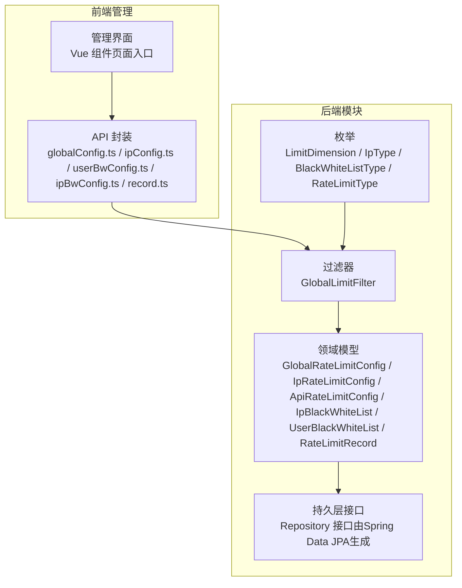
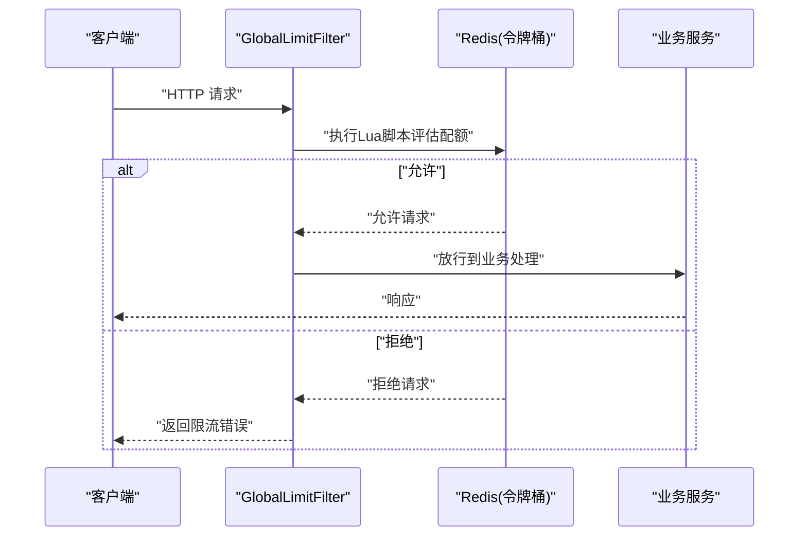
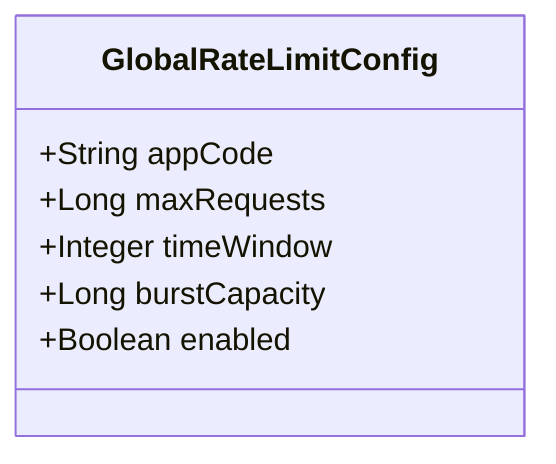
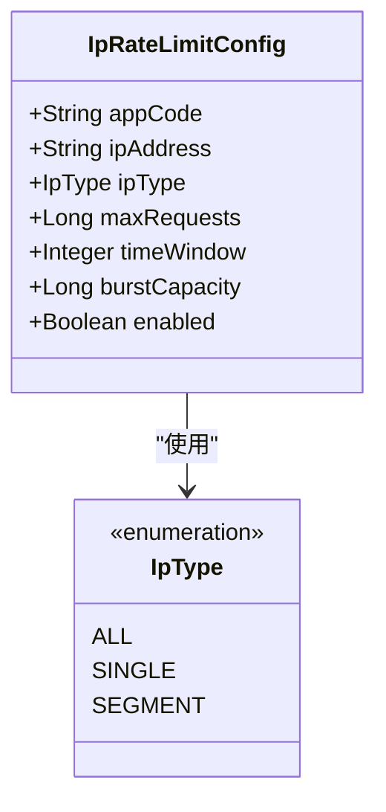
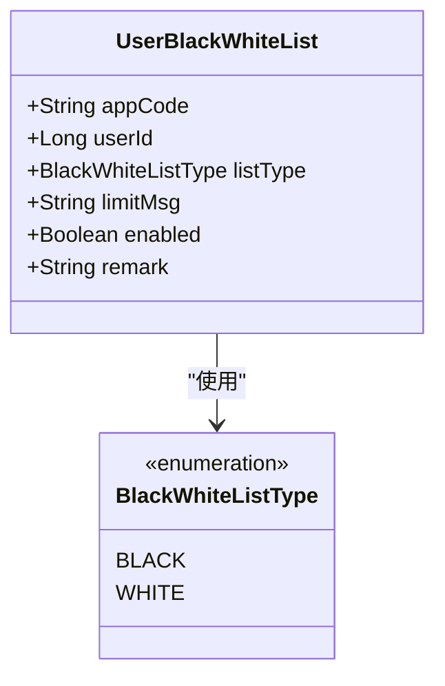
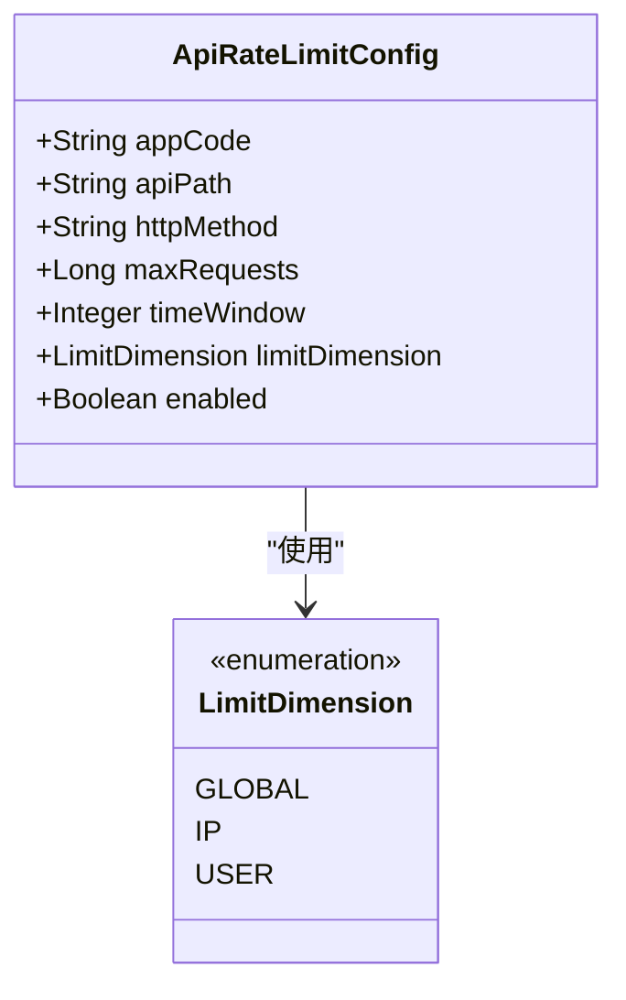
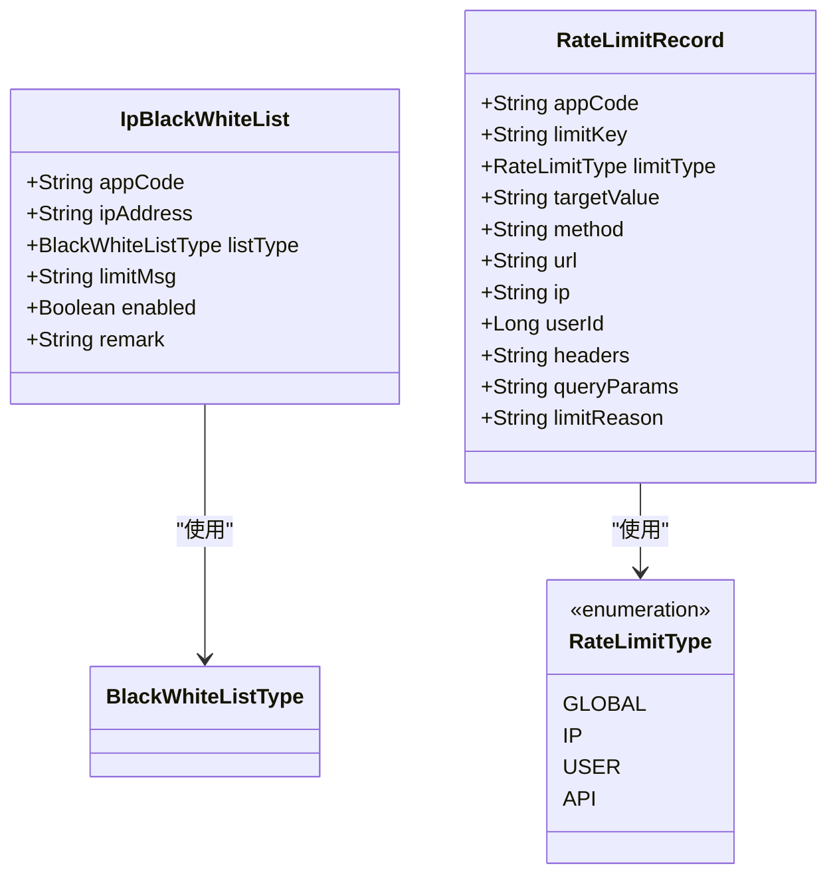
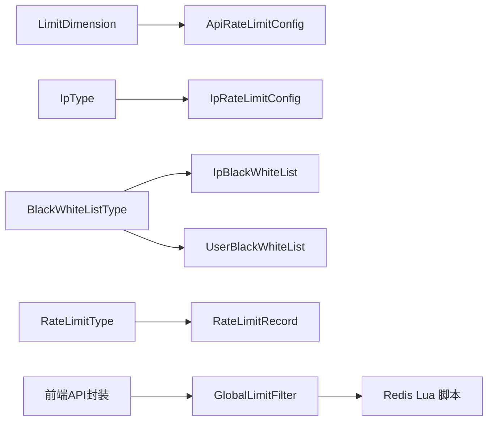

# 限流策略类型

<cite>
**本文引用的文件**
- [GlobalRateLimitConfig.java](file://ratelimit-module/src/main/java/com/ffastproject/ratelimit/domain/GlobalRateLimitConfig.java)
- [IpRateLimitConfig.java](file://ratelimit-module/src/main/java/com/fastproject/ratelimit/domain/IpRateLimitConfig.java)
- [ApiRateLimitConfig.java](file://ratelimit-module/src/main/java/com/fastproject/ratelimit/domain/ApiRateLimitConfig.java)
- [IpBlackWhiteList.java](file://ratelimit-module/src/main/java/com/fastproject/ratelimit/domain/IpBlackWhiteList.java)
- [UserBlackWhiteList.java](file://ratelimit-module/src/main/java/com/fastproject/ratelimit/domain/UserBlackWhiteList.java)
- [RateLimitRecord.java](file://ratelimit-module/src/main/java/com/fastproject/ratelimit/domain/RateLimitRecord.java)
- [LimitDimension.java](file://ratelimit-api/src/main/java/com/fastproject/ratelimit/enums/LimitDimension.java)
- [IpType.java](file://ratelimit-api/src/main/java/com/fastproject/ratelimit/enums/IpType.java)
- [BlackWhiteListType.java](file://ratelimit-api/src/main/java/com/fastproject/ratelimit/enums/BlackWhiteListType.java)
- [RateLimitType.java](file://ratelimit-api/src/main/java/com/fastproject/ratelimit/enums/RateLimitType.java)
- [GlobalLimitFilter.java](file://ratelimit-module/src/main/java/com/fastproject/ratelimit/config/GlobalLimitFilter.java)
- [globalConfig.ts](file://fast-ui/apps/admin-vue/src/api/ratelimit/globalConfig.ts)
- [ipConfig.ts](file://fast-ui/apps/admin-vue/src/api/ratelimit/ipConfig.ts)
- [userBwConfig.ts](file://fast-ui/apps/admin-vue/src/api/ratelimit/userBwConfig.ts)
- [ipBwConfig.ts](file://fast-ui/apps/admin-vue/src/api/ratelimit/ipBwConfig.ts)
- [record.ts](file://fast-ui/apps/admin-vue/src/api/ratelimit/record.ts)
</cite>

## 目录
1. [引言](#引言)
2. [项目结构](#项目结构)
3. [核心组件](#核心组件)
4. [架构总览](#架构总览)
5. [详细组件分析](#详细组件分析)
6. [依赖关系分析](#依赖关系分析)
7. [性能考量](#性能考量)
8. [故障排查指南](#故障排查指南)
9. [结论](#结论)
10. [附录](#附录)

## 引言
本文件系统性梳理并解释本仓库中“限流策略类型”的设计与实现，覆盖四种核心策略：全局限流、IP限流、用户限流、API限流。内容包括：
- 设计原理与实现机制
- 适用场景、配置参数与性能特点
- 策略优先级、组合使用与冲突解决
- 策略配置数据模型、字段含义与约束
- 配置示例与最佳实践
- 不同业务场景下的选择标准与优化策略

## 项目结构
围绕限流功能，后端模块提供领域模型、枚举、过滤器与持久化；前端提供管理界面与API封装。

图表来源
- [GlobalRateLimitConfig.java](file://ratelimit-module/src/main/java/com/fastproject/ratelimit/domain/GlobalRateLimitConfig.java#L1-L50)
- [IpRateLimitConfig.java](file://ratelimit-module/src/main/java/com/fastproject/ratelimit/domain/IpRateLimitConfig.java#L1-L65)
- [ApiRateLimitConfig.java](file://ratelimit-module/src/main/java/com/fastproject/ratelimit/domain/ApiRateLimitConfig.java#L1-L64)
- [IpBlackWhiteList.java](file://ratelimit-module/src/main/java/com/fastproject/ratelimit/domain/IpBlackWhiteList.java#L1-L60)
- [UserBlackWhiteList.java](file://ratelimit-module/src/main/java/com/fastproject/ratelimit/domain/UserBlackWhiteList.java#L1-L60)
- [RateLimitRecord.java](file://ratelimit-module/src/main/java/com/fastproject/ratelimit/domain/RateLimitRecord.java#L1-L84)
- [LimitDimension.java](file://ratelimit-api/src/main/java/com/fastproject/ratelimit/enums/LimitDimension.java#L1-L20)
- [IpType.java](file://ratelimit-api/src/main/java/com/fastproject/ratelimit/enums/IpType.java#L1-L30)
- [BlackWhiteListType.java](file://ratelimit-api/src/main/java/com/fastproject/ratelimit/enums/BlackWhiteListType.java#L1-L25)
- [RateLimitType.java](file://ratelimit-api/src/main/java/com/fastproject/ratelimit/enums/RateLimitType.java#L1-L24)
- [GlobalLimitFilter.java](file://ratelimit-module/src/main/java/com/fastproject/ratelimit/config/GlobalLimitFilter.java#L64-L86)
- [globalConfig.ts](file://fast-ui/apps/admin-vue/src/api/ratelimit/globalConfig.ts#L1-L96)
- [ipConfig.ts](file://fast-ui/apps/admin-vue/src/api/ratelimit/ipConfig.ts#L1-L106)
- [userBwConfig.ts](file://fast-ui/apps/admin-vue/src/api/ratelimit/userBwConfig.ts#L1-L96)
- [ipBwConfig.ts](file://fast-ui/apps/admin-vue/src/api/ratelimit/ipBwConfig.ts#L1-L96)
- [record.ts](file://fast-ui/apps/admin-vue/src/api/ratelimit/record.ts#L1-L63)

章节来源
- [GlobalRateLimitConfig.java](file://ratelimit-module/src/main/java/com/fastproject/ratelimit/domain/GlobalRateLimitConfig.java#L1-L50)
- [IpRateLimitConfig.java](file://ratelimit-module/src/main/java/com/fastproject/ratelimit/domain/IpRateLimitConfig.java#L1-L65)
- [ApiRateLimitConfig.java](file://ratelimit-module/src/main/java/com/fastproject/ratelimit/domain/ApiRateLimitConfig.java#L1-L64)
- [IpBlackWhiteList.java](file://ratelimit-module/src/main/java/com/fastproject/ratelimit/domain/IpBlackWhiteList.java#L1-L60)
- [UserBlackWhiteList.java](file://ratelimit-module/src/main/java/com/fastproject/ratelimit/domain/UserBlackWhiteList.java#L1-L60)
- [RateLimitRecord.java](file://ratelimit-module/src/main/java/com/fastproject/ratelimit/domain/RateLimitRecord.java#L1-L84)
- [LimitDimension.java](file://ratelimit-api/src/main/java/com/fastproject/ratelimit/enums/LimitDimension.java#L1-L20)
- [IpType.java](file://ratelimit-api/src/main/java/com/fastproject/ratelimit/enums/IpType.java#L1-L30)
- [BlackWhiteListType.java](file://ratelimit-api/src/main/java/com/fastproject/ratelimit/enums/BlackWhiteListType.java#L1-L25)
- [RateLimitType.java](file://ratelimit-api/src/main/java/com/fastproject/ratelimit/enums/RateLimitType.java#L1-L24)
- [GlobalLimitFilter.java](file://ratelimit-module/src/main/java/com/fastproject/ratelimit/config/GlobalLimitFilter.java#L64-L86)
- [globalConfig.ts](file://fast-ui/apps/admin-vue/src/api/ratelimit/globalConfig.ts#L1-L96)
- [ipConfig.ts](file://fast-ui/apps/admin-vue/src/api/ratelimit/ipConfig.ts#L1-L106)
- [userBwConfig.ts](file://fast-ui/apps/admin-vue/src/api/ratelimit/userBwConfig.ts#L1-L96)
- [ipBwConfig.ts](file://fast-ui/apps/admin-vue/src/api/ratelimit/ipBwConfig.ts#L1-L96)
- [record.ts](file://fast-ui/apps/admin-vue/src/api/ratelimit/record.ts#L1-L63)

## 核心组件
- 全局限流配置：面向整个应用的全局速率控制，支持令牌桶突发能力。
- IP限流配置：按应用、IP类型（全部/单个/IP段）进行限流。
- API限流配置：按应用、API路径、HTTP方法与限流维度（全局/IP/用户）进行精细化限流。
- 黑白名单：对特定IP或用户进行快速放行或拦截。
- 限流记录：记录触发限流的关键上下文，便于审计与排障。

章节来源
- [GlobalRateLimitConfig.java](file://ratelimit-module/src/main/java/com/fastproject/ratelimit/domain/GlobalRateLimitConfig.java#L10-L50)
- [IpRateLimitConfig.java](file://ratelimit-module/src/main/java/com/fastproject/ratelimit/domain/IpRateLimitConfig.java#L11-L65)
- [ApiRateLimitConfig.java](file://ratelimit-module/src/main/java/com/fastproject/ratelimit/domain/ApiRateLimitConfig.java#L11-L64)
- [IpBlackWhiteList.java](file://ratelimit-module/src/main/java/com/fastproject/ratelimit/domain/IpBlackWhiteList.java#L11-L60)
- [UserBlackWhiteList.java](file://ratelimit-module/src/main/java/com/fastproject/ratelimit/domain/UserBlackWhiteList.java#L11-L60)
- [RateLimitRecord.java](file://ratelimit-module/src/main/java/com/fastproject/ratelimit/domain/RateLimitRecord.java#L13-L84)

## 架构总览
限流策略通过过滤器在请求链路中生效，结合Redis Lua脚本实现高并发令牌桶算法；配置由前端管理界面维护并通过API下发到后端。

图表来源
- [GlobalLimitFilter.java](file://ratelimit-module/src/main/java/com/fastproject/ratelimit/config/GlobalLimitFilter.java#L64-L86)

## 详细组件分析

### 全局限流策略
- 设计原理
  - 基于令牌桶算法，全局共享配额，支持突发容量。
  - 使用Redis Hash存储每个应用的令牌状态，并通过Lua原子性计算。
- 实现机制
  - 过滤器中嵌入Lua脚本，计算当前可允许的请求数与剩余令牌，必要时设置TTL。
- 适用场景
  - 对整体流量进行总量控制，防止系统过载。
- 配置参数
  - appCode：应用标识
  - maxRequests：全局最大QPS
  - timeWindow：时间窗口（秒）
  - burstCapacity：突发容量
  - enabled：是否启用
- 性能特点
  - 单机多核下具备高吞吐，Lua脚本保证原子性与低延迟。
- 数据模型与约束
  - 字段与约束见领域模型定义。
- 前端配置封装
  - 提供分页查询、启用状态切换、创建/更新/删除等API。

图表来源
- [GlobalRateLimitConfig.java](file://ratelimit-module/src/main/java/com/fastproject/ratelimit/domain/GlobalRateLimitConfig.java#L21-L49)

章节来源
- [GlobalRateLimitConfig.java](file://ratelimit-module/src/main/java/com/fastproject/ratelimit/domain/GlobalRateLimitConfig.java#L10-L50)
- [GlobalLimitFilter.java](file://ratelimit-module/src/main/java/com/fastproject/ratelimit/config/GlobalLimitFilter.java#L64-L86)
- [globalConfig.ts](file://fast-ui/apps/admin-vue/src/api/ratelimit/globalConfig.ts#L6-L32)

### IP限流策略
- 设计原理
  - 按应用与IP类型（全部/单个/IP段）进行限流，支持不同粒度的控制。
- 实现机制
  - 通过IP类型枚举与匹配逻辑，定位对应配置并应用令牌桶。
- 适用场景
  - 防刷、DDoS防护、按网段治理。
- 配置参数
  - appCode、ipAddress、ipType、maxRequests、timeWindow、burstCapacity、enabled
- 性能特点
  - Redis键空间按IP维度扩展，需注意键数量与内存占用。
- 数据模型与约束
  - 字段与约束见领域模型定义。

图表来源
- [IpRateLimitConfig.java](file://ratelimit-module/src/main/java/com/fastproject/ratelimit/domain/IpRateLimitConfig.java#L21-L63)
- [IpType.java](file://ratelimit-api/src/main/java/com/fastproject/ratelimit/enums/IpType.java#L11-L26)

章节来源
- [IpRateLimitConfig.java](file://ratelimit-module/src/main/java/com/fastproject/ratelimit/domain/IpRateLimitConfig.java#L11-L65)
- [IpType.java](file://ratelimit-api/src/main/java/com/fastproject/ratelimit/enums/IpType.java#L1-L30)
- [ipConfig.ts](file://fast-ui/apps/admin-vue/src/api/ratelimit/ipConfig.ts#L6-L38)

### 用户限流策略
- 设计原理
  - 基于用户ID进行限流，适用于登录态保护与精细化运营。
- 实现机制
  - 与用户黑白名单配合，黑名单直接拒绝，白名单可绕过或放宽。
- 适用场景
  - 防止恶意注册、刷单、批量操作。
- 配置参数
  - appCode、userId、listType（黑白名单）、limitMsg、enabled、remark
- 性能特点
  - 黑白名单命中为O(1)，限流策略可叠加但需避免重复计算。
- 数据模型与约束
  - 字段与约束见领域模型定义。

图表来源
- [UserBlackWhiteList.java](file://ratelimit-module/src/main/java/com/fastproject/ratelimit/domain/UserBlackWhiteList.java#L21-L57)
- [BlackWhiteListType.java](file://ratelimit-api/src/main/java/com/fastproject/ratelimit/enums/BlackWhiteListType.java#L11-L21)

章节来源
- [UserBlackWhiteList.java](file://ratelimit-module/src/main/java/com/fastproject/ratelimit/domain/UserBlackWhiteList.java#L11-L60)
- [BlackWhiteListType.java](file://ratelimit-api/src/main/java/com/fastproject/ratelimit/enums/BlackWhiteListType.java#L1-L25)
- [userBwConfig.ts](file://fast-ui/apps/admin-vue/src/api/ratelimit/userBwConfig.ts#L6-L36)

### API限流策略
- 设计原理
  - 面向具体接口，支持按路径、方法与限流维度（全局/IP/用户）进行控制。
- 实现机制
  - 通过限流维度枚举决定聚合键，结合令牌桶实现。
- 适用场景
  - 防止热点接口被滥用，保障关键接口SLA。
- 配置参数
  - appCode、apiPath、httpMethod、maxRequests、timeWindow、limitDimension、enabled
- 性能特点
  - 维度越多，键空间越大；建议按需选择维度以平衡精度与成本。
- 数据模型与约束
  - 字段与约束见领域模型定义。

图表来源
- [ApiRateLimitConfig.java](file://ratelimit-module/src/main/java/com/fastproject/ratelimit/domain/ApiRateLimitConfig.java#L21-L63)
- [LimitDimension.java](file://ratelimit-api/src/main/java/com/fastproject/ratelimit/enums/LimitDimension.java#L6-L19)

章节来源
- [ApiRateLimitConfig.java](file://ratelimit-module/src/main/java/com/fastproject/ratelimit/domain/ApiRateLimitConfig.java#L11-L64)
- [LimitDimension.java](file://ratelimit-api/src/main/java/com/fastproject/ratelimit/enums/LimitDimension.java#L1-L20)

### 黑白名单与限流记录
- 黑名单/白名单
  - 支持IP与用户两个维度，用于快速阻断或放行。
- 限流记录
  - 记录触发原因、目标值、请求上下文，便于审计与复盘。

图表来源
- [IpBlackWhiteList.java](file://ratelimit-module/src/main/java/com/fastproject/ratelimit/domain/IpBlackWhiteList.java#L21-L57)
- [RateLimitRecord.java](file://ratelimit-module/src/main/java/com/fastproject/ratelimit/domain/RateLimitRecord.java#L22-L83)
- [RateLimitType.java](file://ratelimit-api/src/main/java/com/fastproject/ratelimit/enums/RateLimitType.java#L6-L22)

章节来源
- [IpBlackWhiteList.java](file://ratelimit-module/src/main/java/com/fastproject/ratelimit/domain/IpBlackWhiteList.java#L11-L60)
- [UserBlackWhiteList.java](file://ratelimit-module/src/main/java/com/fastproject/ratelimit/domain/UserBlackWhiteList.java#L11-L60)
- [RateLimitRecord.java](file://ratelimit-module/src/main/java/com/fastproject/ratelimit/domain/RateLimitRecord.java#L13-L84)
- [RateLimitType.java](file://ratelimit-api/src/main/java/com/fastproject/ratelimit/enums/RateLimitType.java#L1-L24)
- [ipBwConfig.ts](file://fast-ui/apps/admin-vue/src/api/ratelimit/ipBwConfig.ts#L6-L36)
- [record.ts](file://fast-ui/apps/admin-vue/src/api/ratelimit/record.ts#L6-L52)

## 依赖关系分析
- 枚举驱动策略维度：限流维度、IP类型、黑白名单类型、限流类型统一由枚举定义，确保前后端一致性。
- 过滤器依赖Redis：全局限流通过过滤器调用Redis Lua脚本实现原子计数。
- 前端API封装：管理界面通过TS封装的API与后端交互，简化配置与运维。

图表来源
- [LimitDimension.java](file://ratelimit-api/src/main/java/com/fastproject/ratelimit/enums/LimitDimension.java#L1-L20)
- [IpType.java](file://ratelimit-api/src/main/java/com/fastproject/ratelimit/enums/IpType.java#L1-L30)
- [BlackWhiteListType.java](file://ratelimit-api/src/main/java/com/fastproject/ratelimit/enums/BlackWhiteListType.java#L1-L25)
- [RateLimitType.java](file://ratelimit-api/src/main/java/com/fastproject/ratelimit/enums/RateLimitType.java#L1-L24)
- [ApiRateLimitConfig.java](file://ratelimit-module/src/main/java/com/fastproject/ratelimit/domain/ApiRateLimitConfig.java#L1-L64)
- [IpRateLimitConfig.java](file://ratelimit-module/src/main/java/com/fastproject/ratelimit/domain/IpRateLimitConfig.java#L1-L65)
- [IpBlackWhiteList.java](file://ratelimit-module/src/main/java/com/fastproject/ratelimit/domain/IpBlackWhiteList.java#L1-L60)
- [UserBlackWhiteList.java](file://ratelimit-module/src/main/java/com/fastproject/ratelimit/domain/UserBlackWhiteList.java#L1-L60)
- [RateLimitRecord.java](file://ratelimit-module/src/main/java/com/fastproject/ratelimit/domain/RateLimitRecord.java#L1-L84)
- [GlobalLimitFilter.java](file://ratelimit-module/src/main/java/com/fastproject/ratelimit/config/GlobalLimitFilter.java#L64-L86)
- [globalConfig.ts](file://fast-ui/apps/admin-vue/src/api/ratelimit/globalConfig.ts#L1-L96)
- [ipConfig.ts](file://fast-ui/apps/admin-vue/src/api/ratelimit/ipConfig.ts#L1-L106)
- [userBwConfig.ts](file://fast-ui/apps/admin-vue/src/api/ratelimit/userBwConfig.ts#L1-L96)
- [ipBwConfig.ts](file://fast-ui/apps/admin-vue/src/api/ratelimit/ipBwConfig.ts#L1-L96)
- [record.ts](file://fast-ui/apps/admin-vue/src/api/ratelimit/record.ts#L1-L63)

## 性能考量
- Redis Lua脚本：原子性与低延迟，适合高并发令牌桶评估。
- 键空间设计：IP与用户维度会增加键数量，应结合业务规模评估内存与过期策略。
- 突发容量：合理设置burstCapacity以应对短时峰值，避免误杀正常流量。
- 维度选择：API限流的维度越多，键空间越大，需在精度与成本间权衡。

## 故障排查指南
- 限流记录查询
  - 通过限流记录VO提供的字段（如limitKey、limitType、targetValue、url、ip、userId、limitReason）进行筛选与定位。
- 常见问题
  - 配置未生效：检查enabled状态与应用标识匹配。
  - 误杀正常用户：检查白名单配置与维度设置，适当提高maxRequests或timeWindow。
  - Redis键过多：评估维度与键过期策略，清理无效配置。

章节来源
- [record.ts](file://fast-ui/apps/admin-vue/src/api/ratelimit/record.ts#L6-L52)
- [RateLimitRecord.java](file://ratelimit-module/src/main/java/com/fastproject/ratelimit/domain/RateLimitRecord.java#L22-L83)

## 结论
本限流体系以清晰的领域模型与枚举定义为基础，结合Redis Lua脚本实现高并发令牌桶控制，并通过前端管理界面提供便捷的配置与运维能力。四种策略可独立使用或组合部署，建议根据业务场景选择合适的维度与参数，持续监控限流记录以优化策略。

## 附录

### 策略优先级与组合使用
- 优先级建议
  - 黑白名单优先：黑名单直接拒绝，白名单可快速放行。
  - API限流优先：针对热点接口，按接口+方法+维度进行最细粒度控制。
  - IP限流次之：按来源维度进行粗粒度治理。
  - 全局限流兜底：防止整体过载。
- 冲突解决
  - 同一请求同时命中多个策略时，以“最严格”为准；若存在白名单，则可豁免。
  - 维度叠加时，建议明确边界，避免重复计数与资源浪费。

### 配置示例与最佳实践
- 全局限流
  - 场景：系统总QPS上限控制
  - 建议：timeWindow=1，burstCapacity=若干倍maxRequests，按峰值预留突发。
- IP限流
  - 场景：防刷、DDoS
  - 建议：IP段与单个IP结合，对异常网段降低阈值。
- 用户限流
  - 场景：登录态保护
  - 建议：结合白名单与黑名单，对高价值用户适度放宽。
- API限流
  - 场景：热点接口保护
  - 建议：按接口+方法+维度（全局/IP/用户）分别配置，避免过度收敛。