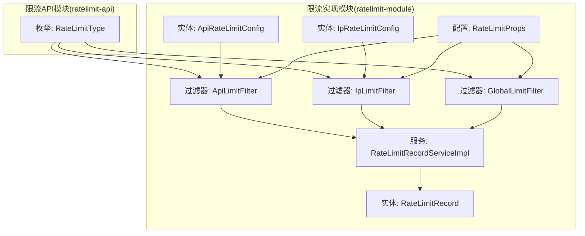
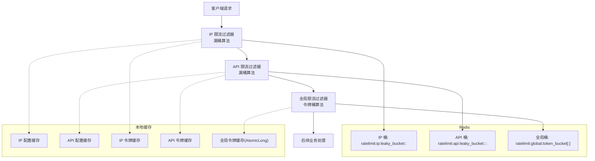
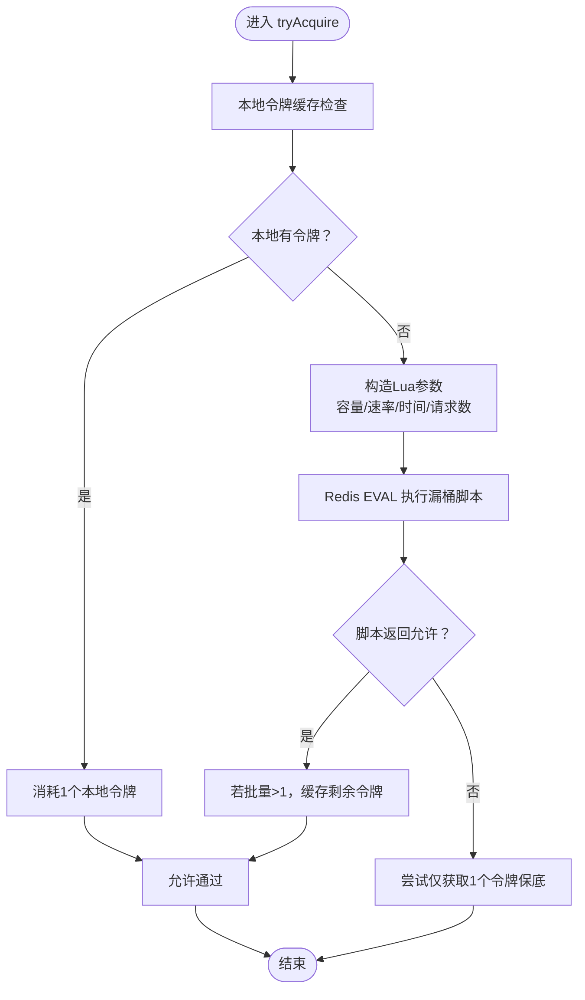
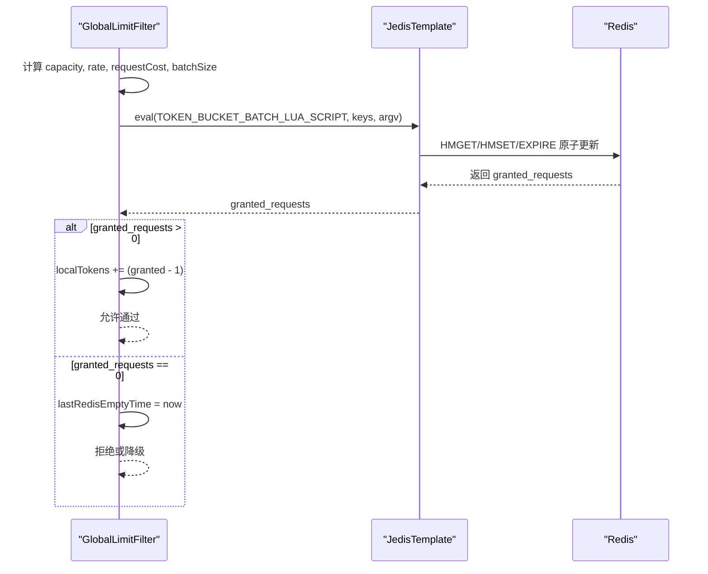
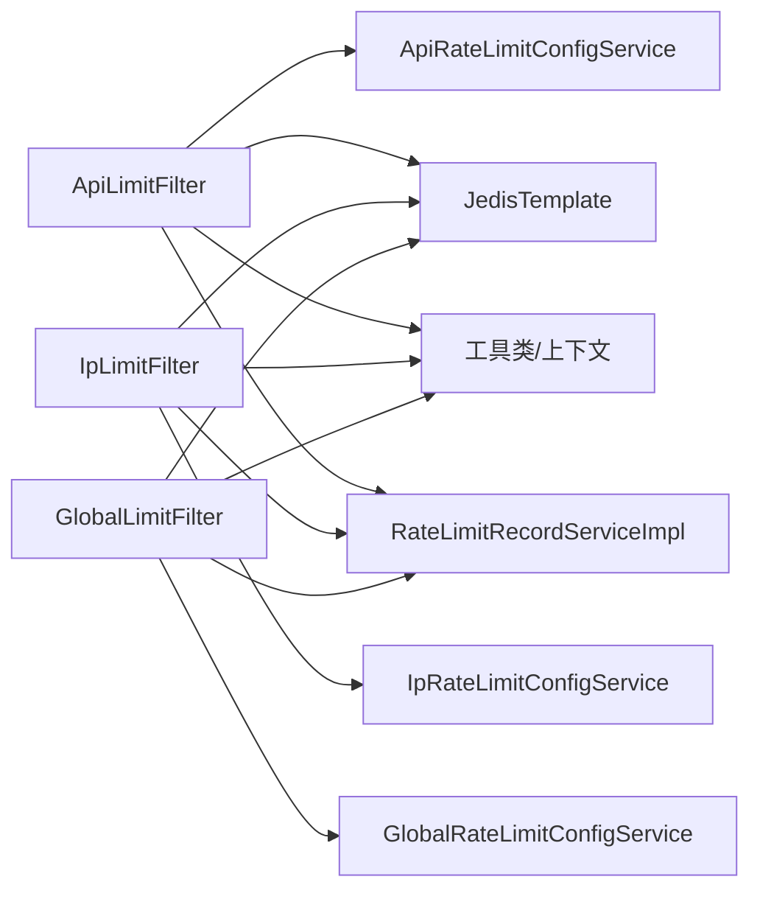

# 限流算法实现

<cite>
**本文引用的文件**
- [RateLimitType.java](file://ratelimit-api/src/main/java/com/fastproject/ratelimit/enums/RateLimitType.java)
- [ApiRateLimitConfig.java](file://ratelimit-module/src/main/java/com/fastproject/ratelimit/domain/ApiRateLimitConfig.java)
- [IpRateLimitConfig.java](file://ratelimit-module/src/main/java/com/fastproject/ratelimit/domain/IpRateLimitConfig.java)
- [RateLimitRecord.java](file://ratelimit-module/src/main/java/com/fastproject/ratelimit/domain/RateLimitRecord.java)
- [RateLimitProps.java](file://ratelimit-module/src/main/java/com/fastproject/ratelimit/config/RateLimitProps.java)
- [ApiLimitFilter.java](file://ratelimit-module/src/main/java/com/fastproject/ratelimit/config/ApiLimitFilter.java)
- [IpLimitFilter.java](file://ratelimit-module/src/main/java/com/fastproject/ratelimit/config/IpLimitFilter.java)
- [GlobalLimitFilter.java](file://ratelimit-module/src/main/java/com/fastproject/ratelimit/config/GlobalLimitFilter.java)
- [RateLimitRecordServiceImpl.java](file://ratelimit-module/src/main/java/com/fastproject/ratelimit/service/impl/RateLimitRecordServiceImpl.java)
</cite>

## 目录
1. [引言](#引言)
2. [项目结构](#项目结构)
3. [核心组件](#核心组件)
4. [架构总览](#架构总览)
5. [详细组件分析](#详细组件分析)
6. [依赖关系分析](#依赖关系分析)
7. [性能考量](#性能考量)
8. [故障排查指南](#故障排查指南)
9. [结论](#结论)
10. [附录](#附录)

## 引言
本技术文档围绕仓库中的限流实现进行系统化梳理，重点覆盖以下内容：
- 滑动窗口、令牌桶、漏桶三类主流限流算法的实现原理与代码细节
- Redis 中的数据结构设计、Lua 原子操作使用与分布式一致性保障
- 限流判断逻辑、计数器更新机制与过期时间管理
- 性能对比、调优参数与故障处理方案
- 实际代码示例路径与调试技巧

## 项目结构
限流功能主要分布在两个模块：
- ratelimit-api：定义枚举与 API 接口契约（如限流类型）
- ratelimit-module：实现限流过滤器、配置模型、记录服务与 Redis Lua 逻辑

图表来源
- [RateLimitType.java](file://ratelimit-api/src/main/java/com/fastproject/ratelimit/enums/RateLimitType.java#L1-L24)
- [ApiRateLimitConfig.java](file://ratelimit-module/src/main/java/com/fastproject/ratelimit/domain/ApiRateLimitConfig.java#L1-L64)
- [IpRateLimitConfig.java](file://ratelimit-module/src/main/java/com/fastproject/ratelimit/domain/IpRateLimitConfig.java#L1-L65)
- [RateLimitRecord.java](file://ratelimit-module/src/main/java/com/fastproject/ratelimit/domain/RateLimitRecord.java#L1-L84)
- [RateLimitProps.java](file://ratelimit-module/src/main/java/com/fastproject/ratelimit/config/RateLimitProps.java#L1-L20)
- [ApiLimitFilter.java](file://ratelimit-module/src/main/java/com/fastproject/ratelimit/config/ApiLimitFilter.java#L1-L256)
- [IpLimitFilter.java](file://ratelimit-module/src/main/java/com/fastproject/ratelimit/config/IpLimitFilter.java#L1-L235)
- [GlobalLimitFilter.java](file://ratelimit-module/src/main/java/com/fastproject/ratelimit/config/GlobalLimitFilter.java#L1-L258)
- [RateLimitRecordServiceImpl.java](file://ratelimit-module/src/main/java/com/fastproject/ratelimit/service/impl/RateLimitRecordServiceImpl.java#L1-L124)

章节来源
- [RateLimitType.java](file://ratelimit-api/src/main/java/com/fastproject/ratelimit/enums/RateLimitType.java#L1-L24)
- [ApiRateLimitConfig.java](file://ratelimit-module/src/main/java/com/fastproject/ratelimit/domain/ApiRateLimitConfig.java#L1-L64)
- [IpRateLimitConfig.java](file://ratelimit-module/src/main/java/com/fastproject/ratelimit/domain/IpRateLimitConfig.java#L1-L65)
- [RateLimitRecord.java](file://ratelimit-module/src/main/java/com/fastproject/ratelimit/domain/RateLimitRecord.java#L1-L84)
- [RateLimitProps.java](file://ratelimit-module/src/main/java/com/fastproject/ratelimit/config/RateLimitProps.java#L1-L20)
- [ApiLimitFilter.java](file://ratelimit-module/src/main/java/com/fastproject/ratelimit/config/ApiLimitFilter.java#L1-L256)
- [IpLimitFilter.java](file://ratelimit-module/src/main/java/com/fastproject/ratelimit/config/IpLimitFilter.java#L1-L235)
- [GlobalLimitFilter.java](file://ratelimit-module/src/main/java/com/fastproject/ratelimit/config/GlobalLimitFilter.java#L1-L258)
- [RateLimitRecordServiceImpl.java](file://ratelimit-module/src/main/java/com/fastproject/ratelimit/service/impl/RateLimitRecordServiceImpl.java#L1-L124)

## 核心组件
- 限流类型枚举：用于标识全局、IP、用户、API 等不同限流维度
- 配置模型：API 限流配置、IP 限流配置，包含最大请求数、时间窗口、限流维度、是否启用等字段
- 记录模型：记录限流触发的上下文信息，便于审计与排障
- 过滤器实现：基于漏桶算法的 API 限流与 IP 限流，以及基于令牌桶算法的全局限流
- 本地缓存与降级：Caffeine 缓存配置与令牌、异常降级放行策略
- Redis Lua 脚本：原子性地完成桶状态更新与过期时间维护

章节来源
- [RateLimitType.java](file://ratelimit-api/src/main/java/com/fastproject/ratelimit/enums/RateLimitType.java#L1-L24)
- [ApiRateLimitConfig.java](file://ratelimit-module/src/main/java/com/fastproject/ratelimit/domain/ApiRateLimitConfig.java#L1-L64)
- [IpRateLimitConfig.java](file://ratelimit-module/src/main/java/com/fastproject/ratelimit/domain/IpRateLimitConfig.java#L1-L65)
- [RateLimitRecord.java](file://ratelimit-module/src/main/java/com/fastproject/ratelimit/domain/RateLimitRecord.java#L1-L84)
- [ApiLimitFilter.java](file://ratelimit-module/src/main/java/com/fastproject/ratelimit/config/ApiLimitFilter.java#L1-L256)
- [IpLimitFilter.java](file://ratelimit-module/src/main/java/com/fastproject/ratelimit/config/IpLimitFilter.java#L1-L235)
- [GlobalLimitFilter.java](file://ratelimit-module/src/main/java/com/fastproject/ratelimit/config/GlobalLimitFilter.java#L1-L258)
- [RateLimitRecordServiceImpl.java](file://ratelimit-module/src/main/java/com/fastproject/ratelimit/service/impl/RateLimitRecordServiceImpl.java#L1-L124)

## 架构总览
整体限流架构由“过滤器层 + Redis 原子脚本 + 本地缓存 + 记录服务”构成，按优先级顺序执行：IP 限流 → API 限流 → 全局限流。

图表来源
- [IpLimitFilter.java](file://ratelimit-module/src/main/java/com/fastproject/ratelimit/config/IpLimitFilter.java#L34-L105)
- [ApiLimitFilter.java](file://ratelimit-module/src/main/java/com/fastproject/ratelimit/config/ApiLimitFilter.java#L32-L103)
- [GlobalLimitFilter.java](file://ratelimit-module/src/main/java/com/fastproject/ratelimit/config/GlobalLimitFilter.java#L32-L143)

## 详细组件分析

### 漏桶算法（Leaky Bucket）实现
- 算法思想：以恒定速率漏水，桶满则丢弃；适合平滑突发流量，限制峰值速率
- Redis 数据结构：Hash 存储 water（当前水量）与 last_time（上次更新时间）
- Lua 原子逻辑：
  - 计算已漏水：delta_time × leak_rate / 1000
  - 更新 water：max(0, water - leaked)，若 +requested 后不超过 capacity 则允许
  - 设置过期时间：约等于桶装满所需时间 +缓冲
- 本地令牌优化：在 Redis 失败或批量获取成功后，将剩余令牌放入本地缓存，减少网络往返
- 降级策略：Lua 执行异常时返回允许，避免影响主流程

图表来源
- [IpLimitFilter.java](file://ratelimit-module/src/main/java/com/fastproject/ratelimit/config/IpLimitFilter.java#L116-L187)
- [ApiLimitFilter.java](file://ratelimit-module/src/main/java/com/fastproject/ratelimit/config/ApiLimitFilter.java#L114-L190)

章节来源
- [IpLimitFilter.java](file://ratelimit-module/src/main/java/com/fastproject/ratelimit/config/IpLimitFilter.java#L31-L235)
- [ApiLimitFilter.java](file://ratelimit-module/src/main/java/com/fastproject/ratelimit/config/ApiLimitFilter.java#L32-L256)

### 令牌桶算法（Token Bucket）实现
- 算法思想：以固定速率向桶内添加令牌，请求需消耗相应令牌；适合突发流量但长期速率受控
- Redis 数据结构：Hash 存储 tokens（可用令牌数）与 timestamp（上次刷新时间）
- Lua 原子逻辑：
  - 计算新增令牌：min(capacity, last_tokens + delta × rate / 1000)
  - 计算可发放请求数：floor(available_tokens / request_cost)
  - 批量发放：granted_requests = min(available_requests, batch_size)
  - 更新 tokens 与 timestamp，并设置 TTL
- 本地令牌优化：批量获取后将剩余令牌放入 AtomicLong，多线程安全地本地消费
- 冷却机制：当 Redis 明确无令牌时设置短暂冷却，避免高频穿透

图表来源
- [GlobalLimitFilter.java](file://ratelimit-module/src/main/java/com/fastproject/ratelimit/config/GlobalLimitFilter.java#L190-L256)

章节来源
- [GlobalLimitFilter.java](file://ratelimit-module/src/main/java/com/fastproject/ratelimit/config/GlobalLimitFilter.java#L32-L258)

### 滑动窗口算法（Sliding Window）
- 现状说明：仓库中未直接提供基于滑动窗口的独立实现
- 可选实现思路（概念性说明）：
  - 使用 Redis ZSET 存储请求时间戳，窗口内计数即为集合大小
  - Lua 原子清理过期时间戳并插入新时间戳，随后判断数量
  - 优点：实现直观，适合严格的时间窗控制；缺点：ZSET 占用随时间增长，需定期修剪
- 适用场景：对精确时间窗有强约束的场景（如每分钟严格不超过 N 次）

[本节为概念性说明，不直接分析具体文件，故无章节来源]

### 限流配置与维度
- API 限流配置：包含应用码、API 路径、HTTP 方法、最大请求数、时间窗口、限流维度、是否启用
- IP 限流配置：包含应用码、IP 类型（单点/网段/全部）、最大 QPS、时间窗口、突发容量、是否启用
- 限流维度：IP、用户、全局三种，API 限流还支持按维度生成不同的 Redis Key

章节来源
- [ApiRateLimitConfig.java](file://ratelimit-module/src/main/java/com/fastproject/ratelimit/domain/ApiRateLimitConfig.java#L1-L64)
- [IpRateLimitConfig.java](file://ratelimit-module/src/main/java/com/fastproject/ratelimit/domain/IpRateLimitConfig.java#L1-L65)
- [ApiLimitFilter.java](file://ratelimit-module/src/main/java/com/fastproject/ratelimit/config/ApiLimitFilter.java#L192-L207)
- [IpLimitFilter.java](file://ratelimit-module/src/main/java/com/fastproject/ratelimit/config/IpLimitFilter.java#L116-L118)

### Redis 数据结构与原子操作
- 漏桶（IP/API）：Hash 字段 water、last_time；Lua 原子更新并设置 EXPIRE
- 令牌桶（全局）：Hash 字段 tokens、timestamp；Lua 原子更新并设置 EXPIRE
- Lua 脚本职责：
  - 计算时间差与漏/增的令牌
  - 判断配额是否充足并更新状态
  - 设置合理的过期时间，避免内存泄漏

章节来源
- [IpLimitFilter.java](file://ratelimit-module/src/main/java/com/fastproject/ratelimit/config/IpLimitFilter.java#L58-L79)
- [ApiLimitFilter.java](file://ratelimit-module/src/main/java/com/fastproject/ratelimit/config/ApiLimitFilter.java#L59-L80)
- [GlobalLimitFilter.java](file://ratelimit-module/src/main/java/com/fastproject/ratelimit/config/GlobalLimitFilter.java#L60-L92)

### 分布式一致性与过期时间管理
- 一致性：通过 Lua 原子脚本确保“读-改-写”过程不可被并发请求打断
- 过期策略：
  - 漏桶：桶容量/漏水速率决定 TTL，额外加缓冲
  - 令牌桶：基于速率与容量估算合理 TTL，最小保护阈值
- 本地缓存：降低热点键的 Redis 压力，同时通过 TTL 与降级策略保证最终一致性

章节来源
- [IpLimitFilter.java](file://ratelimit-module/src/main/java/com/fastproject/ratelimit/config/IpLimitFilter.java#L74-L75)
- [ApiLimitFilter.java](file://ratelimit-module/src/main/java/com/fastproject/ratelimit/config/ApiLimitFilter.java#L75-L76)
- [GlobalLimitFilter.java](file://ratelimit-module/src/main/java/com/fastproject/ratelimit/config/GlobalLimitFilter.java#L83-L91)

### 限流记录与审计
- 记录内容：应用码、限流键、限流类型、目标值、方法、URL、IP、用户ID、请求头、查询参数、原因说明
- 记录服务：提供保存、更新、删除、分页查询能力，支持多条件检索

章节来源
- [RateLimitRecord.java](file://ratelimit-module/src/main/java/com/fastproject/ratelimit/domain/RateLimitRecord.java#L1-L84)
- [RateLimitRecordServiceImpl.java](file://ratelimit-module/src/main/java/com/fastproject/ratelimit/service/impl/RateLimitRecordServiceImpl.java#L38-L124)
- [ApiLimitFilter.java](file://ratelimit-module/src/main/java/com/fastproject/ratelimit/config/ApiLimitFilter.java#L219-L254)
- [IpLimitFilter.java](file://ratelimit-module/src/main/java/com/fastproject/ratelimit/config/IpLimitFilter.java#L198-L233)
- [GlobalLimitFilter.java](file://ratelimit-module/src/main/java/com/fastproject/ratelimit/config/GlobalLimitFilter.java#L146-L187)

## 依赖关系分析
- 过滤器依赖：
  - 配置服务：动态获取生效的限流配置
  - Redis 客户端：执行 Lua 脚本
  - 工具类：IP 解析、用户解析、JSON 序列化、Spring 上下文获取
  - 本地缓存：Caffeine 与 AtomicLong
- 记录服务依赖：
  - JPA 仓储与映射器，支持分页与多条件查询

图表来源
- [ApiLimitFilter.java](file://ratelimit-module/src/main/java/com/fastproject/ratelimit/config/ApiLimitFilter.java#L82-L103)
- [IpLimitFilter.java](file://ratelimit-module/src/main/java/com/fastproject/ratelimit/config/IpLimitFilter.java#L81-L105)
- [GlobalLimitFilter.java](file://ratelimit-module/src/main/java/com/fastproject/ratelimit/config/GlobalLimitFilter.java#L94-L143)

章节来源
- [ApiLimitFilter.java](file://ratelimit-module/src/main/java/com/fastproject/ratelimit/config/ApiLimitFilter.java#L1-L256)
- [IpLimitFilter.java](file://ratelimit-module/src/main/java/com/fastproject/ratelimit/config/IpLimitFilter.java#L1-L235)
- [GlobalLimitFilter.java](file://ratelimit-module/src/main/java/com/fastproject/ratelimit/config/GlobalLimitFilter.java#L1-L258)

## 性能考量
- 时间复杂度
  - 漏桶：O(1)（Redis Hash 原子更新）
  - 令牌桶：O(1)（Redis Hash 原子更新）
  - 滑动窗口：O(log N)（ZSET 操作，N 为窗口内请求数）
- 空间复杂度
  - 漏桶：每个维度一个键（Hash）
  - 令牌桶：每个维度一个键（Hash）
  - 滑动窗口：每个维度一个键（ZSET），随时间增长
- 优化建议
  - 使用本地令牌缓存减少 Redis 压力
  - 合理设置批量大小与过期时间，平衡延迟与资源占用
  - 对于高 QPS 的全局限流，结合冷却机制避免穿透

[本节为通用性能讨论，不直接分析具体文件，故无章节来源]

## 故障排查指南
- 常见问题
  - Redis Lua 执行异常：过滤器已做异常降级放行，检查日志定位具体键与参数
  - 本地缓存命中率低：检查批量大小与过期时间设置
  - TTL 过短导致频繁重建：核对 Lua 中 TTL 计算逻辑
- 调试技巧
  - 开启限流记录，通过 URL/IP/维度等条件检索
  - 使用 Redis 客户端查看对应键的 Hash 字段与过期时间
  - 逐步缩小范围：先验证配置加载、再验证 Lua 脚本、最后验证拒绝/放行分支

章节来源
- [ApiLimitFilter.java](file://ratelimit-module/src/main/java/com/fastproject/ratelimit/config/ApiLimitFilter.java#L186-L189)
- [IpLimitFilter.java](file://ratelimit-module/src/main/java/com/fastproject/ratelimit/config/IpLimitFilter.java#L183-L186)
- [GlobalLimitFilter.java](file://ratelimit-module/src/main/java/com/fastproject/ratelimit/config/GlobalLimitFilter.java#L249-L252)
- [RateLimitRecordServiceImpl.java](file://ratelimit-module/src/main/java/com/fastproject/ratelimit/service/impl/RateLimitRecordServiceImpl.java#L82-L124)

## 结论
本实现以漏桶与令牌桶为核心，结合本地缓存与 Redis 原子脚本，提供了高吞吐、低延迟且具备分布式一致性的限流能力。漏桶适合平滑突发、限制峰值，令牌桶适合突发但长期受控。通过合理的批量大小、过期时间与降级策略，可在生产环境中稳定运行。对于滑动窗口需求，可参考概念性实现思路进行扩展。

[本节为总结性内容，不直接分析具体文件，故无章节来源]

## 附录
- 关键实现路径索引
  - API 限流（漏桶）：[ApiLimitFilter.java](file://ratelimit-module/src/main/java/com/fastproject/ratelimit/config/ApiLimitFilter.java#L32-L256)
  - IP 限流（漏桶）：[IpLimitFilter.java](file://ratelimit-module/src/main/java/com/fastproject/ratelimit/config/IpLimitFilter.java#L31-L235)
  - 全局限流（令牌桶）：[GlobalLimitFilter.java](file://ratelimit-module/src/main/java/com/fastproject/ratelimit/config/GlobalLimitFilter.java#L32-L258)
  - 限流记录服务：[RateLimitRecordServiceImpl.java](file://ratelimit-module/src/main/java/com/fastproject/ratelimit/service/impl/RateLimitRecordServiceImpl.java#L1-L124)
  - 限流类型枚举：[RateLimitType.java](file://ratelimit-api/src/main/java/com/fastproject/ratelimit/enums/RateLimitType.java#L1-L24)
  - API 限流配置模型：[ApiRateLimitConfig.java](file://ratelimit-module/src/main/java/com/fastproject/ratelimit/domain/ApiRateLimitConfig.java#L1-L64)
  - IP 限流配置模型：[IpRateLimitConfig.java](file://ratelimit-module/src/main/java/com/fastproject/ratelimit/domain/IpRateLimitConfig.java#L1-L65)
  - 限流记录模型：[RateLimitRecord.java](file://ratelimit-module/src/main/java/com/fastproject/ratelimit/domain/RateLimitRecord.java#L1-L84)
  - 限流配置属性：[RateLimitProps.java](file://ratelimit-module/src/main/java/com/fastproject/ratelimit/config/RateLimitProps.java#L1-L20)