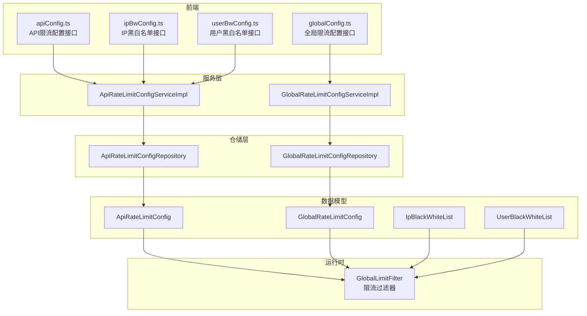
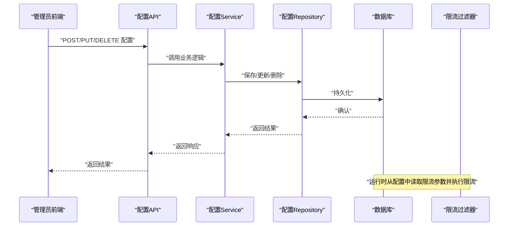
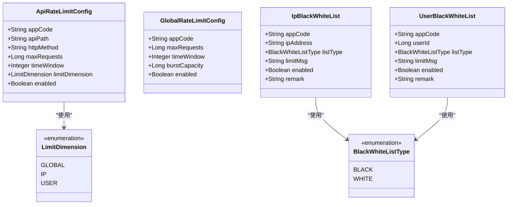
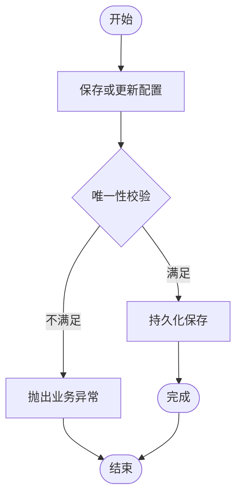
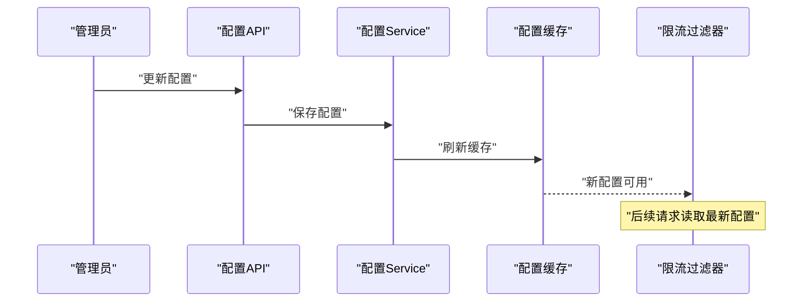
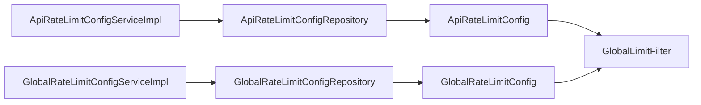

# 限流配置管理

<cite>
**本文档引用的文件**
- [ApiRateLimitConfig.java](file://ratelimit-module/src/main/java/com/fastproject/ratelimit/domain/ApiRateLimitConfig.java)
- [GlobalRateLimitConfig.java](file://ratelimit-module/src/main/java/com/fastproject/ratelimit/domain/GlobalRateLimitConfig.java)
- [IpBlackWhiteList.java](file://ratelimit-module/src/main/java/com/fastproject/ratelimit/domain/IpBlackWhiteList.java)
- [UserBlackWhiteList.java](file://ratelimit-module/src/main/java/com/fastproject/ratelimit/domain/UserBlackWhiteList.java)
- [ApiRateLimitConfigRepository.java](file://ratelimit-module/src/main/java/com/fastproject/ratelimit/repository/db/ApiRateLimitConfigRepository.java)
- [GlobalRateLimitConfigRepository.java](file://ratelimit-module/src/main/java/com/fastproject/ratelimit/repository/db/GlobalRateLimitConfigRepository.java)
- [ApiRateLimitConfigService.java](file://ratelimit-module/src/main/java/com/fastproject/ratelimit/service/ApiRateLimitConfigService.java)
- [GlobalRateLimitConfigService.java](file://ratelimit-module/src/main/java/com/fastproject/ratelimit/service/GlobalRateLimitConfigService.java)
- [ApiRateLimitConfigServiceImpl.java](file://ratelimit-module/src/main/java/com/fastproject/ratelimit/service/impl/ApiRateLimitConfigServiceImpl.java)
- [GlobalRateLimitConfigServiceImpl.java](file://ratelimit-module/src/main/java/com/fastproject/ratelimit/service/impl/GlobalRateLimitConfigServiceImpl.java)
- [LimitDimension.java](file://ratelimit-api/src/main/java/com/fastproject/ratelimit/enums/LimitDimension.java)
- [BlackWhiteListType.java](file://ratelimit-api/src/main/java/com/fastproject/ratelimit/enums/BlackWhiteListType.java)
- [GlobalLimitFilter.java](file://ratelimit-module/src/main/java/com/fastproject/ratelimit/config/GlobalLimitFilter.java)
- [apiConfig.ts](file://fast-ui/apps/admin-vue/src/api/ratelimit/apiConfig.ts)
- [globalConfig.ts](file://fast-ui/apps/admin-vue/src/api/ratelimit/globalConfig.ts)
- [ipBwConfig.ts](file://fast-ui/apps/admin-vue/src/api/ratelimit/ipBwConfig.ts)
- [userBwConfig.ts](file://fast-ui/apps/admin-vue/src/api/ratelimit/userBwConfig.ts)
</cite>

## 目录
1. [简介](#简介)
2. [项目结构](#项目结构)
3. [核心组件](#核心组件)
4. [架构总览](#架构总览)
5. [详细组件分析](#详细组件分析)
6. [依赖关系分析](#依赖关系分析)
7. [性能考虑](#性能考虑)
8. [故障排查指南](#故障排查指南)
9. [结论](#结论)
10. [附录](#附录)

## 简介
本文件系统性阐述限流配置管理的技术方案，覆盖配置数据模型、CRUD与动态更新机制、配置验证规则、持久化与版本管理、热更新与缓存刷新、API接口规范以及最佳实践与性能优化建议。目标是帮助开发者与运维人员快速理解并安全地使用与扩展限流配置能力。

## 项目结构
限流配置管理由三层构成：
- 数据模型层：定义限流配置与黑白名单的实体结构
- 服务与仓储层：提供CRUD、校验与查询能力
- 过滤器与前端API：实现限流控制与配置管理界面交互

图表来源
- [ApiRateLimitConfigServiceImpl.java](file://ratelimit-module/src/main/java/com/fastproject/ratelimit/service/impl/ApiRateLimitConfigServiceImpl.java#L1-L130)
- [GlobalRateLimitConfigServiceImpl.java](file://ratelimit-module/src/main/java/com/fastproject/ratelimit/service/impl/GlobalRateLimitConfigServiceImpl.java#L1-L145)
- [ApiRateLimitConfigRepository.java](file://ratelimit-module/src/main/java/com/fastproject/ratelimit/repository/db/ApiRateLimitConfigRepository.java#L1-L28)
- [GlobalRateLimitConfigRepository.java](file://ratelimit-module/src/main/java/com/fastproject/ratelimit/repository/db/GlobalRateLimitConfigRepository.java#L1-L21)
- [ApiRateLimitConfig.java](file://ratelimit-module/src/main/java/com/fastproject/ratelimit/domain/ApiRateLimitConfig.java#L1-L64)
- [GlobalRateLimitConfig.java](file://ratelimit-module/src/main/java/com/fastproject/ratelimit/domain/GlobalRateLimitConfig.java#L1-L50)
- [IpBlackWhiteList.java](file://ratelimit-module/src/main/java/com/fastproject/ratelimit/domain/IpBlackWhiteList.java#L1-L60)
- [UserBlackWhiteList.java](file://ratelimit-module/src/main/java/com/fastproject/ratelimit/domain/UserBlackWhiteList.java#L1-L60)
- [GlobalLimitFilter.java](file://ratelimit-module/src/main/java/com/fastproject/ratelimit/config/GlobalLimitFilter.java#L64-L219)

章节来源
- [ApiRateLimitConfigServiceImpl.java](file://ratelimit-module/src/main/java/com/fastproject/ratelimit/service/impl/ApiRateLimitConfigServiceImpl.java#L1-L130)
- [GlobalRateLimitConfigServiceImpl.java](file://ratelimit-module/src/main/java/com/fastproject/ratelimit/service/impl/GlobalRateLimitConfigServiceImpl.java#L1-L145)
- [ApiRateLimitConfigRepository.java](file://ratelimit-module/src/main/java/com/fastproject/ratelimit/repository/db/ApiRateLimitConfigRepository.java#L1-L28)
- [GlobalRateLimitConfigRepository.java](file://ratelimit-module/src/main/java/com/fastproject/ratelimit/repository/db/GlobalRateLimitConfigRepository.java#L1-L21)
- [ApiRateLimitConfig.java](file://ratelimit-module/src/main/java/com/fastproject/ratelimit/domain/ApiRateLimitConfig.java#L1-L64)
- [GlobalRateLimitConfig.java](file://ratelimit-module/src/main/java/com/fastproject/ratelimit/domain/GlobalRateLimitConfig.java#L1-L50)
- [IpBlackWhiteList.java](file://ratelimit-module/src/main/java/com/fastproject/ratelimit/domain/IpBlackWhiteList.java#L1-L60)
- [UserBlackWhiteList.java](file://ratelimit-module/src/main/java/com/fastproject/ratelimit/domain/UserBlackWhiteList.java#L1-L60)
- [GlobalLimitFilter.java](file://ratelimit-module/src/main/java/com/fastproject/ratelimit/config/GlobalLimitFilter.java#L64-L219)

## 核心组件
- 配置数据模型
  - API限流配置：应用代码、API路径、HTTP方法、最大请求数、时间窗口、限流维度、是否启用
  - 全局限流配置：应用代码、全局最大QPS、时间窗口、突发容量、是否启用
  - IP黑白名单：应用代码、IP地址/网段、名单类型、限制提示、是否启用、备注
  - 用户黑白名单：应用代码、用户ID、名单类型、限制提示、是否启用、备注
- 服务接口与实现
  - API限流配置Service：新增、修改、删除、批量删除、按ID查询、分页查询、按应用+路径+方法查询
  - 全局限流配置Service：新增、修改、删除、批量删除、按ID查询、分页查询、查询当前生效配置
- 仓储接口
  - 提供基于JPA的CRUD与条件查询，含唯一性校验
- 限流过滤器
  - 基于令牌桶算法，支持本地缓存+Redis批量拉取的混合限流策略

章节来源
- [ApiRateLimitConfig.java](file://ratelimit-module/src/main/java/com/fastproject/ratelimit/domain/ApiRateLimitConfig.java#L1-L64)
- [GlobalRateLimitConfig.java](file://ratelimit-module/src/main/java/com/fastproject/ratelimit/domain/GlobalRateLimitConfig.java#L1-L50)
- [IpBlackWhiteList.java](file://ratelimit-module/src/main/java/com/fastproject/ratelimit/domain/IpBlackWhiteList.java#L1-L60)
- [UserBlackWhiteList.java](file://ratelimit-module/src/main/java/com/fastproject/ratelimit/domain/UserBlackWhiteList.java#L1-L60)
- [ApiRateLimitConfigService.java](file://ratelimit-module/src/main/java/com/fastproject/ratelimit/service/ApiRateLimitConfigService.java#L1-L50)
- [GlobalRateLimitConfigService.java](file://ratelimit-module/src/main/java/com/fastproject/ratelimit/service/GlobalRateLimitConfigService.java#L1-L50)
- [ApiRateLimitConfigServiceImpl.java](file://ratelimit-module/src/main/java/com/fastproject/ratelimit/service/impl/ApiRateLimitConfigServiceImpl.java#L1-L130)
- [GlobalRateLimitConfigServiceImpl.java](file://ratelimit-module/src/main/java/com/fastproject/ratelimit/service/impl/GlobalRateLimitConfigServiceImpl.java#L1-L145)
- [ApiRateLimitConfigRepository.java](file://ratelimit-module/src/main/java/com/fastproject/ratelimit/repository/db/ApiRateLimitConfigRepository.java#L1-L28)
- [GlobalRateLimitConfigRepository.java](file://ratelimit-module/src/main/java/com/fastproject/ratelimit/repository/db/GlobalRateLimitConfigRepository.java#L1-L21)
- [LimitDimension.java](file://ratelimit-api/src/main/java/com/fastproject/ratelimit/enums/LimitDimension.java#L1-L20)
- [BlackWhiteListType.java](file://ratelimit-api/src/main/java/com/fastproject/ratelimit/enums/BlackWhiteListType.java#L1-L25)
- [GlobalLimitFilter.java](file://ratelimit-module/src/main/java/com/fastproject/ratelimit/config/GlobalLimitFilter.java#L64-L219)

## 架构总览
限流配置管理采用“配置即数据”的设计：前端通过REST API对配置进行CRUD；服务层负责业务校验与持久化；过滤器在运行时读取配置并执行限流判断。为保证高并发下的低延迟，过滤器采用本地令牌缓存与Redis批量拉取相结合的策略。

图表来源
- [ApiRateLimitConfigServiceImpl.java](file://ratelimit-module/src/main/java/com/fastproject/ratelimit/service/impl/ApiRateLimitConfigServiceImpl.java#L38-L66)
- [GlobalRateLimitConfigServiceImpl.java](file://ratelimit-module/src/main/java/com/fastproject/ratelimit/service/impl/GlobalRateLimitConfigServiceImpl.java#L40-L84)
- [ApiRateLimitConfigRepository.java](file://ratelimit-module/src/main/java/com/fastproject/ratelimit/repository/db/ApiRateLimitConfigRepository.java#L12-L28)
- [GlobalRateLimitConfigRepository.java](file://ratelimit-module/src/main/java/com/fastproject/ratelimit/repository/db/GlobalRateLimitConfigRepository.java#L12-L21)
- [GlobalLimitFilter.java](file://ratelimit-module/src/main/java/com/fastproject/ratelimit/config/GlobalLimitFilter.java#L64-L219)

## 详细组件分析

### 数据模型与字段约束
- API限流配置
  - 关键字段：应用代码、API路径、HTTP方法、最大请求数、时间窗口、限流维度、是否启用
  - 约束：应用代码+API路径+HTTP方法组合唯一；最大请求数与时间窗口必填；维度枚举限定
- 全局限流配置
  - 关键字段：应用代码、全局最大QPS、时间窗口、突发容量、是否启用
  - 约束：同一应用下仅允许一个启用的配置；全局默认场景下可无应用代码
- 黑白名单
  - IP黑白名单：应用代码、IP地址/网段、名单类型、限制提示、是否启用、备注
  - 用户黑白名单：应用代码、用户ID、名单类型、限制提示、是否启用、备注
  - 约束：名单类型枚举限定；可按应用代码+标识（IP/用户）+类型唯一

图表来源
- [ApiRateLimitConfig.java](file://ratelimit-module/src/main/java/com/fastproject/ratelimit/domain/ApiRateLimitConfig.java#L1-L64)
- [GlobalRateLimitConfig.java](file://ratelimit-module/src/main/java/com/fastproject/ratelimit/domain/GlobalRateLimitConfig.java#L1-L50)
- [IpBlackWhiteList.java](file://ratelimit-module/src/main/java/com/fastproject/ratelimit/domain/IpBlackWhiteList.java#L1-L60)
- [UserBlackWhiteList.java](file://ratelimit-module/src/main/java/com/fastproject/ratelimit/domain/UserBlackWhiteList.java#L1-L60)
- [LimitDimension.java](file://ratelimit-api/src/main/java/com/fastproject/ratelimit/enums/LimitDimension.java#L1-L20)
- [BlackWhiteListType.java](file://ratelimit-api/src/main/java/com/fastproject/ratelimit/enums/BlackWhiteListType.java#L1-L25)

章节来源
- [ApiRateLimitConfig.java](file://ratelimit-module/src/main/java/com/fastproject/ratelimit/domain/ApiRateLimitConfig.java#L1-L64)
- [GlobalRateLimitConfig.java](file://ratelimit-module/src/main/java/com/fastproject/ratelimit/domain/GlobalRateLimitConfig.java#L1-L50)
- [IpBlackWhiteList.java](file://ratelimit-module/src/main/java/com/fastproject/ratelimit/domain/IpBlackWhiteList.java#L1-L60)
- [UserBlackWhiteList.java](file://ratelimit-module/src/main/java/com/fastproject/ratelimit/domain/UserBlackWhiteList.java#L1-L60)
- [LimitDimension.java](file://ratelimit-api/src/main/java/com/fastproject/ratelimit/enums/LimitDimension.java#L1-L20)
- [BlackWhiteListType.java](file://ratelimit-api/src/main/java/com/fastproject/ratelimit/enums/BlackWhiteListType.java#L1-L25)

### CRUD与验证规则
- API限流配置
  - 新增：校验应用代码+API路径+HTTP方法组合唯一性，保存后返回ID
  - 修改：校验唯一性（排除自身），更新后持久化
  - 删除：按ID删除
  - 批量删除：按ID列表删除
  - 查询：按ID、分页查询；支持多条件过滤
  - 业务规则：同一应用+路径+方法只能存在一条配置
- 全局限流配置
  - 新增：若启用，则检查同应用或全局是否已有启用配置，若有则拒绝
  - 修改：若启用，则检查是否存在其他启用配置（排除自身），若有则拒绝
  - 查询：按ID、分页查询；支持应用代码模糊匹配与启用状态过滤
  - 业务规则：同一作用域内仅允许一个启用配置
- 黑白名单
  - 新增/修改：按应用代码+标识+类型唯一
  - 查询：支持按应用代码、类型、启用状态过滤
  - 业务规则：名单类型枚举约束

图表来源
- [ApiRateLimitConfigServiceImpl.java](file://ratelimit-module/src/main/java/com/fastproject/ratelimit/service/impl/ApiRateLimitConfigServiceImpl.java#L38-L66)
- [GlobalRateLimitConfigServiceImpl.java](file://ratelimit-module/src/main/java/com/fastproject/ratelimit/service/impl/GlobalRateLimitConfigServiceImpl.java#L40-L84)
- [ApiRateLimitConfigRepository.java](file://ratelimit-module/src/main/java/com/fastproject/ratelimit/repository/db/ApiRateLimitConfigRepository.java#L14-L22)
- [GlobalRateLimitConfigRepository.java](file://ratelimit-module/src/main/java/com/fastproject/ratelimit/repository/db/GlobalRateLimitConfigRepository.java#L14-L20)

章节来源
- [ApiRateLimitConfigServiceImpl.java](file://ratelimit-module/src/main/java/com/fastproject/ratelimit/service/impl/ApiRateLimitConfigServiceImpl.java#L38-L130)
- [GlobalRateLimitConfigServiceImpl.java](file://ratelimit-module/src/main/java/com/fastproject/ratelimit/service/impl/GlobalRateLimitConfigServiceImpl.java#L40-L145)
- [ApiRateLimitConfigRepository.java](file://ratelimit-module/src/main/java/com/fastproject/ratelimit/repository/db/ApiRateLimitConfigRepository.java#L1-L28)
- [GlobalRateLimitConfigRepository.java](file://ratelimit-module/src/main/java/com/fastproject/ratelimit/repository/db/GlobalRateLimitConfigRepository.java#L1-L21)

### 动态更新与热更新机制
- 配置监听与变更通知
  - 当前代码未见显式的配置监听器或事件发布/订阅机制
  - 建议引入配置变更事件与缓存刷新策略，以实现配置的近实时生效
- 缓存刷新机制
  - 限流过滤器采用本地令牌缓存与Redis批量拉取结合的方式，减少Redis访问频率
  - 建议在配置更新后主动失效或刷新相关缓存键，确保新配置尽快被读取

图表来源
- [GlobalLimitFilter.java](file://ratelimit-module/src/main/java/com/fastproject/ratelimit/config/GlobalLimitFilter.java#L64-L219)

章节来源
- [GlobalLimitFilter.java](file://ratelimit-module/src/main/java/com/fastproject/ratelimit/config/GlobalLimitFilter.java#L64-L219)

### 配置持久化策略、版本管理与回滚
- 持久化策略
  - 使用软删除标记（deleted字段）与SQL Restriction实现逻辑删除，便于审计与恢复
  - 建议引入版本号字段与变更日志表，记录每次配置变更的差异
- 版本管理与回滚
  - 建议在配置表中增加版本号字段，变更时递增版本
  - 回滚可通过版本号定位历史快照，或通过变更日志反向应用

章节来源
- [ApiRateLimitConfig.java](file://ratelimit-module/src/main/java/com/fastproject/ratelimit/domain/ApiRateLimitConfig.java#L17-L18)
- [GlobalRateLimitConfig.java](file://ratelimit-module/src/main/java/com/fastproject/ratelimit/domain/GlobalRateLimitConfig.java#L17-L18)
- [IpBlackWhiteList.java](file://ratelimit-module/src/main/java/com/fastproject/ratelimit/domain/IpBlackWhiteList.java#L17-L18)
- [UserBlackWhiteList.java](file://ratelimit-module/src/main/java/com/fastproject/ratelimit/domain/UserBlackWhiteList.java#L17-L18)

### 配置管理API接口文档
- API限流配置
  - 分页查询：POST /ratelimit/api-config/page
  - 根据ID查询：GET /ratelimit/api-config/{id}
  - 新增：POST /ratelimit/api-config
  - 更新：PUT /ratelimit/api-config
  - 删除：DELETE /ratelimit/api-config/{id}
  - 批量删除：DELETE /ratelimit/api-config/batch
- 全局限流配置
  - 分页查询：POST /ratelimit/global-config/page
  - 根据ID查询：GET /ratelimit/global-config/{id}
  - 新增：POST /ratelimit/global-config
  - 更新：PUT /ratelimit/global-config
  - 删除：DELETE /ratelimit/global-config/{id}
  - 批量删除：DELETE /ratelimit/global-config/batch
- IP黑白名单配置
  - 分页查询：POST /ratelimit/ip-bw-config/page
  - 根据ID查询：GET /ratelimit/ip-bw-config/{id}
  - 新增：POST /ratelimit/ip-bw-config
  - 更新：PUT /ratelimit/ip-bw-config
  - 删除：DELETE /ratelimit/ip-bw-config/{id}
  - 批量删除：DELETE /ratelimit/ip-bw-config/batch
- 用户黑白名单配置
  - 分页查询：POST /ratelimit/user-bw-config/page
  - 根据ID查询：GET /ratelimit/user-bw-config/{id}
  - 新增：POST /ratelimit/user-bw-config
  - 更新：PUT /ratelimit/user-bw-config
  - 删除：DELETE /ratelimit/user-bw-config/{id}
  - 批量删除：DELETE /ratelimit/user-bw-config/batch

请求参数与响应格式
- 通用响应：包含状态码、数据体、消息
- 分页响应：包含数据列表与总数
- 错误处理：业务异常统一抛出，前端根据状态码与消息提示

章节来源
- [apiConfig.ts](file://fast-ui/apps/admin-vue/src/api/ratelimit/apiConfig.ts#L55-L107)
- [globalConfig.ts](file://fast-ui/apps/admin-vue/src/api/ratelimit/globalConfig.ts#L61-L96)
- [ipBwConfig.ts](file://fast-ui/apps/admin-vue/src/api/ratelimit/ipBwConfig.ts#L57-L96)
- [userBwConfig.ts](file://fast-ui/apps/admin-vue/src/api/ratelimit/userBwConfig.ts#L57-L96)

## 依赖关系分析
- 组件耦合
  - Service层依赖Repository与Mapper，职责清晰
  - 过滤器依赖配置模型与Redis，关注点分离
- 外部依赖
  - JPA/Hibernate用于数据持久化
  - Redis用于令牌桶计数与过期控制
  - 前端通过Axios封装的请求函数调用后端API

图表来源
- [ApiRateLimitConfigServiceImpl.java](file://ratelimit-module/src/main/java/com/fastproject/ratelimit/service/impl/ApiRateLimitConfigServiceImpl.java#L34-L36)
- [GlobalRateLimitConfigServiceImpl.java](file://ratelimit-module/src/main/java/com/fastproject/ratelimit/service/impl/GlobalRateLimitConfigServiceImpl.java#L35-L38)
- [ApiRateLimitConfigRepository.java](file://ratelimit-module/src/main/java/com/fastproject/ratelimit/repository/db/ApiRateLimitConfigRepository.java#L12-L28)
- [GlobalRateLimitConfigRepository.java](file://ratelimit-module/src/main/java/com/fastproject/ratelimit/repository/db/GlobalRateLimitConfigRepository.java#L12-L21)
- [ApiRateLimitConfig.java](file://ratelimit-module/src/main/java/com/fastproject/ratelimit/domain/ApiRateLimitConfig.java#L14-L64)
- [GlobalRateLimitConfig.java](file://ratelimit-module/src/main/java/com/fastproject/ratelimit/domain/GlobalRateLimitConfig.java#L13-L50)
- [GlobalLimitFilter.java](file://ratelimit-module/src/main/java/com/fastproject/ratelimit/config/GlobalLimitFilter.java#L64-L219)

章节来源
- [ApiRateLimitConfigServiceImpl.java](file://ratelimit-module/src/main/java/com/fastproject/ratelimit/service/impl/ApiRateLimitConfigServiceImpl.java#L1-L130)
- [GlobalRateLimitConfigServiceImpl.java](file://ratelimit-module/src/main/java/com/fastproject/ratelimit/service/impl/GlobalRateLimitConfigServiceImpl.java#L1-L145)
- [ApiRateLimitConfigRepository.java](file://ratelimit-module/src/main/java/com/fastproject/ratelimit/repository/db/ApiRateLimitConfigRepository.java#L1-L28)
- [GlobalRateLimitConfigRepository.java](file://ratelimit-module/src/main/java/com/fastproject/ratelimit/repository/db/GlobalRateLimitConfigRepository.java#L1-L21)
- [ApiRateLimitConfig.java](file://ratelimit-module/src/main/java/com/fastproject/ratelimit/domain/ApiRateLimitConfig.java#L1-L64)
- [GlobalRateLimitConfig.java](file://ratelimit-module/src/main/java/com/fastproject/ratelimit/domain/GlobalRateLimitConfig.java#L1-L50)
- [GlobalLimitFilter.java](file://ratelimit-module/src/main/java/com/fastproject/ratelimit/config/GlobalLimitFilter.java#L64-L219)

## 性能考虑
- 本地令牌缓存
  - 在高并发场景下，优先从本地缓存消耗令牌，降低Redis压力
  - 本地令牌耗尽后，批量从Redis拉取令牌，动态调整批量大小
- Redis键设计
  - 使用哈希存储令牌与时间戳，设置合理TTL，避免内存膨胀
- 查询优化
  - 分页查询使用Specification构建条件，避免N+1查询
  - 对常用过滤字段建立索引（如应用代码、启用状态）

章节来源
- [GlobalLimitFilter.java](file://ratelimit-module/src/main/java/com/fastproject/ratelimit/config/GlobalLimitFilter.java#L64-L219)
- [ApiRateLimitConfigServiceImpl.java](file://ratelimit-module/src/main/java/com/fastproject/ratelimit/service/impl/ApiRateLimitConfigServiceImpl.java#L91-L120)
- [GlobalRateLimitConfigServiceImpl.java](file://ratelimit-module/src/main/java/com/fastproject/ratelimit/service/impl/GlobalRateLimitConfigServiceImpl.java#L109-L129)

## 故障排查指南
- 常见问题
  - 唯一性冲突：新增或修改时提示应用+路径+方法已存在
  - 启用冲突：全局限流配置在同一作用域内重复启用
  - 配置未生效：检查缓存是否已刷新，或过滤器是否正确读取配置
- 排查步骤
  - 核对配置唯一性与启用状态
  - 检查数据库软删除标记与SQL Restriction
  - 观察Redis键值与TTL，确认令牌桶状态
  - 查看服务日志与异常栈，定位业务异常原因

章节来源
- [ApiRateLimitConfigServiceImpl.java](file://ratelimit-module/src/main/java/com/fastproject/ratelimit/service/impl/ApiRateLimitConfigServiceImpl.java#L42-L45)
- [GlobalRateLimitConfigServiceImpl.java](file://ratelimit-module/src/main/java/com/fastproject/ratelimit/service/impl/GlobalRateLimitConfigServiceImpl.java#L44-L55)
- [ApiRateLimitConfigRepository.java](file://ratelimit-module/src/main/java/com/fastproject/ratelimit/repository/db/ApiRateLimitConfigRepository.java#L14-L22)
- [GlobalRateLimitConfigRepository.java](file://ratelimit-module/src/main/java/com/fastproject/ratelimit/repository/db/GlobalRateLimitConfigRepository.java#L14-L20)

## 结论
本方案通过清晰的数据模型、严格的业务校验与高效的运行时限流策略，实现了可维护、可扩展的限流配置管理体系。建议在现有基础上补充配置监听与缓存刷新机制，并完善版本管理与回滚能力，以进一步提升系统的可观测性与可靠性。

## 附录
- 最佳实践
  - 配置变更应走审批流程，避免误操作
  - 为高频查询字段建立索引，优化分页查询性能
  - 定期清理过期Redis键，避免资源浪费
- 性能优化建议
  - 调整本地缓存大小与批量拉取阈值，适配实际流量
  - 对热点配置进行预热，减少首次加载延迟
  - 使用连接池与异步写入，降低数据库压力