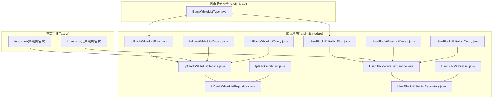
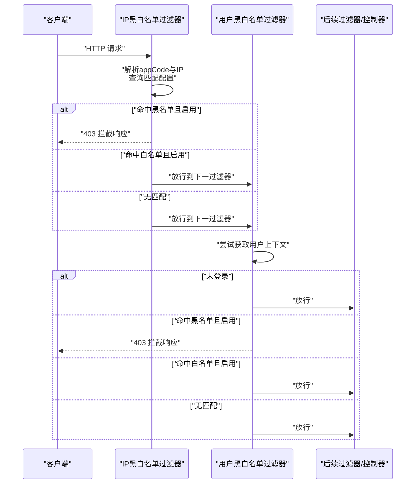
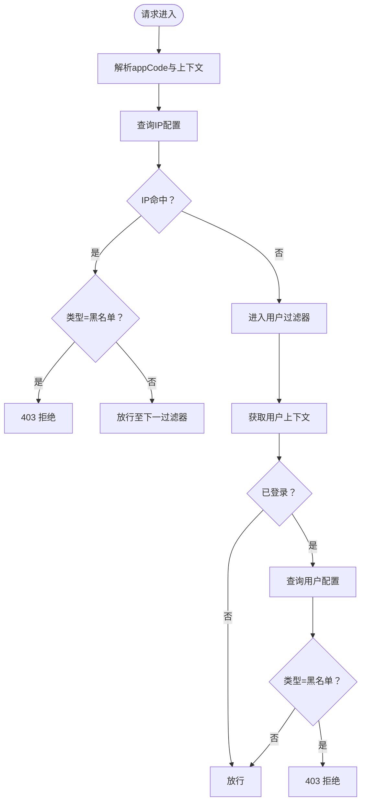
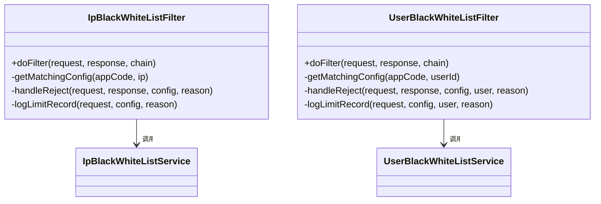
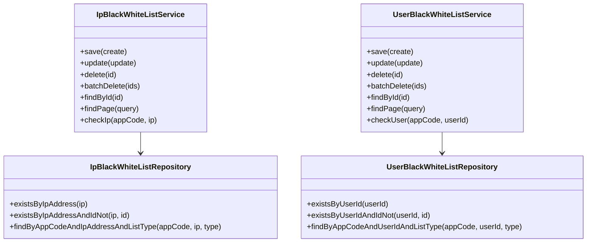
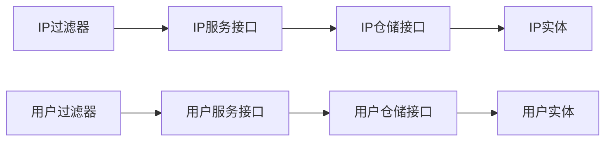

# 黑白名单机制

<cite>
**本文引用的文件**
- [IpBlackWhiteList.java](file://ratelimit-module/src/main/java/com/fastproject/ratelimit/domain/IpBlackWhiteList.java)
- [UserBlackWhiteList.java](file://ratelimit-module/src/main/java/com/fastproject/ratelimit/domain/UserBlackWhiteList.java)
- [IpBlackWhiteListFilter.java](file://ratelimit-module/src/main/java/com/fastproject/ratelimit/config/IpBlackWhiteListFilter.java)
- [UserBlackWhiteListFilter.java](file://ratelimit-module/src/main/java/com/fastproject/ratelimit/config/UserBlackWhiteListFilter.java)
- [BlackWhiteListType.java](file://ratelimit-api/src/main/java/com/fastproject/ratelimit/enums/BlackWhiteListType.java)
- [IpBlackWhiteListCreate.java](file://ratelimit-module/src/main/java/com/fastproject/ratelimit/vo/ipbw/IpBlackWhiteListCreate.java)
- [IpBlackWhiteListQuery.java](file://ratelimit-module/src/main/java/com/fastproject/ratelimit/vo/ipbw/IpBlackWhiteListQuery.java)
- [UserBlackWhiteListCreate.java](file://ratelimit-module/src/main/java/com/fastproject/ratelimit/vo/userbw/UserBlackWhiteListCreate.java)
- [UserBlackWhiteListQuery.java](file://ratelimit-module/src/main/java/com/fastproject/ratelimit/vo/userbw/UserBlackWhiteListQuery.java)
- [IpBlackWhiteListService.java](file://ratelimit-module/src/main/java/com/fastproject/ratelimit/service/IpBlackWhiteListService.java)
- [UserBlackWhiteListService.java](file://ratelimit-module/src/main/java/com/fastproject/ratelimit/service/UserBlackWhiteListService.java)
- [IpBlackWhiteListRepository.java](file://ratelimit-module/src/main/java/com/fastproject/ratelimit/repository/db/IpBlackWhiteListRepository.java)
- [UserBlackWhiteListRepository.java](file://ratelimit-module/src/main/java/com/fastproject/ratelimit/repository/db/UserBlackWhiteListRepository.java)
- [index.vue（IP黑白名单）](file://fast-ui/apps/admin-vue/src/views/ratelimit/ip-bw-config/index.vue)
- [index.vue（用户黑白名单）](file://fast-ui/apps/admin-vue/src/views/ratelimit/user-bw-config/index.vue)
</cite>

## 目录
1. [引言](#引言)
2. [项目结构](#项目结构)
3. [核心组件](#核心组件)
4. [架构总览](#架构总览)
5. [详细组件分析](#详细组件分析)
6. [依赖关系分析](#依赖关系分析)
7. [性能与缓存策略](#性能与缓存策略)
8. [故障排查指南](#故障排查指南)
9. [结论](#结论)
10. [附录：API接口定义](#附录api接口定义)

## 引言
本文件系统性阐述黑白名单机制的设计与实现，覆盖IP黑名单与用户黑名单两大维度，包括配置模型、过滤器链路、匹配算法、优先级与冲突处理、前端管理界面以及运维最佳实践。目标是帮助开发者与运维人员快速理解并正确使用该能力。

## 项目结构
黑白名单能力主要分布在以下模块与目录：
- 领域模型：IP黑白名单与用户黑白名单实体
- 过滤器：IP黑白名单过滤器与用户黑白名单过滤器
- 枚举：黑白名单类型
- VO与查询：新增、更新、查询与分页对象
- 服务与仓储：业务服务接口与JPA仓储
- 前端：黑白名单配置页面（支持增删改查与分页）

图表来源
- [IpBlackWhiteList.java](file://ratelimit-module/src/main/java/com/fastproject/ratelimit/domain/IpBlackWhiteList.java#L1-L60)
- [UserBlackWhiteList.java](file://ratelimit-module/src/main/java/com/fastproject/ratelimit/domain/UserBlackWhiteList.java#L1-L60)
- [IpBlackWhiteListFilter.java](file://ratelimit-module/src/main/java/com/fastproject/ratelimit/config/IpBlackWhiteListFilter.java#L1-L141)
- [UserBlackWhiteListFilter.java](file://ratelimit-module/src/main/java/com/fastproject/ratelimit/config/UserBlackWhiteListFilter.java#L1-L149)
- [IpBlackWhiteListService.java](file://ratelimit-module/src/main/java/com/fastproject/ratelimit/service/IpBlackWhiteListService.java#L1-L52)
- [UserBlackWhiteListService.java](file://ratelimit-module/src/main/java/com/fastproject/ratelimit/service/UserBlackWhiteListService.java#L1-L52)
- [IpBlackWhiteListRepository.java](file://ratelimit-module/src/main/java/com/fastproject/ratelimit/repository/db/IpBlackWhiteListRepository.java#L1-L30)
- [UserBlackWhiteListRepository.java](file://ratelimit-module/src/main/java/com/fastproject/ratelimit/repository/db/UserBlackWhiteListRepository.java#L1-L30)
- [BlackWhiteListType.java](file://ratelimit-api/src/main/java/com/fastproject/ratelimit/enums/BlackWhiteListType.java#L1-L25)
- [index.vue（IP黑白名单）](file://fast-ui/apps/admin-vue/src/views/ratelimit/ip-bw-config/index.vue#L311-L424)
- [index.vue（用户黑白名单）](file://fast-ui/apps/admin-vue/src/views/ratelimit/user-bw-config/index.vue#L311-L365)

章节来源
- [IpBlackWhiteList.java](file://ratelimit-module/src/main/java/com/fastproject/ratelimit/domain/IpBlackWhiteList.java#L1-L60)
- [UserBlackWhiteList.java](file://ratelimit-module/src/main/java/com/fastproject/ratelimit/domain/UserBlackWhiteList.java#L1-L60)
- [BlackWhiteListType.java](file://ratelimit-api/src/main/java/com/fastproject/ratelimit/enums/BlackWhiteListType.java#L1-L25)

## 核心组件
- 实体模型
  - IP黑白名单实体：包含应用标识、IP/IP段、名单类型、提示信息、启用状态、备注等字段
  - 用户黑白名单实体：包含应用标识、用户ID、名单类型、提示信息、启用状态、备注等字段
- 过滤器
  - IP黑白名单过滤器：在进入限流前对请求进行拦截判断，命中黑名单直接拒绝，命中白名单直接放行
  - 用户黑白名单过滤器：基于登录用户上下文进行拦截判断，未登录请求跳过
- 服务与仓储
  - 服务接口：提供新增、修改、删除、批量删除、分页查询、按条件检查等能力
  - 仓储接口：基于Spring Data JPA提供存在性校验与精确查询
- 枚举
  - 黑白名单类型：BLACK（黑名单）、WHITE（白名单）
- 前端管理
  - 支持分页查询、新增编辑、启用/禁用切换、批量删除等

章节来源
- [IpBlackWhiteList.java](file://ratelimit-module/src/main/java/com/fastproject/ratelimit/domain/IpBlackWhiteList.java#L11-L60)
- [UserBlackWhiteList.java](file://ratelimit-module/src/main/java/com/fastproject/ratelimit/domain/UserBlackWhiteList.java#L11-L60)
- [IpBlackWhiteListFilter.java](file://ratelimit-module/src/main/java/com/fastproject/ratelimit/config/IpBlackWhiteListFilter.java#L33-L85)
- [UserBlackWhiteListFilter.java](file://ratelimit-module/src/main/java/com/fastproject/ratelimit/config/UserBlackWhiteListFilter.java#L33-L97)
- [IpBlackWhiteListService.java](file://ratelimit-module/src/main/java/com/fastproject/ratelimit/service/IpBlackWhiteListService.java#L11-L52)
- [UserBlackWhiteListService.java](file://ratelimit-module/src/main/java/com/fastproject/ratelimit/service/UserBlackWhiteListService.java#L11-L52)
- [IpBlackWhiteListRepository.java](file://ratelimit-module/src/main/java/com/fastproject/ratelimit/repository/db/IpBlackWhiteListRepository.java#L9-L30)
- [UserBlackWhiteListRepository.java](file://ratelimit-module/src/main/java/com/fastproject/ratelimit/repository/db/UserBlackWhiteListRepository.java#L9-L30)
- [BlackWhiteListType.java](file://ratelimit-api/src/main/java/com/fastproject/ratelimit/enums/BlackWhiteListType.java#L6-L25)
- [index.vue（IP黑白名单）](file://fast-ui/apps/admin-vue/src/views/ratelimit/ip-bw-config/index.vue#L311-L424)
- [index.vue（用户黑白名单）](file://fast-ui/apps/admin-vue/src/views/ratelimit/user-bw-config/index.vue#L311-L365)

## 架构总览
黑白名单作为请求拦截层的一部分，位于限流之前，通过过滤器链对请求进行快速判定。命中黑名单直接拒绝并记录拦截日志；命中白名单直接放行。两者之间通过顺序保证黑名单优先于用户名单生效。

图表来源
- [IpBlackWhiteListFilter.java](file://ratelimit-module/src/main/java/com/fastproject/ratelimit/config/IpBlackWhiteListFilter.java#L51-L85)
- [UserBlackWhiteListFilter.java](file://ratelimit-module/src/main/java/com/fastproject/ratelimit/config/UserBlackWhiteListFilter.java#L51-L97)

## 详细组件分析

### 数据模型与匹配逻辑
- IP黑白名单实体
  - 关键字段：应用标识、IP/IP段、名单类型、提示信息、启用状态、备注
  - 删除采用软删除策略，查询默认带“未删除”限制
- 用户黑白名单实体
  - 关键字段：应用标识、用户ID、名单类型、提示信息、启用状态、备注
- 匹配算法
  - IP匹配：根据appCode+IP查询配置，命中黑名单直接拒绝，命中白名单放行
  - 用户匹配：需具备有效用户上下文，命中黑名单拒绝，命中白名单放行
- 优先级与冲突
  - IP黑名单优先于用户黑名单生效；白名单仅在对应层级内生效
  - 同一请求最多触发一次拦截（命中黑名单后提前返回）

图表来源
- [IpBlackWhiteListFilter.java](file://ratelimit-module/src/main/java/com/fastproject/ratelimit/config/IpBlackWhiteListFilter.java#L69-L85)
- [UserBlackWhiteListFilter.java](file://ratelimit-module/src/main/java/com/fastproject/ratelimit/config/UserBlackWhiteListFilter.java#L81-L97)

章节来源
- [IpBlackWhiteList.java](file://ratelimit-module/src/main/java/com/fastproject/ratelimit/domain/IpBlackWhiteList.java#L11-L60)
- [UserBlackWhiteList.java](file://ratelimit-module/src/main/java/com/fastproject/ratelimit/domain/UserBlackWhiteList.java#L11-L60)
- [IpBlackWhiteListFilter.java](file://ratelimit-module/src/main/java/com/fastproject/ratelimit/config/IpBlackWhiteListFilter.java#L33-L85)
- [UserBlackWhiteListFilter.java](file://ratelimit-module/src/main/java/com/fastproject/ratelimit/config/UserBlackWhiteListFilter.java#L33-L97)

### 过滤器实现要点
- 缓存策略
  - 使用本地Caffeine缓存，键为“appCode:ip”或“appCode:userId”，默认10秒过期，容量上限1万
- 拦截行为
  - 黑名单：设置403状态码，返回统一错误响应
  - 白名单：直接放行
- 日志记录
  - 记录拦截原因、请求方法、URL、IP、用户ID、请求头与查询参数等

图表来源
- [IpBlackWhiteListFilter.java](file://ratelimit-module/src/main/java/com/fastproject/ratelimit/config/IpBlackWhiteListFilter.java#L51-L141)
- [UserBlackWhiteListFilter.java](file://ratelimit-module/src/main/java/com/fastproject/ratelimit/config/UserBlackWhiteListFilter.java#L51-L149)

章节来源
- [IpBlackWhiteListFilter.java](file://ratelimit-module/src/main/java/com/fastproject/ratelimit/config/IpBlackWhiteListFilter.java#L42-L94)
- [UserBlackWhiteListFilter.java](file://ratelimit-module/src/main/java/com/fastproject/ratelimit/config/UserBlackWhiteListFilter.java#L42-L106)

### 服务与仓储设计
- 服务接口
  - 提供新增、修改、删除、批量删除、分页查询、按条件检查（checkIp/checkUser）等
- 仓储接口
  - 提供存在性校验（含排除自身ID）与按应用+主体+名单类型的精确查询

图表来源
- [IpBlackWhiteListService.java](file://ratelimit-module/src/main/java/com/fastproject/ratelimit/service/IpBlackWhiteListService.java#L11-L52)
- [UserBlackWhiteListService.java](file://ratelimit-module/src/main/java/com/fastproject/ratelimit/service/UserBlackWhiteListService.java#L11-L52)
- [IpBlackWhiteListRepository.java](file://ratelimit-module/src/main/java/com/fastproject/ratelimit/repository/db/IpBlackWhiteListRepository.java#L9-L30)
- [UserBlackWhiteListRepository.java](file://ratelimit-module/src/main/java/com/fastproject/ratelimit/repository/db/UserBlackWhiteListRepository.java#L9-L30)

章节来源
- [IpBlackWhiteListService.java](file://ratelimit-module/src/main/java/com/fastproject/ratelimit/service/IpBlackWhiteListService.java#L11-L52)
- [UserBlackWhiteListService.java](file://ratelimit-module/src/main/java/com/fastproject/ratelimit/service/UserBlackWhiteListService.java#L11-L52)
- [IpBlackWhiteListRepository.java](file://ratelimit-module/src/main/java/com/fastproject/ratelimit/repository/db/IpBlackWhiteListRepository.java#L9-L30)
- [UserBlackWhiteListRepository.java](file://ratelimit-module/src/main/java/com/fastproject/ratelimit/repository/db/UserBlackWhiteListRepository.java#L9-L30)

### 前端管理界面
- IP黑白名单
  - 支持按应用代码、IP、名单类型、启用状态筛选
  - 支持新增、编辑、启用/禁用切换、分页查看、批量删除
- 用户黑白名单
  - 支持按应用代码、用户ID、名单类型、启用状态筛选
  - 支持新增、编辑、启用/禁用切换、分页查看、批量删除

章节来源
- [index.vue（IP黑白名单）](file://fast-ui/apps/admin-vue/src/views/ratelimit/ip-bw-config/index.vue#L311-L424)
- [index.vue（用户黑白名单）](file://fast-ui/apps/admin-vue/src/views/ratelimit/user-bw-config/index.vue#L311-L365)

## 依赖关系分析
- 组件耦合
  - 过滤器依赖服务接口，服务依赖仓储接口，形成清晰的分层
  - 实体与仓储通过JPA映射数据库表，软删除与查询限制由注解保障
- 外部依赖
  - Caffeine本地缓存用于降低数据库压力
  - 统一响应封装与工具类用于日志记录与IP解析
- 可能的循环依赖
  - 当前结构为单向依赖，不存在循环依赖风险

图表来源
- [IpBlackWhiteListFilter.java](file://ratelimit-module/src/main/java/com/fastproject/ratelimit/config/IpBlackWhiteListFilter.java#L51-L94)
- [UserBlackWhiteListFilter.java](file://ratelimit-module/src/main/java/com/fastproject/ratelimit/config/UserBlackWhiteListFilter.java#L51-L106)
- [IpBlackWhiteListService.java](file://ratelimit-module/src/main/java/com/fastproject/ratelimit/service/IpBlackWhiteListService.java#L11-L52)
- [UserBlackWhiteListService.java](file://ratelimit-module/src/main/java/com/fastproject/ratelimit/service/UserBlackWhiteListService.java#L11-L52)
- [IpBlackWhiteListRepository.java](file://ratelimit-module/src/main/java/com/fastproject/ratelimit/repository/db/IpBlackWhiteListRepository.java#L9-L30)
- [UserBlackWhiteListRepository.java](file://ratelimit-module/src/main/java/com/fastproject/ratelimit/repository/db/UserBlackWhiteListRepository.java#L9-L30)
- [IpBlackWhiteList.java](file://ratelimit-module/src/main/java/com/fastproject/ratelimit/domain/IpBlackWhiteList.java#L11-L60)
- [UserBlackWhiteList.java](file://ratelimit-module/src/main/java/com/fastproject/ratelimit/domain/UserBlackWhiteList.java#L11-L60)

## 性能与缓存策略
- 本地缓存
  - 默认10秒过期，最大1万条，显著降低重复查询开销
  - 建议结合实际流量规模调整过期时间与容量
- 数据库访问
  - 存在性校验与精确查询均通过JPA完成，建议在高频场景下配合缓存
- 过滤器链路
  - 仅进行轻量判断与缓存查询，避免阻塞请求路径

章节来源
- [IpBlackWhiteListFilter.java](file://ratelimit-module/src/main/java/com/fastproject/ratelimit/config/IpBlackWhiteListFilter.java#L42-L47)
- [UserBlackWhiteListFilter.java](file://ratelimit-module/src/main/java/com/fastproject/ratelimit/config/UserBlackWhiteListFilter.java#L42-L47)
- [IpBlackWhiteListRepository.java](file://ratelimit-module/src/main/java/com/fastproject/ratelimit/repository/db/IpBlackWhiteListRepository.java#L15-L28)
- [UserBlackWhiteListRepository.java](file://ratelimit-module/src/main/java/com/fastproject/ratelimit/repository/db/UserBlackWhiteListRepository.java#L15-L28)

## 故障排查指南
- 常见问题
  - 未生效：确认过滤器开关与应用标识一致
  - 误拦截：检查名单类型、启用状态与提示信息
  - 未登录：用户名单仅在有用户上下文时生效
- 定位手段
  - 查看拦截日志与统一响应
  - 确认缓存键与过期时间
  - 核对数据库软删除与查询限制

章节来源
- [IpBlackWhiteListFilter.java](file://ratelimit-module/src/main/java/com/fastproject/ratelimit/config/IpBlackWhiteListFilter.java#L96-L103)
- [UserBlackWhiteListFilter.java](file://ratelimit-module/src/main/java/com/fastproject/ratelimit/config/UserBlackWhiteListFilter.java#L108-L115)

## 结论
黑白名单机制以过滤器为核心，结合本地缓存与数据库查询，在进入限流前对请求进行快速拦截或放行。其设计强调可配置性（名单类型、启用状态、提示信息）、可维护性（软删除、分页查询）与可观测性（拦截日志）。通过合理的缓存与查询策略，可在保证安全性的同时兼顾性能。

## 附录：API接口定义

### IP黑白名单
- 新增
  - 方法与路径：POST /api/ratelimit/ip-bw
  - 请求体字段：appCode、ipAddress、listType、limitMsg、enabled、remark
  - 返回：新增记录ID
- 修改
  - 方法与路径：PUT /api/ratelimit/ip-bw
  - 请求体字段：同新增（需包含ID）
  - 返回：无内容
- 删除
  - 方法与路径：DELETE /api/ratelimit/ip-bw/{id}
  - 路径参数：id
  - 返回：无内容
- 批量删除
  - 方法与路径：DELETE /api/ratelimit/ip-bw/batch
  - 请求体字段：ids（数组）
  - 返回：无内容
- 分页查询
  - 方法与路径：GET /api/ratelimit/ip-bw/page
  - 查询参数：appCode、ipAddress、listType、enabled、page、pageSize
  - 返回：分页结果（data、total）
- 按ID查询
  - 方法与路径：GET /api/ratelimit/ip-bw/{id}
  - 路径参数：id
  - 返回：单条记录
- 检查IP
  - 方法与路径：GET /api/ratelimit/ip-bw/check
  - 查询参数：appCode、ip
  - 返回：匹配的配置或空

章节来源
- [IpBlackWhiteListCreate.java](file://ratelimit-module/src/main/java/com/fastproject/ratelimit/vo/ipbw/IpBlackWhiteListCreate.java#L6-L24)
- [IpBlackWhiteListQuery.java](file://ratelimit-module/src/main/java/com/fastproject/ratelimit/vo/ipbw/IpBlackWhiteListQuery.java#L8-L23)
- [IpBlackWhiteListService.java](file://ratelimit-module/src/main/java/com/fastproject/ratelimit/service/IpBlackWhiteListService.java#L16-L50)

### 用户黑白名单
- 新增
  - 方法与路径：POST /api/ratelimit/user-bw
  - 请求体字段：appCode、userId、listType、limitMsg、enabled、remark
  - 返回：新增记录ID
- 修改
  - 方法与路径：PUT /api/ratelimit/user-bw
  - 请求体字段：同新增（需包含ID）
  - 返回：无内容
- 删除
  - 方法与路径：DELETE /api/ratelimit/user-bw/{id}
  - 路径参数：id
  - 返回：无内容
- 批量删除
  - 方法与路径：DELETE /api/ratelimit/user-bw/batch
  - 请求体字段：ids（数组）
  - 返回：无内容
- 分页查询
  - 方法与路径：GET /api/ratelimit/user-bw/page
  - 查询参数：appCode、userId、listType、enabled、page、pageSize
  - 返回：分页结果（data、total）
- 按ID查询
  - 方法与路径：GET /api/ratelimit/user-bw/{id}
  - 路径参数：id
  - 返回：单条记录
- 检查用户
  - 方法与路径：GET /api/ratelimit/user-bw/check
  - 查询参数：appCode、userId
  - 返回：匹配的配置或空

章节来源
- [UserBlackWhiteListCreate.java](file://ratelimit-module/src/main/java/com/fastproject/ratelimit/vo/userbw/UserBlackWhiteListCreate.java#L6-L24)
- [UserBlackWhiteListQuery.java](file://ratelimit-module/src/main/java/com/fastproject/ratelimit/vo/userbw/UserBlackWhiteListQuery.java#L8-L23)
- [UserBlackWhiteListService.java](file://ratelimit-module/src/main/java/com/fastproject/ratelimit/service/UserBlackWhiteListService.java#L16-L50)

### 统一响应与权限控制
- 统一响应
  - 成功：code=200，data包含业务数据
  - 失败：code非200，message描述错误
- 拦截响应
  - 黑名单拦截：HTTP 403，统一错误响应
- 权限控制
  - 建议在网关或控制器层增加鉴权与授权校验，确保只有授权用户可访问管理接口

章节来源
- [IpBlackWhiteListFilter.java](file://ratelimit-module/src/main/java/com/fastproject/ratelimit/config/IpBlackWhiteListFilter.java#L96-L103)
- [UserBlackWhiteListFilter.java](file://ratelimit-module/src/main/java/com/fastproject/ratelimit/config/UserBlackWhiteListFilter.java#L108-L115)