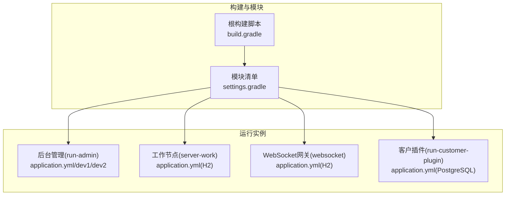
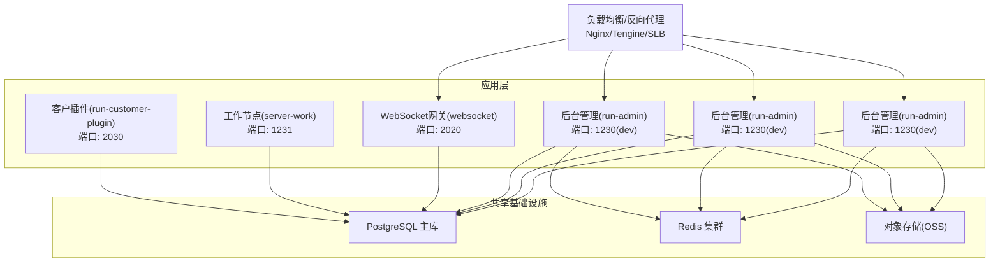
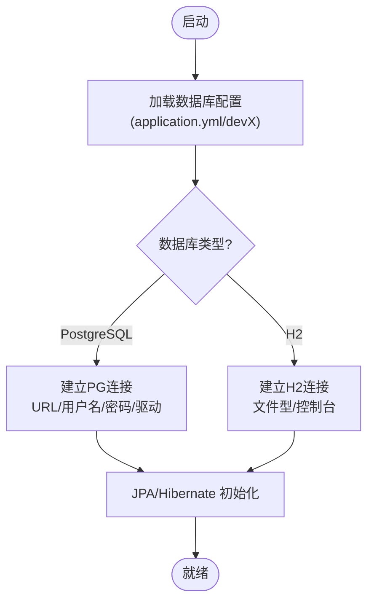
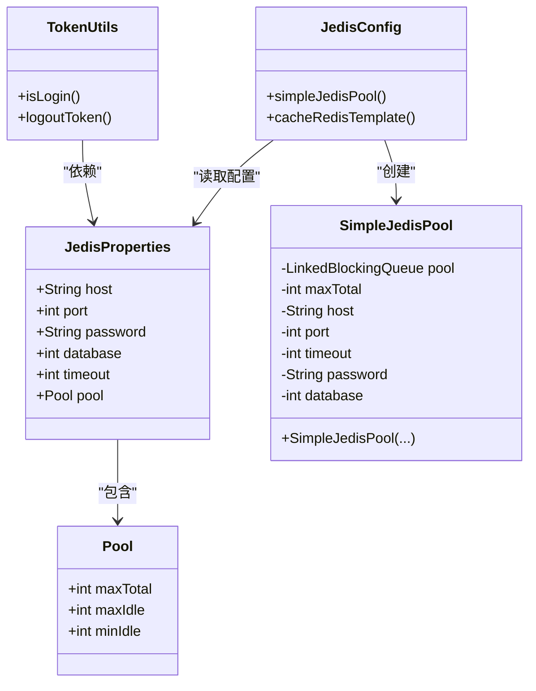
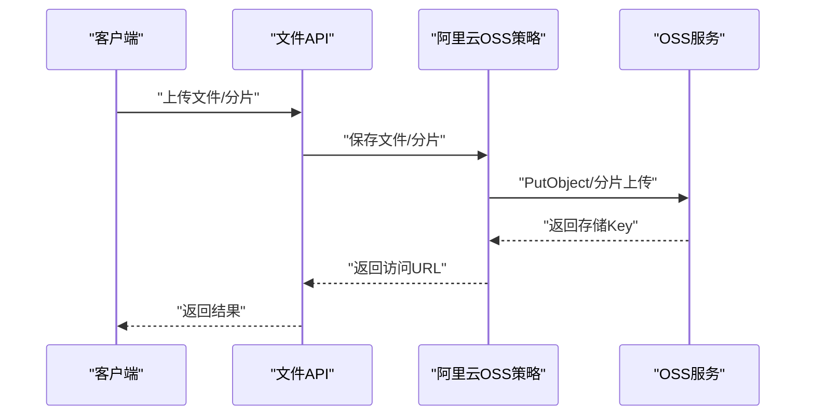
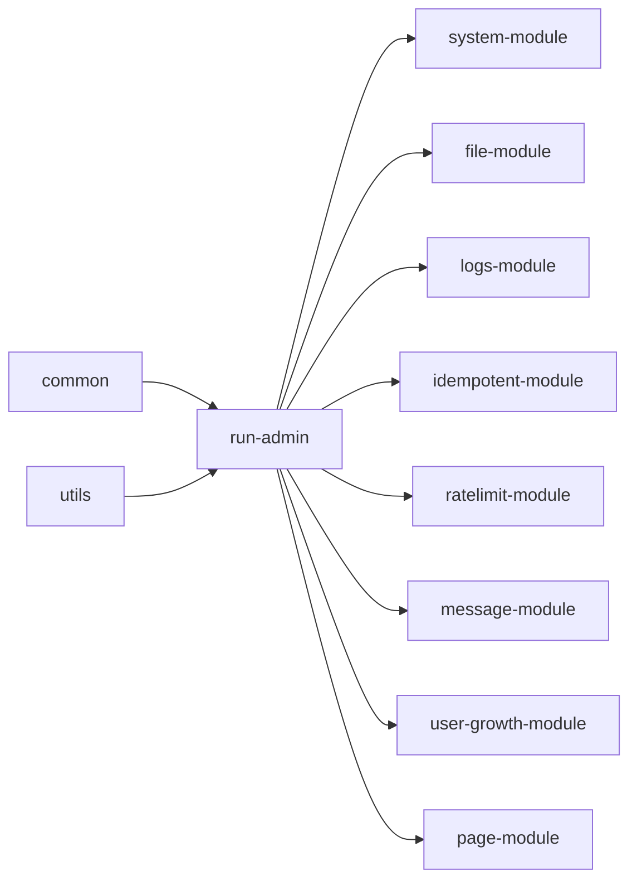

# 部署运维

<cite>
**本文引用的文件**
- [build.gradle](file://build.gradle)
- [settings.gradle](file://settings.gradle)
- [run-admin/src/main/resources/application.yml](file://run-admin/src/main/resources/application.yml)
- [run-admin/src/main/resources/application-dev1.yml](file://run-admin/src/main/resources/application-dev1.yml)
- [run-admin/src/main/resources/application-dev2.yml](file://run-admin/src/main/resources/application-dev2.yml)
- [server-work/src/main/resources/application.yml](file://server-work/src/main/resources/application.yml)
- [websocket/src/main/resources/application.yml](file://websocket/src/main/resources/application.yml)
- [run-customer-plugin/src/main/resources/application.yml](file://run-customer-plugin/src/main/resources/application.yml)
- [run-admin/src/main/java/com/fastproject/config/JedisProperties.java](file://run-admin/src/main/java/com/fastproject/config/JedisProperties.java)
- [run-admin/src/main/java/com/fastproject/config/JedisConfig.java](file://run-admin/src/main/java/com/fastproject/config/JedisConfig.java)
- [common/src/main/java/com/fastproject/jedis/SimpleJedisPool.java](file://common/src/main/java/com/fastproject/jedis/SimpleJedisPool.java)
- [common/src/main/java/com/fastproject/jedis/AbstractJedisTemplate.java](file://common/src/main/java/com/fastproject/jedis/AbstractJedisTemplate.java)
- [run-admin/src/main/java/com/fastproject/config/JpaSqlTimingConfig.java](file://run-admin/src/main/java/com/fastproject/config/JpaSqlTimingConfig.java)
- [file-module/src/main/java/com/fastproject/file/storage/impl/AliyunFileStorageStrategyImpl.java](file://file-module/src/main/java/com/fastproject/file/storage/impl/AliyunFileStorageStrategyImpl.java)
- [run-admin/src/main/java/com/fastproject/module/security/config/SecurityConfig.java](file://run-admin/src/main/java/com/fastproject/module/security/config/SecurityConfig.java)
- [common/src/main/java/com/fastproject/utils/TokenUtils.java](file://common/src/main/java/com/fastproject/utils/TokenUtils.java)
</cite>

## 目录
1. [简介](#简介)
2. [项目结构](#项目结构)
3. [核心组件](#核心组件)
4. [架构总览](#架构总览)
5. [详细组件分析](#详细组件分析)
6. [依赖关系分析](#依赖关系分析)
7. [性能考虑](#性能考虑)
8. [故障排除指南](#故障排除指南)
9. [结论](#结论)
10. [附录](#附录)

## 简介
本文件面向运维团队，提供Fast项目的生产级部署与运维操作手册。内容覆盖生产环境部署配置、环境变量与配置文件管理、容器化部署方案、数据库连接、缓存集群、文件存储、负载均衡与反向代理、SSL证书、监控告警、日志收集、性能调优、灾难恢复与数据备份、安全加固等。文档以仓库中的实际配置与实现为依据，确保可执行与可追溯。

## 项目结构
Fast项目采用多模块Gradle工程组织，包含通用模块、业务模块与运行入口模块。核心运行实例包括后台管理服务、工作节点服务、WebSocket网关以及客户插件服务。各模块通过Spring Boot Starter进行依赖装配，并使用YAML配置文件管理运行参数。

图表来源
- [build.gradle](file://build.gradle#L1-L457)
- [settings.gradle](file://settings.gradle#L1-L24)

章节来源
- [build.gradle](file://build.gradle#L1-L457)
- [settings.gradle](file://settings.gradle#L1-L24)

## 核心组件
- 运行实例与端口
  - 后台管理服务：监听端口由配置文件指定；开发环境提供dev1与dev2两套配置，分别指向不同数据库与缓存地址。
  - 工作节点服务：内置H2数据库，便于本地与测试环境运行。
  - WebSocket网关：独立端口与H2配置，便于消息通道调试。
  - 客户端插件服务：连接PostgreSQL数据库，适用于外部客户端集成场景。
- 数据库与ORM
  - PostgreSQL作为主库，H2用于工作节点与WebSocket网关的本地开发。
  - JPA/Hibernate配置支持SQL日志与慢查询统计，便于生产诊断。
- 缓存与会话
  - 使用Redis作为分布式缓存，提供连接池配置与模板封装，支持分布式锁等能力。
  - 基于Caffeine的本地缓存用于Token校验与用户信息短期缓存。
- 文件存储
  - 支持阿里云OSS直传策略，结合后端生成访问URL与分片上传/合并流程。
- 安全与鉴权
  - Spring Security与JWT过滤链，支持跨域、密码编码器与方法级安全注解。

章节来源
- [run-admin/src/main/resources/application.yml](file://run-admin/src/main/resources/application.yml#L1-L5)
- [run-admin/src/main/resources/application-dev1.yml](file://run-admin/src/main/resources/application-dev1.yml#L1-L70)
- [run-admin/src/main/resources/application-dev2.yml](file://run-admin/src/main/resources/application-dev2.yml#L1-L71)
- [server-work/src/main/resources/application.yml](file://server-work/src/main/resources/application.yml#L1-L16)
- [websocket/src/main/resources/application.yml](file://websocket/src/main/resources/application.yml#L1-L28)
- [run-customer-plugin/src/main/resources/application.yml](file://run-customer-plugin/src/main/resources/application.yml#L1-L26)
- [run-admin/src/main/java/com/fastproject/config/JedisProperties.java](file://run-admin/src/main/java/com/fastproject/config/JedisProperties.java#L1-L31)
- [run-admin/src/main/java/com/fastproject/config/JedisConfig.java](file://run-admin/src/main/java/com/fastproject/config/JedisConfig.java#L1-L55)
- [common/src/main/java/com/fastproject/jedis/SimpleJedisPool.java](file://common/src/main/java/com/fastproject/jedis/SimpleJedisPool.java#L1-L32)
- [common/src/main/java/com/fastproject/jedis/AbstractJedisTemplate.java](file://common/src/main/java/com/fastproject/jedis/AbstractJedisTemplate.java#L126-L286)
- [run-admin/src/main/java/com/fastproject/config/JpaSqlTimingConfig.java](file://run-admin/src/main/java/com/fastproject/config/JpaSqlTimingConfig.java#L1-L68)
- [file-module/src/main/java/com/fastproject/file/storage/impl/AliyunFileStorageStrategyImpl.java](file://file-module/src/main/java/com/fastproject/file/storage/impl/AliyunFileStorageStrategyImpl.java#L30-L254)
- [run-admin/src/main/java/com/fastproject/module/security/config/SecurityConfig.java](file://run-admin/src/main/java/com/fastproject/module/security/config/SecurityConfig.java#L1-L32)
- [common/src/main/java/com/fastproject/utils/TokenUtils.java](file://common/src/main/java/com/fastproject/utils/TokenUtils.java#L1-L212)

## 架构总览
下图展示生产环境典型拓扑：反向代理/负载均衡前置，后端由多个应用实例组成，共享数据库与缓存集群，文件存储采用对象存储（如阿里云OSS）。

图表来源
- [run-admin/src/main/resources/application.yml](file://run-admin/src/main/resources/application.yml#L1-L5)
- [websocket/src/main/resources/application.yml](file://websocket/src/main/resources/application.yml#L1-L28)
- [server-work/src/main/resources/application.yml](file://server-work/src/main/resources/application.yml#L1-L16)
- [run-customer-plugin/src/main/resources/application.yml](file://run-customer-plugin/src/main/resources/application.yml#L1-L26)
- [run-admin/src/main/resources/application-dev1.yml](file://run-admin/src/main/resources/application-dev1.yml#L28-L32)
- [run-admin/src/main/resources/application-dev2.yml](file://run-admin/src/main/resources/application-dev2.yml#L29-L32)
- [run-admin/src/main/resources/application-dev1.yml](file://run-admin/src/main/resources/application-dev1.yml#L61-L70)
- [run-admin/src/main/resources/application-dev2.yml](file://run-admin/src/main/resources/application-dev2.yml#L62-L70)

## 详细组件分析

### 数据库连接配置
- PostgreSQL主库
  - run-admin与run-customer-plugin均连接PostgreSQL，配置项包含URL、用户名、密码与驱动类名。
  - Hibernate方言与DDL策略在配置中明确，建议生产环境将DDL设为none并由迁移工具管理。
- H2本地库
  - server-work与websocket使用H2文件型数据库，便于本地开发与调试；生产环境应替换为PostgreSQL。

图表来源
- [run-admin/src/main/resources/application.yml](file://run-admin/src/main/resources/application.yml#L1-L5)
- [run-admin/src/main/resources/application-dev1.yml](file://run-admin/src/main/resources/application-dev1.yml#L28-L42)
- [run-admin/src/main/resources/application-dev2.yml](file://run-admin/src/main/resources/application-dev2.yml#L29-L42)
- [server-work/src/main/resources/application.yml](file://server-work/src/main/resources/application.yml#L4-L16)
- [websocket/src/main/resources/application.yml](file://websocket/src/main/resources/application.yml#L14-L26)
- [run-customer-plugin/src/main/resources/application.yml](file://run-customer-plugin/src/main/resources/application.yml#L10-L26)

章节来源
- [run-admin/src/main/resources/application.yml](file://run-admin/src/main/resources/application.yml#L1-L5)
- [run-admin/src/main/resources/application-dev1.yml](file://run-admin/src/main/resources/application-dev1.yml#L28-L42)
- [run-admin/src/main/resources/application-dev2.yml](file://run-admin/src/main/resources/application-dev2.yml#L29-L42)
- [server-work/src/main/resources/application.yml](file://server-work/src/main/resources/application.yml#L4-L16)
- [websocket/src/main/resources/application.yml](file://websocket/src/main/resources/application.yml#L14-L26)
- [run-customer-plugin/src/main/resources/application.yml](file://run-customer-plugin/src/main/resources/application.yml#L10-L26)

### 缓存集群设置
- Redis属性绑定
  - 通过配置前缀绑定Redis主机、端口、密码、数据库索引、超时与连接池参数。
- 连接池与模板
  - 自定义SimpleJedisPool替代第三方连接池，适配原生镜像环境；提供JedisTemplate封装常用命令。
- 令牌与会话
  - TokenUtils结合Redis与本地Caffeine缓存，实现登录态校验与注销流程。

图表来源
- [run-admin/src/main/java/com/fastproject/config/JedisProperties.java](file://run-admin/src/main/java/com/fastproject/config/JedisProperties.java#L1-L31)
- [run-admin/src/main/java/com/fastproject/config/JedisConfig.java](file://run-admin/src/main/java/com/fastproject/config/JedisConfig.java#L1-L55)
- [common/src/main/java/com/fastproject/jedis/SimpleJedisPool.java](file://common/src/main/java/com/fastproject/jedis/SimpleJedisPool.java#L1-L32)
- [common/src/main/java/com/fastproject/jedis/AbstractJedisTemplate.java](file://common/src/main/java/com/fastproject/jedis/AbstractJedisTemplate.java#L126-L286)
- [common/src/main/java/com/fastproject/utils/TokenUtils.java](file://common/src/main/java/com/fastproject/utils/TokenUtils.java#L1-L212)

章节来源
- [run-admin/src/main/java/com/fastproject/config/JedisProperties.java](file://run-admin/src/main/java/com/fastproject/config/JedisProperties.java#L1-L31)
- [run-admin/src/main/java/com/fastproject/config/JedisConfig.java](file://run-admin/src/main/java/com/fastproject/config/JedisConfig.java#L1-L55)
- [common/src/main/java/com/fastproject/jedis/SimpleJedisPool.java](file://common/src/main/java/com/fastproject/jedis/SimpleJedisPool.java#L1-L32)
- [common/src/main/java/com/fastproject/jedis/AbstractJedisTemplate.java](file://common/src/main/java/com/fastproject/jedis/AbstractJedisTemplate.java#L126-L286)
- [common/src/main/java/com/fastproject/utils/TokenUtils.java](file://common/src/main/java/com/fastproject/utils/TokenUtils.java#L1-L212)

### 文件存储配置（阿里云OSS）
- 存储策略
  - 提供基于阿里云OSS的直传策略实现，支持单文件上传、分片上传与合并、存在性检查与删除。
- 访问URL
  - 根据配置生成访问域名或默认前缀，支持HTTP/HTTPS协议推断。
- 配置项
  - 通过配置对象传递AK、Endpoint、Region、Bucket等参数，确保最小权限与安全传输。

图表来源
- [file-module/src/main/java/com/fastproject/file/storage/impl/AliyunFileStorageStrategyImpl.java](file://file-module/src/main/java/com/fastproject/file/storage/impl/AliyunFileStorageStrategyImpl.java#L30-L254)

章节来源
- [file-module/src/main/java/com/fastproject/file/storage/impl/AliyunFileStorageStrategyImpl.java](file://file-module/src/main/java/com/fastproject/file/storage/impl/AliyunFileStorageStrategyImpl.java#L30-L254)

### 负载均衡、反向代理与SSL
- 负载均衡
  - 建议在LB后端注册多个run-admin实例，实现高可用与水平扩展。
- 反向代理
  - Nginx/Tengine作为入口，转发静态资源与API请求至后端服务。
- SSL证书
  - 在LB层统一部署证书，启用TLS 1.3与现代加密套件，禁用弱算法。
- WebSocket
  - WebSocket网关独立端口暴露，可在LB层单独配置WS升级与长连接透传。

章节来源
- [websocket/src/main/resources/application.yml](file://websocket/src/main/resources/application.yml#L1-L28)

### 监控告警、日志收集与性能调优
- SQL性能
  - JPA SQL耗时统计可通过配置开关与阈值控制，生产建议开启并设置合理阈值。
- 日志
  - 开发配置中已设置SQL日志级别，生产建议集中采集并分级处理。
- 性能优化
  - 合理设置Redis连接池大小、超时时间；对热点接口进行缓存与限流；数据库连接池参数与DDL策略需与迁移工具配合。

章节来源
- [run-admin/src/main/java/com/fastproject/config/JpaSqlTimingConfig.java](file://run-admin/src/main/java/com/fastproject/config/JpaSqlTimingConfig.java#L1-L68)
- [run-admin/src/main/resources/application-dev1.yml](file://run-admin/src/main/resources/application-dev1.yml#L55-L57)
- [run-admin/src/main/resources/application-dev2.yml](file://run-admin/src/main/resources/application-dev2.yml#L55-L57)

### 安全加固
- 鉴权与跨域
  - Spring Security与JWT过滤链、跨域配置、密码编码器等已在配置中体现。
- 令牌管理
  - TokenUtils负责登录态校验与注销，结合Redis与本地缓存实现高效验证。
- 最小权限
  - 数据库与缓存连接使用专用账号与最小权限；OSS配置严格限制Bucket与目录范围。

章节来源
- [run-admin/src/main/java/com/fastproject/module/security/config/SecurityConfig.java](file://run-admin/src/main/java/com/fastproject/module/security/config/SecurityConfig.java#L1-L32)
- [common/src/main/java/com/fastproject/utils/TokenUtils.java](file://common/src/main/java/com/fastproject/utils/TokenUtils.java#L1-L212)

## 依赖关系分析
- 模块依赖
  - run-admin依赖系统、文件、日志、幂等、限流、消息、积分权益、页面配置等模块。
  - 公共模块common提供JPA、Web、缓存与工具能力，被多个业务模块复用。
- 外部依赖
  - PostgreSQL驱动、Redis客户端、H2数据库、Netty、OSS SDK等。

图表来源
- [build.gradle](file://build.gradle#L92-L134)
- [build.gradle](file://build.gradle#L61-L78)
- [build.gradle](file://build.gradle#L329-L345)

章节来源
- [build.gradle](file://build.gradle#L61-L78)
- [build.gradle](file://build.gradle#L92-L134)
- [build.gradle](file://build.gradle#L329-L345)

## 性能考虑
- 数据库
  - 生产环境DDL策略设为none，使用迁移工具管理结构变更；合理设置连接池大小与超时。
- 缓存
  - Redis连接池参数与超时需根据QPS与延迟目标调整；对热点键设置合理TTL。
- 应用
  - 启用JPA SQL耗时统计与慢查询记录，结合指标监控定位瓶颈。
- 文件
  - OSS直传与分片上传提升大文件吞吐；URL签名与CDN加速降低回源压力。

## 故障排除指南
- 数据库连接失败
  - 检查URL、用户名、密码与驱动类名；确认网络连通与防火墙策略。
- 缓存不可用
  - 校验Redis主机、端口、密码与数据库索引；查看连接池状态与超时配置。
- 文件上传异常
  - 核对OSS配置（AK、Endpoint、Region、Bucket）；检查网络与权限策略。
- 登录态失效
  - 检查Token头名称与过期时间；确认Redis中是否存在对应键；查看本地缓存清理逻辑。
- SQL性能问题
  - 开启SQL耗时统计，定位慢查询并优化索引与语句。

章节来源
- [run-admin/src/main/resources/application-dev1.yml](file://run-admin/src/main/resources/application-dev1.yml#L28-L32)
- [run-admin/src/main/resources/application-dev2.yml](file://run-admin/src/main/resources/application-dev2.yml#L29-L32)
- [run-admin/src/main/resources/application-dev1.yml](file://run-admin/src/main/resources/application-dev1.yml#L61-L70)
- [run-admin/src/main/resources/application-dev2.yml](file://run-admin/src/main/resources/application-dev2.yml#L62-L70)
- [file-module/src/main/java/com/fastproject/file/storage/impl/AliyunFileStorageStrategyImpl.java](file://file-module/src/main/java/com/fastproject/file/storage/impl/AliyunFileStorageStrategyImpl.java#L206-L237)
- [common/src/main/java/com/fastproject/utils/TokenUtils.java](file://common/src/main/java/com/fastproject/utils/TokenUtils.java#L196-L212)
- [run-admin/src/main/java/com/fastproject/config/JpaSqlTimingConfig.java](file://run-admin/src/main/java/com/fastproject/config/JpaSqlTimingConfig.java#L38-L53)

## 结论
本运维文档基于仓库中的实际配置与实现，给出了生产环境部署与运维的完整方案。建议在生产中统一使用PostgreSQL与Redis集群，启用SSL与最小权限策略，结合监控与日志体系持续优化性能与稳定性。

## 附录
- 环境变量建议
  - 数据库连接：DB_URL、DB_USER、DB_PASSWORD
  - Redis连接：REDIS_HOST、REDIS_PORT、REDIS_PASSWORD、REDIS_DB
  - 应用端口：ADMIN_PORT、WS_PORT、WORK_PORT、CUSTOMER_PORT
  - 安全密钥：JWT_SECRET、TOKEN_KEY
- 备份与恢复
  - PostgreSQL定期逻辑备份与增量备份；Redis持久化策略与快照；H2文件备份。
- 容器化部署要点
  - 使用官方JRE镜像，分层构建产物；挂载配置卷与持久化卷；健康检查与探针配置。