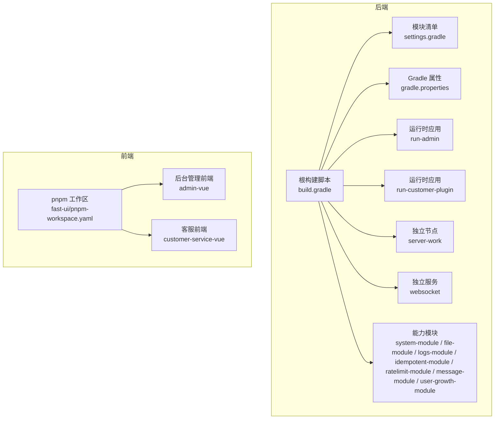
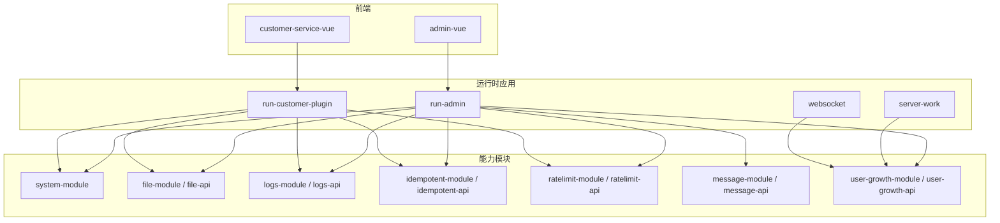
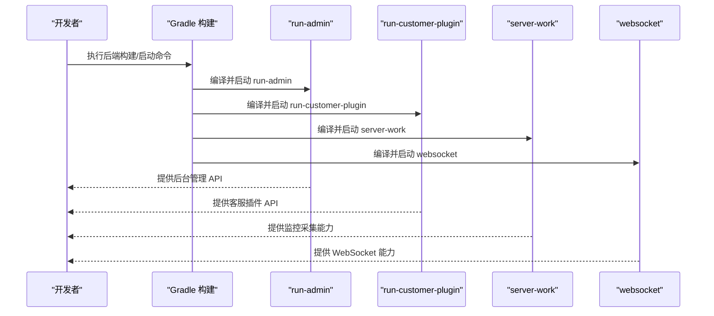
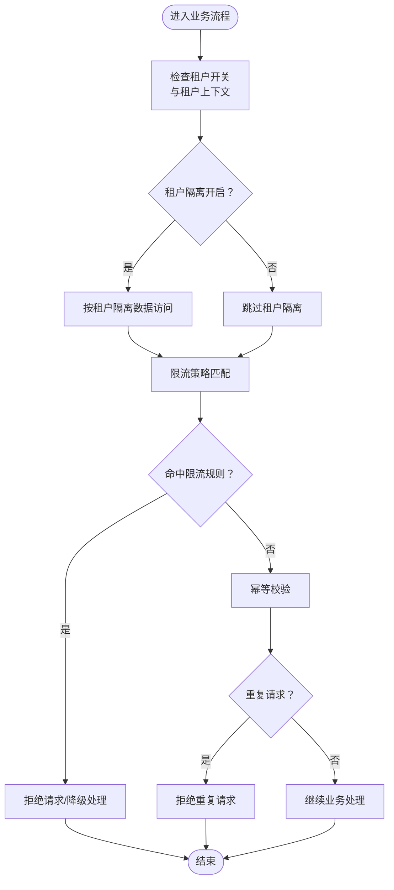
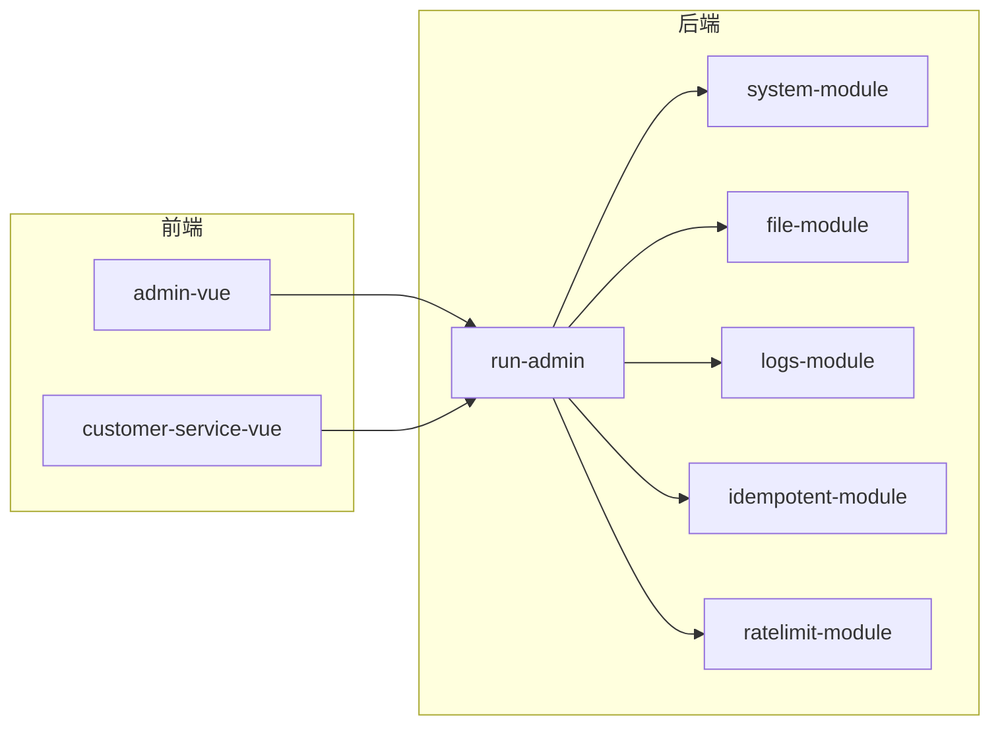
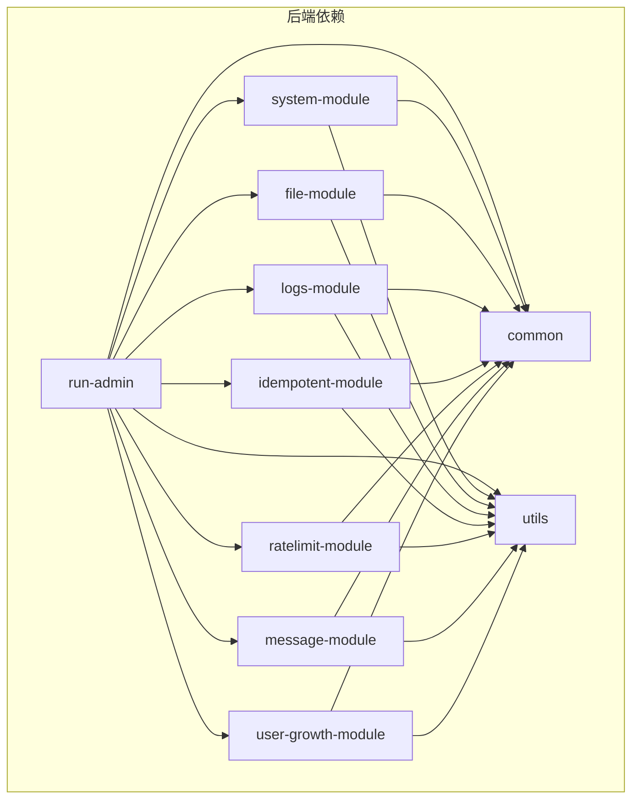

# 项目概述

<cite>
**本文引用的文件**
- [build.gradle](file://build.gradle)
- [settings.gradle](file://settings.gradle)
- [gradle.properties](file://gradle.properties)
- [AGENTS.md](file://AGENTS.md)
- [fast-ui/package.json](file://fast-ui/package.json)
- [fast-ui/pnpm-workspace.yaml](file://fast-ui/pnpm-workspace.yaml)
- [run-admin/src/main/java/com/fastproject/RunAdmin.java](file://run-admin/src/main/java/com/fastproject/RunAdmin.java)
- [run-customer-plugin/src/main/java/com/fastproject/RunCustomer.java](file://run-customer-plugin/src/main/java/com/fastproject/RunCustomer.java)
- [server-work/src/main/java/com/fastproject/RunServerWork.java](file://server-work/src/main/java/com/fastproject/RunServerWork.java)
- [websocket/src/main/java/com/fastproject/WebSocketRun.java](file://websocket/src/main/java/com/fastproject/WebSocketRun.java)
</cite>

## 目录
1. [引言](#引言)
2. [项目结构](#项目结构)
3. [核心组件](#核心组件)
4. [架构总览](#架构总览)
5. [详细组件分析](#详细组件分析)
6. [依赖分析](#依赖分析)
7. [性能考虑](#性能考虑)
8. [故障排查指南](#故障排查指南)
9. [结论](#结论)
10. [附录](#附录)

## 引言
Fast 项目是一个基于 Spring Boot 4.0.3 的企业级微服务架构示例工程，采用前后端分离、多模块 Gradle + pnpm workspace 的组织方式，覆盖后台管理、客服插件、独立监控节点与 WebSocket 服务等多场景。项目强调模块化解耦、可扩展的企业级特性（如多租户、限流、幂等、日志与文件能力），并提供统一的开发范式与最佳实践，适合初学者建立清晰的认知框架，也为资深开发者提供足够的技术深度。

## 项目结构
项目采用 Gradle 多模块与 pnpm workspace 双层工作区组织：
- 后端：根构建脚本统一管理版本与依赖，子模块按领域与运行时拆分，形成“能力模块 + 运行时聚合”的分层。
- 前端：fast-ui 作为 pnpm workspace，包含 admin-vue 与 customer-service-vue 两个子应用，分别对应后台管理与客服插件前端。

图表来源
- [build.gradle](file://build.gradle#L1-L457)
- [settings.gradle](file://settings.gradle#L1-L24)
- [fast-ui/pnpm-workspace.yaml](file://fast-ui/pnpm-workspace.yaml#L1-L4)

章节来源
- [build.gradle](file://build.gradle#L1-L457)
- [settings.gradle](file://settings.gradle#L1-L24)
- [fast-ui/pnpm-workspace.yaml](file://fast-ui/pnpm-workspace.yaml#L1-L4)

## 核心组件
- 运行时应用
  - run-admin：后台管理后端聚合模块，提供 REST API、安全配置、JWT 鉴权与全局异常处理，并聚合系统、文件、日志、幂等、限流、消息与积分权益等能力模块。
  - run-customer-plugin：客服插件后端启动工程，面向客服场景的独立运行时。
  - server-work：独立监控采集服务，内置系统信息采集与密钥生成工具。
  - websocket：独立 WebSocket 服务，提供实时通信能力。
- 能力模块（按领域划分）
  - system-module：系统管理核心领域（用户、角色、权限、部门、岗位、租户、字典、配置、慢查询等）。
  - file-module / file-api：文件上传、文件信息、文件域名与配置。
  - logs-module / logs-api：操作日志记录与查询。
  - idempotent-module / idempotent-api：接口幂等控制与重复请求日志。
  - ratelimit-module / ratelimit-api：全局限流、IP 限流、API 限流与命中记录。
  - message-module / message-api：消息领域（当前接入程度较低）。
  - user-growth-module / user-growth-api：积分与等级成长体系。
- 公共与工具
  - common：公共基础设施（基础实体、分页查询、异常、Redis/Jedis、Token 工具等）。
  - utils：纯工具模块（状态枚举、加解密、常用工具等）。

章节来源
- [AGENTS.md](file://AGENTS.md#L1-L532)
- [build.gradle](file://build.gradle#L40-L58)

## 架构总览
项目采用“运行时应用 + 领域能力模块 + 前端工作区”的组合模式，后端通过 Gradle 多模块实现能力下沉与运行时聚合；前端通过 pnpm workspace 管理多子应用，实现资源复用与独立构建。

图表来源
- [build.gradle](file://build.gradle#L92-L134)
- [build.gradle](file://build.gradle#L136-L159)
- [build.gradle](file://build.gradle#L164-L200)
- [build.gradle](file://build.gradle#L202-L242)
- [build.gradle](file://build.gradle#L244-L280)
- [build.gradle](file://build.gradle#L282-L310)
- [build.gradle](file://build.gradle#L315-L326)
- [build.gradle](file://build.gradle#L413-L431)
- [fast-ui/package.json](file://fast-ui/package.json#L1-L15)

## 详细组件分析

### 运行时应用与启动入口
- run-admin：Spring Boot 启动类，启用异步任务，作为后台管理聚合入口，依赖 common、utils 与各能力模块。
- run-customer-plugin：Spring Boot 启动类，作为客服插件独立运行时。
- server-work：Spring Boot 启动类，启用调度任务，内置系统信息采集 Bean 与密钥生成工具。
- websocket：Spring Boot 启动类，提供 WebSocket 服务。

图表来源
- [run-admin/src/main/java/com/fastproject/RunAdmin.java](file://run-admin/src/main/java/com/fastproject/RunAdmin.java#L1-L14)
- [run-customer-plugin/src/main/java/com/fastproject/RunCustomer.java](file://run-customer-plugin/src/main/java/com/fastproject/RunCustomer.java#L1-L12)
- [server-work/src/main/java/com/fastproject/RunServerWork.java](file://server-work/src/main/java/com/fastproject/RunServerWork.java#L1-L57)
- [websocket/src/main/java/com/fastproject/WebSocketRun.java](file://websocket/src/main/java/com/fastproject/WebSocketRun.java#L1-L12)

章节来源
- [AGENTS.md](file://AGENTS.md#L58-L73)
- [AGENTS.md](file://AGENTS.md#L160-L179)

### 多租户与企业级特性
- 多租户隔离：项目已具备租户管理与第一版后端隔离能力，核心开关与默认配置位于 run-admin 的配置文件中，隔离范围涵盖用户、角色、部门、岗位等基础域。
- 限流与幂等：通过 ratelimit-module 与 idempotent-module 提供全局限流、IP 限流、API 限流与重复请求日志记录，结合注解与切面实现横切能力。
- 日志与文件：logs-module 提供操作日志能力，file-module 提供文件上传与 URL 解析，支撑业务审计与数据资产管理。
- 分布式部署：通过模块化与运行时分离，便于按需扩容与独立部署，结合 Redis/Caffeine 缓存与 PostgreSQL/H2 数据库适配不同环境。

图表来源
- [AGENTS.md](file://AGENTS.md#L220-L239)
- [build.gradle](file://build.gradle#L202-L242)
- [build.gradle](file://build.gradle#L164-L200)

章节来源
- [AGENTS.md](file://AGENTS.md#L220-L239)

### 前后端分离与开发范式
- 前端工作区：fast-ui 通过 pnpm workspace 管理 admin-vue 与 customer-service-vue，分别对应后台管理与客服插件前端。
- 开发范式：后端遵循“domain → repository/db → mapper → service → controller”的分层结构，运行时模块集中控制器，能力模块下沉至领域模块；前端页面与 API 与后端控制器与领域模型一一对应，便于快速定位与联调。

图表来源
- [fast-ui/package.json](file://fast-ui/package.json#L1-L15)
- [fast-ui/pnpm-workspace.yaml](file://fast-ui/pnpm-workspace.yaml#L1-L4)
- [AGENTS.md](file://AGENTS.md#L95-L115)
- [AGENTS.md](file://AGENTS.md#L152-L159)

章节来源
- [AGENTS.md](file://AGENTS.md#L95-L115)
- [AGENTS.md](file://AGENTS.md#L152-L159)

## 依赖分析
- 技术栈选择
  - 后端：Spring Boot 4.0.3、Spring Data JPA + Hibernate 7、PostgreSQL/H2、Spring Security、Jedis + Caffeine、MapStruct、GraalVM Native 支持。
  - 前端：pnpm workspace、Vue 3 + TypeScript、Vite、Pinia、Vue Router、Ant Design Vue、Axios。
- 模块依赖
  - run-admin 聚合 system-module、file-module、logs-module、idempotent-module、ratelimit-module、message-module、user-growth-module 与 common/utils。
  - 各能力模块内部通过 common/utils 与 API 模块解耦，避免循环依赖。
  - 前端通过 API 文件与后端控制器对接，页面与 API 文件一一对应，便于维护。

图表来源
- [build.gradle](file://build.gradle#L92-L134)
- [build.gradle](file://build.gradle#L328-L345)
- [build.gradle](file://build.gradle#L382-L402)
- [build.gradle](file://build.gradle#L347-L365)
- [build.gradle](file://build.gradle#L164-L200)
- [build.gradle](file://build.gradle#L202-L242)
- [build.gradle](file://build.gradle#L244-L280)

章节来源
- [build.gradle](file://build.gradle#L1-L457)

## 性能考虑
- 缓存策略：广泛使用 Caffeine 与 Jedis，结合 MapStruct 减少对象转换开销，提升读写性能。
- 数据库适配：PostgreSQL 用于生产环境，H2 用于本地与监控节点，DDL 自动更新便于开发，但需谨慎变更实体结构。
- 异步与调度：run-admin 启用异步任务，server-work 启用调度任务，合理利用线程池与定时任务降低阻塞。
- 前端构建：pnpm workspace 与 Vite 提升开发与构建效率，按需加载与组件拆分减少首屏压力。

## 故障排查指南
- 启动失败
  - 检查 Redis 是否可用，多数模块依赖 Redis/Jedis。
  - 确认数据库连接（PostgreSQL/H2），关注 ddl-auto 配置对表结构的影响。
  - Windows 下使用 gradlew.bat 启动，Linux/macOS 使用 ./gradlew。
- 多租户问题
  - 确认租户开关与默认配置位置，确保租户上下文正确传递。
  - 若出现越权访问，检查租户隔离逻辑与数据访问边界。
- 限流与幂等
  - 关注限流命中记录与重复请求日志，定位高频接口与重复调用场景。
- 前端联调
  - 确认 API 文件与后端控制器一致，页面与 API 类型定义匹配，避免类型不一致导致的错误。

章节来源
- [AGENTS.md](file://AGENTS.md#L160-L179)
- [AGENTS.md](file://AGENTS.md#L213-L218)
- [AGENTS.md](file://AGENTS.md#L220-L239)

## 结论
Fast 项目以模块化为核心设计理念，通过“运行时应用 + 领域能力模块 + 前端工作区”的组合，实现了功能解耦与企业级特性支撑。其技术栈与构建方式兼顾易用性与扩展性，既适合初学者快速上手，也能满足复杂业务场景下的演进需求。建议在开发中遵循既有范式，重视租户隔离、限流幂等与日志审计等横切能力，持续完善前端与后端的协同一致性。

## 附录
- 快速启动与构建
  - 后端：在仓库根目录执行 Gradle 命令启动各运行时应用。
  - 前端：在 fast-ui 目录执行 pnpm install 与子应用 dev/build 命令。
- 命名与开发顺序建议
  - 遵循“实体 → 仓储 → VO → Mapper → Service → Controller → 前端 API → 前端页面”的顺序推进，保持前后端命名一致，便于维护与协作。

章节来源
- [AGENTS.md](file://AGENTS.md#L160-L196)
- [AGENTS.md](file://AGENTS.md#L511-L532)