# fast-project

一个基于 `Spring Boot + Vue 3` 的前后端分离后台管理系统 / 管理后台项目，适合作为企业后台、Admin 管理平台、RBAC 权限系统、快速开发脚手架使用。仓库采用多模块 Gradle + pnpm workspace 组织方式，整体以“运行时应用 + 领域能力模块 + 前端工作区”的分层架构组织，便于按领域扩展能力模块、按应用聚合对外接口与前端页面。

关键词：后台管理系统、管理后台、后台管理平台、Admin、Spring Boot、Vue 3、RBAC、权限管理、用户角色菜单、Java 企业级后台、前后端分离脚手架、多模块架构、pnpm workspace、Gradle 多模块。

文档地址：http://123.57.211.81/
## 技术栈

### 后端

- Java 25
- Spring Boot 4.0.3
- Gradle 多模块工程
- Spring Data JPA + Hibernate 7
- PostgreSQL / H2
- Spring Security
- Redis（Jedis）+ Caffeine
- MapStruct
- GraalVM Native（可选）

### 前端

- pnpm workspace
- Vue 3 + TypeScript
- Vite
- Pinia
- Vue Router
- Ant Design Vue
- Axios

## 目录结构

该仓库核心面向后台管理、系统管理、权限控制、文件管理、日志审计、限流幂等、页面配置等常见企业后台场景。

### 后端运行时应用（启动模块）

- `run-admin`：后台管理 API 服务入口
- `run-customer-plugin`：客服插件后端服务入口
- `run-web`：Web 端服务入口
- `server-work`：独立监控/采集节点
- `websocket`：独立 WebSocket 服务

说明：`run-customer-plugin`、`server-work`、`websocket` 为可选模块，当前功能与配套文档尚未完全整理；如有业务需要请按自身场景自行二次开发/裁剪接入。

### 后端领域能力模块（库模块）

- `system-module`：用户/角色/权限/部门/岗位/租户/字典/配置等系统域
- `file-module`：文件上传、文件信息、域名与配置
- `logs-module`：操作日志
- `idempotent-module`：幂等控制与重复请求日志
- `ratelimit-module`：限流配置、限流记录、黑白名单
- `message-module`：消息领域（当前接入程度较低）
- `mall-module` / `pay-module` / `page-module` / `user-growth-module`：业务领域扩展模块

### 前端工作区

- `fast-ui`：pnpm 工作区，包含多个 Vue 应用
  - `fast-ui/apps/admin-vue`：后台管理端
  - `fast-ui/apps/customer-service-vue`：客服插件端
  - `fast-ui/apps/web-web`：Web 端应用

### 文档与脚本

- `AGENTS.md`：项目整体概览与模块定位建议
- `docs`：初始化 SQL、Docker Compose、配置示例等
- `fast-ui/doc`：基于 VitePress 的工程文档
- `.qoder/repowiki`：更细粒度的模块/接口文档沉淀（历史资料）

## 功能预览

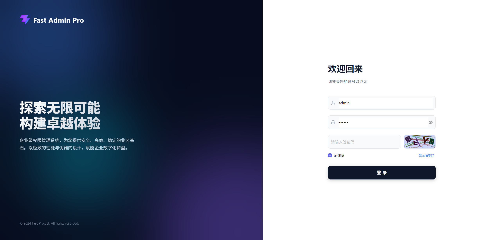 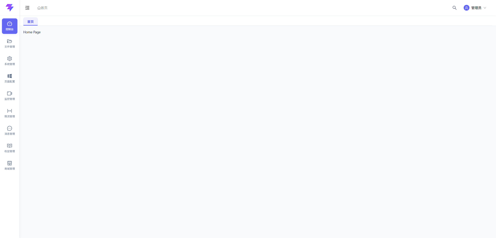 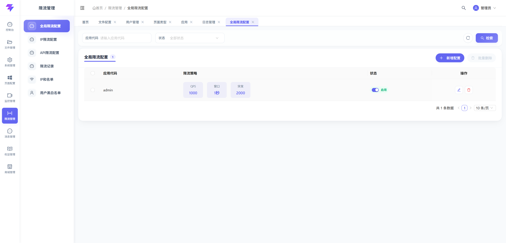

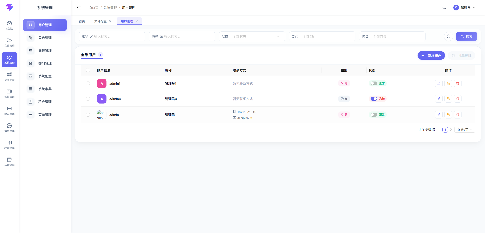 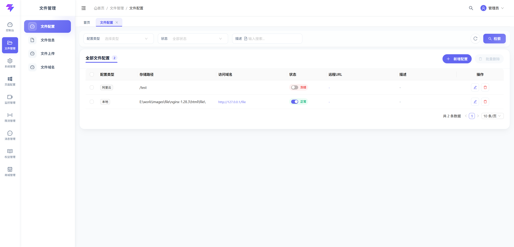 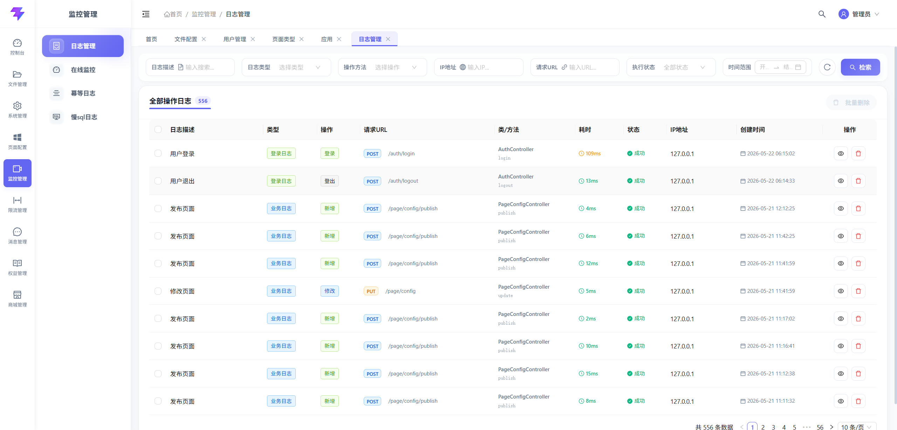

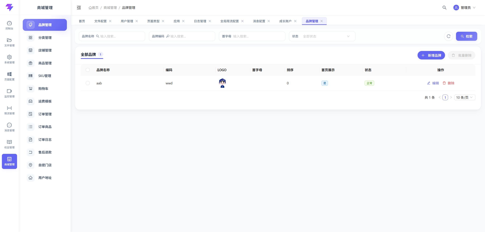 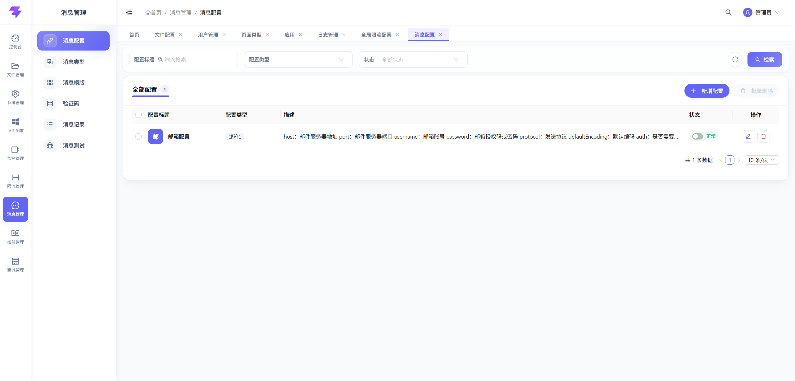 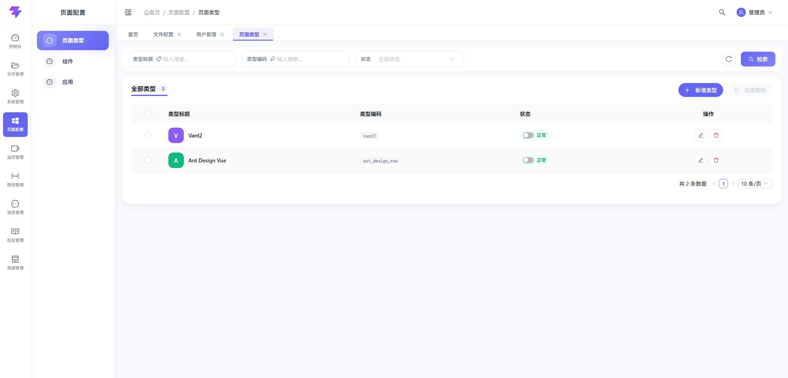

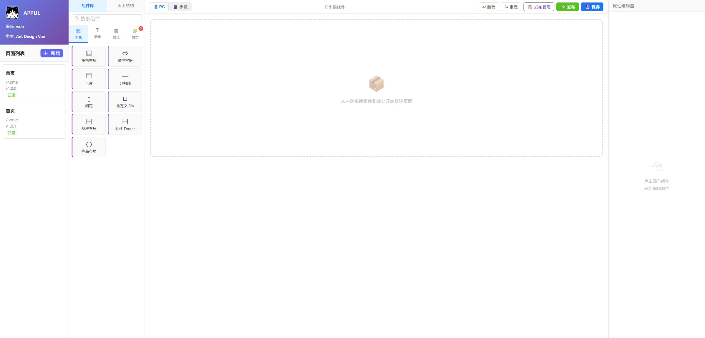 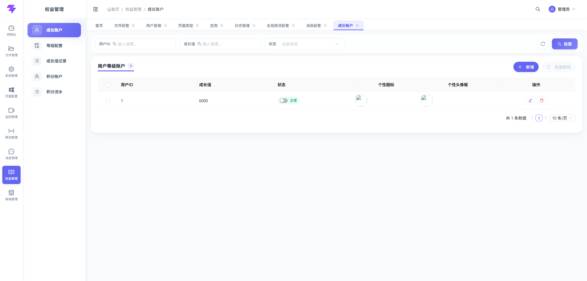

## 快速开始

### 环境准备

- JDK 25
- Node.js（建议使用较新 LTS）+ pnpm
- PostgreSQL（`run-admin` 默认使用）
- Redis（部分模块依赖，请按需准备）

### 后端启动

在仓库根目录执行：

```powershell
.\gradlew.bat :run-admin:bootRun
```

其他服务（按需）：

```powershell
.\gradlew.bat :run-customer-plugin:bootRun
.\gradlew.bat :run-web:bootRun
.\gradlew.bat :server-work:bootRun
.\gradlew.bat :websocket:bootRun
```

如需仅校验编译（推荐在改动后执行一次）：

```powershell
.\gradlew.bat :run-admin:compileJava
```

### 前端启动

在 `fast-ui` 目录执行：

```bash
pnpm install
pnpm admin-vue:dev
```

也可以进入某个子应用目录单独启动（以 `admin-vue` 为例）：

```bash
pnpm dev
```

## 开发定位建议

- 后台“系统管理”类需求优先按链路定位：
  - `fast-ui/apps/admin-vue/src/views/system/**`
  - `fast-ui/apps/admin-vue/src/api/system/**`
  - `run-admin/src/main/java/com/fastproject/module/system/controller/**`
  - `system-module/src/main/java/com/fastproject/system/**`
- 文件/日志/限流/幂等等领域建议先从对应 `*-module` 与 `run-admin` 聚合接口入手。

## License

见 [LICENSE](file:///e:/work/images/fast-project/LICENSE)。
