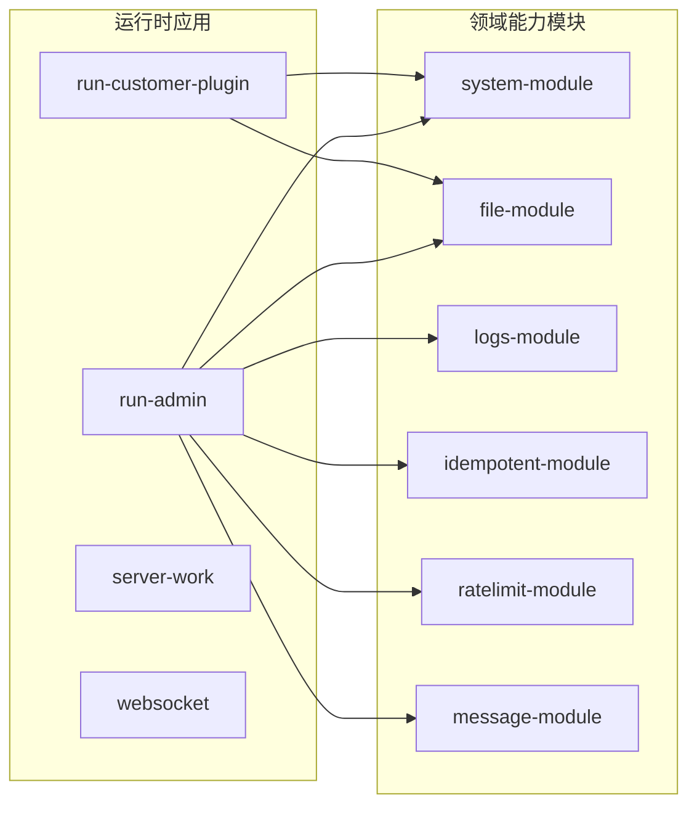

# 架构总览

`fast-project` 是一个前后端分离的业务系统仓库，后端采用 Gradle 多模块 + Spring Boot，前端采用 pnpm workspace + Vue 3 + Vite。

## 后端：运行时应用 + 领域能力模块

后端以“运行时应用（Run 模块）”聚合“领域能力模块（* -module）”的方式组织：

典型调用链：

`Controller -> Service -> Repository -> Entity`

模块内部常见分层：

- `domain`：JPA 实体
- `repository/db`：Spring Data JPA 仓储
- `mapper`：MapStruct 映射器
- `service` / `service/impl`：业务接口与实现
- `vo`：请求/响应对象

## 前端：多应用工作区

`fast-ui` 是 pnpm workspace：

- `apps/admin-vue`：后台管理端
- `apps/customer-service-vue`：客服插件端
- `apps/web-web`：Web 站点相关

每个应用独立维护依赖与 Vite 配置，通过工作区脚本聚合运行。
